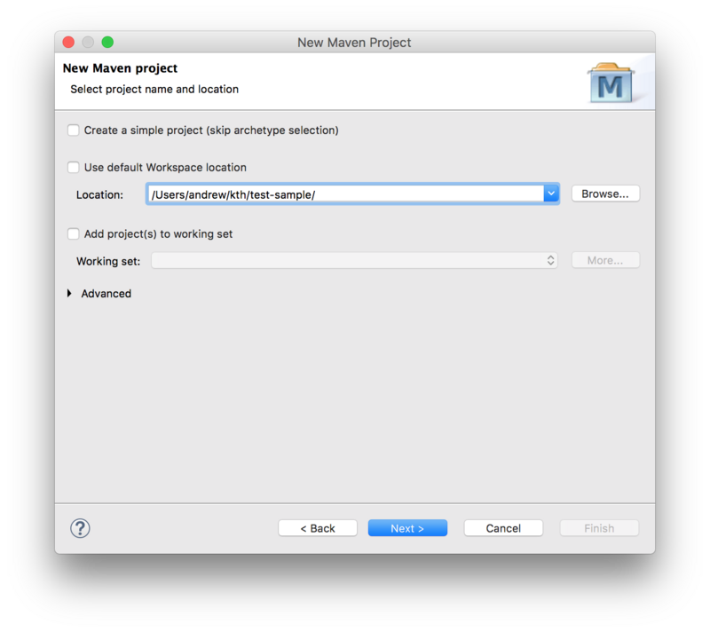
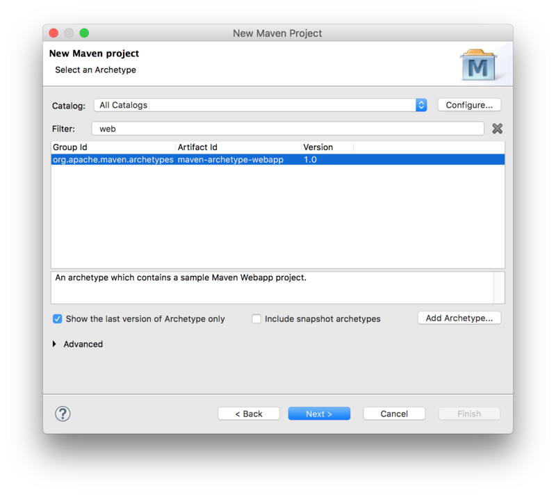
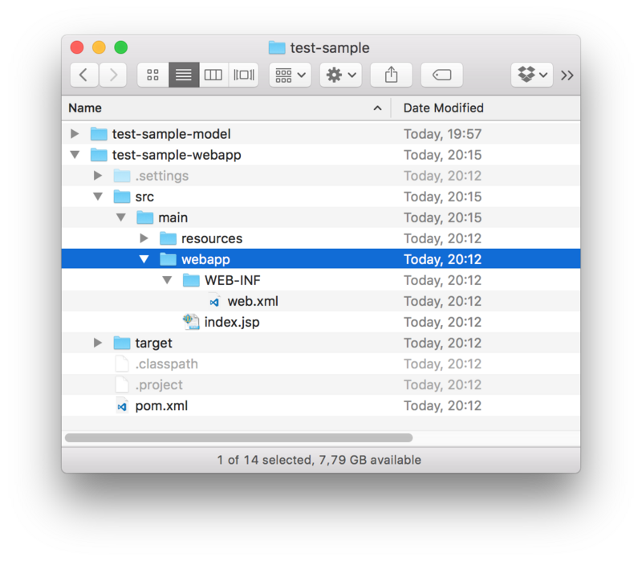

# Create an Eclipse Lyo project

The steps below guide you through the necessary steps of creating a Java
project with the necessary configurations to develop any OSLC server/client
using Lyo. The instructions assume you are using the Eclipse IDE, but should be
equally valid for any other development environment.

<!-- omit in toc -->
## Table of Contents 

- [An alternative to the manual steps below](#an-alternative-to-the-manual-steps-below)
- [Introduction](#introduction)
- [Set up Eclipse](#set-up-eclipse)
- [Decide if you want to adopt JAX-RS 1.0 or 2.0?](#decide-if-you-want-to-adopt-jax-rs-10-or-20)
- [Create a Maven project](#create-a-maven-project)
- [Customise the project POM file](#customise-the-project-pom-file)
  - [Setup general POM properties](#setup-general-pom-properties)
  - [(Optional) Add Lyo repositories](#optional-add-lyo-repositories)
  - [SLF4J package dependencies](#slf4j-package-dependencies)
  - [Servlet dependencies](#servlet-dependencies)
  - [JAX-RS implementation dependencies](#jax-rs-implementation-dependencies)
    - [For Lyo 5.x](#for-lyo-5x)
    - [For Lyo 4.x](#for-lyo-4x)
    - [For Lyo 2.4.0 and earlier](#for-lyo-240-and-earlier)
  - [Lyo dependencies](#lyo-dependencies)
  - [OSLC OAuth support](#oslc-oauth-support)
  - [OSLC Client support](#oslc-client-support)
    - [For Lyo 4.0+](#for-lyo-40)
    - [For Lyo 2.4 and earlier](#for-lyo-24-and-earlier)
  - [Configure the Embedded Jetty server for quick debugging](#configure-the-embedded-jetty-server-for-quick-debugging)
- [Customise the web configuration](#customise-the-web-configuration)
- [(Optional) Provide OpenApi/Swagger Support](#optional-provide-openapiswagger-support)
  - [Add OpenApi/Swagger Maven dependencies](#add-openapiswagger-maven-dependencies)
    - [For Lyo 5.0.0](#for-lyo-500)
    - [For Lyo 4.1.0](#for-lyo-410)
    - [For Lyo 2.4.0 and earlier](#for-lyo-240-and-earlier-1)
  - [Co-host Swagger UI with your server](#co-host-swagger-ui-with-your-server)
  - [Add Swagger-Core's JAX-RS Providers to your Application](#add-swagger-cores-jax-rs-providers-to-your-application)
  - [Configure Swagger's Servlet in the web.xml](#configure-swaggers-servlet-in-the-webxml)
  - [Add OpenApi Annotations (Almost Optional)](#add-openapi-annotations-almost-optional)
    - [@Api](#api)
    - [@ApiOperation (Optional)](#apioperation-optional)
    - [@ApiModel (Optional)](#apimodel-optional)
  - [Access the Swagger UI interactive console](#access-the-swagger-ui-interactive-console)
  - [Access OpenAPI specification document (yaml file)](#access-openapi-specification-document-yaml-file)
- [(Optional) Provide TRS Support](#optional-provide-trs-support)
  - [Add Maven dependencies](#add-maven-dependencies)
  - [Setup the TRS JAX-RS Provider to your Application](#setup-the-trs-jax-rs-provider-to-your-application)
  - [Update the TRS data set](#update-the-trs-data-set)
- [Run the server](#run-the-server)

## An alternative to the manual steps below
An alternative to the instructions on this page is to instead use [Lyo Designer](./lyo-designer) to quickly generate the project, including a very basic code skeleton. The generated project will also include the neccessary setup for OpenApi/Swagger support, TRS, etc.
1. Make sure your environment is setup for Lyo development as instructed on [Eclipse Setup for Lyo-based Development](./eclipse-setup-for-lyo-based-development)
1. install [Lyo Designer](./install-lyo-designer)
1. Follow the [Create a Modelling Project](./toolchain-modelling-workshop#create-modelling-project) instructions (*Only this particular section*) to create the Eclipse project.
1. Follow the [Adapter Interface](./toolchain-modelling-workshop#adaptor-interface-view) instructions (*Only this particular section*) to create a single Adaptor Interface in the model. You do not need to create any additional elements, such as a Service Provider Catalog, Service Provider, etc. Just make sure you set the generation settings as expected.
1. Follow the [Generate Lyo Java code](./toolchain-modelling-workshop#generate-oslc4j-java-code) instructions (*Only this particular section*) to generate your basic project setup.
1. You are done! But of course, you can proceed with Lyo Designer to model your complete OSLC Server/Client and generate even more of your project code.

## Introduction

In the instructions below, we assume the following parameters, which you will need to adjust for your particular project:

* Eclipse Project Name: *adaptor-sample-webapp*
* Base Package Name for Java Classes: *com.sample.adaptor*

We will here only create the code skeleton. The
[Toolchain Modelling Workshop](./toolchain-modelling-workshop) can then be used to generate the necessary code to become a fully functional server.

As a complement when following the instructions below, you can find sample projects under the [Lyo Adaptor Sample Modelling](https://github.com/OSLC/lyo-adaptor-sample-modelling) git repository.

* For Lyo 4.1.0, please refer to the `main-4.x` branch.
* For Lyo 5.0.0-SNAPSHOT, please refer to the `main-5.x` branch.
* For Lyo 2.4.0, please refer to the `main-2.x` branch.

Creating the project consists of these steps:

1. [Setup Eclipse](#setup-eclipse)
1. [Decide if you want to adopt JAX-RS 1.0 or 2.0?](#decide-jaxrs)
1. [Create a Maven project](#create-maven-project)
1. [Customise the project POM file](#customize-project-pom-file)
1. [Customise the web configuration](#customize-web-configuration)
1. [(Optional) Provide OpenApi/Swagger Support](#provide-openapi-support)
1. [(Optional) Provide TRS Support](#provide-trs-support)
1. [Run the server](#run-server)

## Set up Eclipse

Make sure your environment is setup for Lyo development as instructed on [Eclipse Setup for Lyo-based Development](./eclipse-setup-for-lyo-based-development)

## Decide if you want to adopt JAX-RS 1.0 or 2.0?

Starting with version 4.0.0, Lyo supports JAX-RS 2.0, and no longer depends on any particlar implementation of JAX-RS. This gives the developer the chance to adopt any preferred implementation such as [Jersey](https://jersey.github.io/), [RESTEasy](https://resteasy.github.io/), etc. 

> Older Lyo releases (2.x) only supported JAX-RS 1.0 and required Apache Wink implementation, which is **retired to Apache Attic** since 2015). They also relied on "HP Labs" Jena. We recommend you adopt the latest versions of Lyo.

The instructions below will vary depending on the Lyo version to be adopted. We will refer to the version as *${version.lyo}*, which can then take one of the two values:

* 4.1.0
* 2.4.0 (unsupported)

## Create a Maven project

To create a Maven project from an archetype via Eclipse

1. select *File -> New -> Other*
1. then select *Maven Project* under *Maven* group.
1. Leave the *Create a simple project* checkbox unchecked.
1. Uncheck the *Use default Workspace location* option and point it to the project root
1. Press *Next*



Next, select the `maven-archetype-webapp` archetype:



Next, Fill in the **Group Id**, **Artefact Id**, and the **Package Base**.

* The **Package Base** value (`com.sample.adaptor` on this page) will be used as a base package for your server code.


You should now have the project in Eclipse and the following folder structure:



## Customise the project POM file

We now need to modify the project *pom.xml* file.

### Setup general POM properties

We need to make sure our project uses UTF-8 and JDK 1.8+ (Lyo 5.0 requires JDK 11+). We will also use properties to define a common version for Lyo packages:

```xml
<properties>
  <project.build.sourceEncoding>UTF-8</project.build.sourceEncoding>
  <project.reporting.outputEncoding>UTF-8</project.reporting.outputEncoding>
  <maven.compiler.source>1.8</maven.compiler.source>
  <maven.compiler.target>1.8</maven.compiler.target>
  <version.lyo>ENTER-LYO-VERSION-HERE</version.lyo>
</properties>
```

In the snippet above, ```ENTER-LYO-VERSION-HERE``` is either ```5.0.0``` or ```2.4.0``` (**not supported since December 2020!**), depending on your choice of JAX-RS version.

### (Optional) Add Lyo repositories

A Lyo project will use Lyo dependencies that we need to declare. **All necessary Lyo dependencies are available on Maven Central starting with Lyo 4.0.0.** If you are using Lyo 2.x, you need to add the following entry:

```xml
<repositories>
  <repository>
    <id>lyo-releases</id>
    <name>Eclipse Lyo Releases</name>
    <url>https://repo.eclipse.org/content/repositories/lyo-releases/</url>
    <snapshots>
      <enabled>false</enabled>
    </snapshots>
  </repository>
</repositories>
```

If you wish to use the latest development snapshots, you will need the following entry:

```xml
<repositories>
  <repository>
    <id>lyo-snapshots</id>
    <name>Eclipse Lyo Snapshots</name>
    <url>https://repo.eclipse.org/content/repositories/lyo-snapshots/</url>
    <releases>
      <enabled>false</enabled>
    </releases>
  </repository>
</repositories>
```

### SLF4J package dependencies

Lyo uses SLF4J for logging, leaving the choice of the actual logging library to
use. We will use the simplest option:

```xml
<dependency>
  <groupId>org.slf4j</groupId>
  <artifactId>slf4j-simple</artifactId>
  <version>1.7.36</version>
  <scope>runtime</scope>
</dependency>
```

### Servlet dependencies

We require Java EE 6 or higher and JSTL:

```xml
<dependency>
  <groupId>javax.servlet</groupId>
  <artifactId>javax.servlet-api</artifactId>
  <version>3.1.0</version>
  <scope>provided</scope>
</dependency>
<dependency>
  <groupId>javax.servlet</groupId>
  <artifactId>jstl</artifactId>
  <version>1.2</version>
</dependency>
```

### JAX-RS implementation dependencies

Lyo depends on JAX-RS APIs and your application needs to add implementations of those APIs.

#### For Lyo 5.x 

For Lyo release 5.0.0 and above, you will need to choose a JAX-RS 2.0 implementation. If you are using Jersey, you should use version 2.35. *Note that starting with Jersey 2.26, HK2 is not bundled with the core artifacts (see the [Jersey migration guide](https://eclipse-ee4j.github.io/jersey.github.io/documentation/2.35/user-guide.html#mig-2.26)).*
```xml
<dependency>
  <groupId>org.glassfish.jersey.core</groupId>
  <artifactId>jersey-server</artifactId>
  <version>2.35</version>
</dependency>
<dependency>
  <groupId>org.glassfish.jersey.containers</groupId>
  <artifactId>jersey-container-servlet</artifactId>
  <version>2.35</version>
</dependency>
<dependency>
    <groupId>org.glassfish.jersey.inject</groupId>
    <artifactId>jersey-hk2</artifactId>
    <version>2.35</version>
</dependency>
```

#### For Lyo 4.x 

For Lyo release 4.0.0 and above, you will need to choose a JAX-RS 2.0 implementation, such as [Jersey](https://jersey.github.io/), [RESTEasy](https://resteasy.github.io/), etc. Below is an example for Jersey.

```xml
<dependency>
  <groupId>org.glassfish.jersey.core</groupId>
  <artifactId>jersey-server</artifactId>
  <version>2.25.1</version>
</dependency>
<dependency>
  <groupId>org.glassfish.jersey.containers</groupId>
  <artifactId>jersey-container-servlet</artifactId>
  <version>2.25.1</version>
</dependency>
```

#### For Lyo 2.4.0 and earlier 

For Lyo release 2.4.0 (and earlier), a Lyo package includes a dependency to the [Apache Wink implementation](https://svn.apache.org/repos/infra/websites/production/wink/content/index.html).

```
<dependency>
  <groupId>org.eclipse.lyo.oslc4j.core</groupId>
  <artifactId>oslc4j-wink</artifactId>
  <version>${version.lyo}</version>
</dependency>
```

### Lyo dependencies

The minimal Lyo dependencies are:

```xml
<dependency>
  <groupId>org.eclipse.lyo.oslc4j.core</groupId>
  <artifactId>oslc4j-core</artifactId>
  <version>${version.lyo}</version>
</dependency>
<dependency>
  <groupId>org.eclipse.lyo.oslc4j.core</groupId>
  <artifactId>oslc4j-jena-provider</artifactId>
  <version>${version.lyo}</version>
</dependency>
<dependency>
  <groupId>org.eclipse.lyo.oslc4j.core</groupId>
  <artifactId>oslc4j-json4j-provider</artifactId>
  <version>${version.lyo}</version>
</dependency>
```

### OSLC OAuth support

If your server needs to support OAuth, include the following:

```xml
<dependency>
  <groupId>org.eclipse.lyo.server</groupId>
  <artifactId>oauth-core</artifactId>
  <version>${version.lyo}</version>
</dependency>
<dependency>
  <groupId>org.eclipse.lyo.server</groupId>
  <artifactId>oauth-consumer-store</artifactId>
  <version>${version.lyo}</version>
</dependency>
<dependency>
  <groupId>org.eclipse.lyo.server</groupId>
  <artifactId>oauth-webapp</artifactId>
  <version>${version.lyo}</version>
  <type>war</type>
</dependency>
```

To support OAuth, you will need to add the following JAX-RS Providers to your Application (the `javax.ws.rs.core.Application` subclass)
```java
RESOURCE_CLASSES.add(Class.forName("org.eclipse.lyo.server.oauth.webapp.services.ConsumersService"));
RESOURCE_CLASSES.add(Class.forName("org.eclipse.lyo.server.oauth.webapp.services.OAuthService"));
```
### OSLC Client support

If your OSLC server also needs to consume resources from another server, a dependency to the OSLC client package is needed:

#### For Lyo 4.0+ 
```xml
<dependency>
  <groupId>org.eclipse.lyo.clients</groupId>
  <artifactId>oslc-client</artifactId>
  <version>${version.lyo}</version>
</dependency>
```

#### For Lyo 2.4 and earlier 
```xml
<dependency>
  <groupId>org.eclipse.lyo.clients</groupId>
  <artifactId>oslc-java-client</artifactId>
  <version>${version.lyo}</version>
</dependency>
```

### Configure the Embedded Jetty server for quick debugging

Finally, you should use an embedded servlet container during the debugging to simplify the development process.

Replace the existing `<build>` entry with the Jetty configuration below, using the following customisations:

* *adaptor-sample* is the context path that can be the same as your eclipse project name (or something more appropriate)

* *8080* is the port number you want to run the services on.

This will make your server available under the path http://localhost:8080/adaptor-sample

```xml
<build>
  <plugins>
    <plugin>
      <groupId>org.eclipse.jetty</groupId>
      <artifactId>jetty-maven-plugin</artifactId>
      <version>9.4.46.v20220331</version>
      <configuration>
        <webAppConfig>
          <contextPath>/adaptor-sample</contextPath>
        </webAppConfig>
        <reload>automatic</reload>
        <scanIntervalSeconds>5</scanIntervalSeconds>
        <systemProperties>
          <systemProperty>
            <name>jetty.port</name>
            <value>8080</value>
          </systemProperty>
        </systemProperties>
        <stopKey />
        <stopPort />
      </configuration>
    </plugin>
  </plugins>
</build>
```

## Customise the web configuration

Modify the parameters in `/src/main/webapp/WEB-INF/web.xml` according to the template below.

* *Adaptor Sample* could be the same as your eclipse project name (or something more appropriate)
* *com.sample.adaptor* should be the same as the base package name for your project.
* *8080* should match the port number specified in the POM file for Jetty configuration.
* ```ENTER-SERVLET-CLASS-HERE``` depends on the Lyo version and choice of JAX-RS implementation:
  * For ```4.0.0``` and higher, use the Jersey implementation: ```org.glassfish.jersey.servlet.ServletContainer```
  * For ```2.4.0```, use the legacy Wink implementation: ```org.apache.wink.server.internal.servlet.RestServlet```

```xml
<?xml version="1.0" encoding="UTF-8"?>
<web-app xmlns:xsi="http://www.w3.org/2001/XMLSchema-instance"
  xmlns="http://java.sun.com/xml/ns/javaee"
  xsi:schemaLocation="http://java.sun.com/xml/ns/javaee http://java.sun.com/xml/ns/javaee/web-app_3_0.xsd"
  id="WebApp_ID" version="3.0">
  <display-name>Adaptor Sample</display-name>
  <context-param>
    <description>Base URI for the adaptor.</description>
    <param-name>com.sample.adaptor.servlet.baseurl</param-name>
    <param-value>http://localhost:8080</param-value>
  </context-param>
  <listener>
    <description>Listener for ServletContext lifecycle changes</description>
    <listener-class>com.sample.adaptor.servlet.ServletListener</listener-class>
  </listener>
  <servlet>
    <servlet-name>JAX-RS Servlet</servlet-name>
    <servlet-class>ENTER-SERVLET-CLASS-HERE</servlet-class>
    <init-param>
      <param-name>javax.ws.rs.Application</param-name>
      <param-value>com.sample.adaptor.servlet.Application</param-value>
    </init-param>
    <load-on-startup>1</load-on-startup>
  </servlet>
  <servlet-mapping>
    <servlet-name>JAX-RS Servlet</servlet-name>
    <url-pattern>/services/*</url-pattern>
  </servlet-mapping>
</web-app>
```

## (Optional) Provide OpenApi/Swagger Support

With OSLC being based on REST, an OSLC Server can relatively easily be documented using [OpenApi/Swagger](https://swagger.io/). 

The instructions below are based on [Swagger Core JAX RS Project Setup 1.5.X](https://github.com/swagger-api/swagger-core/wiki/Swagger-Core-JAX-RS-Project-Setup-1.5.X), compiled for a typical Lyo project. The instructions are also partially base on 
[Co-hosting Swagger UI with your Jersey REST API using Maven dependencies](https://medium.com/shark-bytes/co-hosting-swagger-ui-with-your-jersey-rest-api-using-maven-dependencies-44d88ae85bf8). The instructions provide the minimal settings necessary for a Lyo project.

### Add OpenApi/Swagger Maven dependencies

Add the following Swagger dependency to your maven pom.xml file


#### For Lyo 5.0.0 

Assuming you are adopting the Jersey implementation with the version specified above.

```xml
<dependency>
  <groupId>io.swagger.core.v3</groupId>
  <artifactId>swagger-jaxrs2</artifactId>
  <version>2.1.4</version>
  <exclusions>
    <exclusion>
      <!--should be <provided>-->
      <groupId>jakarta.activation</groupId>
      <artifactId>jakarta.activation-api</artifactId>
    </exclusion>
  </exclusions>
</dependency>
<dependency>
  <groupId>io.swagger.core.v3</groupId>
  <artifactId>swagger-jaxrs2-servlet-initializer-v2</artifactId>
  <version>2.1.4</version>
</dependency>
```

#### For Lyo 4.1.0 
Assuming you are adopting the Jersey implementation with the version specified above.

```xml
<dependency>
  <groupId>io.swagger</groupId>
  <artifactId>swagger-jersey2-jaxrs</artifactId>
  <version>1.5.22</version>
</dependency>
```

#### For Lyo 2.4.0 and earlier 

```xml
<dependency>
  <groupId>io.swagger</groupId>
  <artifactId>swagger-jaxrs</artifactId>
  <version>1.5.17</version>
</dependency>
```

### Co-host Swagger UI with your server 

The following steps provide the end-user with an interactive console to the OSLC services, by integrating [Swagger UI](https://swagger.io/swagger-ui/) with your OSLC server.

Add the following plugins to the existing `<plugins>` entry of your `pom.xml` file. These plugins download and extract the necessary `Swagger UI` files from [Swagger UI GitHub project](https://github.com/swagger-api/swagger-ui) onto your project:

```xml
<build>
  <plugins>
    <plugin>
    ...
    </plugin>
    <plugin>
      <!-- Download Swagger UI webjar. -->
      <groupId>org.apache.maven.plugins</groupId>
      <artifactId>maven-dependency-plugin</artifactId>
      <version>3.1.2</version>
      <executions>
          <execution>
              <phase>prepare-package</phase>
              <goals>
                  <goal>unpack</goal>
              </goals>
              <configuration>
                  <artifactItems>
                      <artifactItem>
                          <groupId>org.webjars</groupId>
                          <artifactId>swagger-ui</artifactId>
                          <version>3.25.0</version>
                      </artifactItem>
                  </artifactItems>
                  <outputDirectory>${project.build.directory}/swagger-ui</outputDirectory>
              </configuration>
          </execution>
      </executions>
    </plugin>
    <plugin>
      <!-- Add Swagger UI resources to the war file. -->
      <groupId>org.apache.maven.plugins</groupId>
      <artifactId>maven-war-plugin</artifactId>
      <version>3.2.3</version>
      <configuration>
          <webResources combine.children="append">
              <resource>
                  <directory>${project.build.directory}/swagger-ui/META-INF/resources/webjars/swagger-ui/3.25.0</directory>
                  <includes>
                      <include>**/*.*</include>
                  </includes>
                  <targetPath>/swagger-ui/dist</targetPath>
              </resource>
          </webResources>
      </configuration>
    </plugin>
  </plugins>
</build>
```

### Add Swagger-Core's JAX-RS Providers to your Application
Add swagger-core's JAX-RS Providers to the Application class that extends ```javax.ws.rs.core.Application```

```java
public class Application extends javax.ws.rs.core.Application {
  private static final Set<Class<?>> RESOURCE_CLASSES = new HashSet<Class<?>>();
    static
    {
      ...
      RESOURCE_CLASSES.add(io.swagger.jaxrs.listing.ApiListingResource.class);
      RESOURCE_CLASSES.add(io.swagger.jaxrs.listing.SwaggerSerializers.class);
      ...
    }
    ...
```

### Configure Swagger's Servlet in the web.xml

Add the following to your web.xml:

* *swagger.api.basepath* depends on your particular settings, as instructed above.

```xml
  <servlet>
    <servlet-name>DefaultJaxrsConfig</servlet-name>
    <servlet-class>io.swagger.jaxrs.config.DefaultJaxrsConfig</servlet-class>
    <init-param>
      <param-name>api.version</param-name>
      <param-value>1.0.0</param-value>
    </init-param>
    <init-param>
      <param-name>swagger.api.basepath</param-name>
      <param-value>http://localhost:8080/adaptor-sample/services/</param-value>
    </init-param>
    <load-on-startup>2</load-on-startup>
  </servlet>
```

### Add OpenApi Annotations (Almost Optional)

The OpenApi documentation can be achieved with as little as adding *@Api* to each REST/OSLC service in your project. This is detailed in the first step below. While the remaining intructions are optional, they are highly recommended to provide a documentation that can best reflect the OSLC services.

#### @Api

1. For each REST service (ie. OSLC Service), simply add the *@Api* annotation.
1. (*OPTIONAL*) add the *value* and *description* details. The *value* is used to group the REST methods into common categories, helping in the structuring of the methods in the documentaton. You can give it the same value as that of the @Path annotation, collecting all REST methods for the same service together.

```java
@Api(value = "requirements", description = "OSLC service for resources of type" + "Requirement")
@OslcService(Oslc_rmDomainConstants.REQUIREMENTS_MANAGEMENT_DOMAIN)
@Path("requirements")
```

#### @ApiOperation (Optional)

For each REST method, add the *@ApiOperation* Swagger annotation.

**Important**: In [OpenApi](https://swagger.io/docs/specification/paths-and-operations/), an operation is defined as unique through the combination of its path and method. This means that two C.R.U.D. methods for the same path are not allowed – even if they have different parameters (including Accept and Content-Type annotations).

* Example: Your OSLC Service may define two different Java methods to separately handle HTML and RDF/XML content types. OpenApi will only recognise one of these two methods, while ignoring the other.
* Workaround: Annotate ALL methods that are identified as unique with the complete list of media types in the *produces* property of the @ApiOperation annotation. This way, the generated documentation correctly indicates the existance of all methods.

```java
    @GET
    @ApiOperation(value = "GET on Requirement resources",
		produces = OslcMediaType.APPLICATION_RDF_XML + ", " + MediaType.TEXT_HTML)
    @Path("{requirementId}")
    @Produces(OslcMediaType.APPLICATION_RDF_XML)
    public Requirement getRequirement(
```

#### @ApiModel (Optional)

For each Java class that models an OSLC-resource (@OslcName annotation), add an *@ApiModel* annotation that refers to the Shape of the resource, since a Shape is a more accurate description of the object, than the one automatically generated by Swagger.

```java
@ApiModel(description = "The  model below is only a object structure as derived by swagger.  For a more accurate RDF Description, refer to the Requirement Resource Shape.")
@OslcNamespace(Oslc_rmDomainConstants.REQUIREMENT_NAMESPACE)
@OslcName(Oslc_rmDomainConstants.REQUIREMENT_LOCALNAME)
@OslcResourceShape(title = "Requirement Resource Shape", describes = Oslc_rmDomainConstants.REQUIREMENT_TYPE)
public class Requirement
...
```

### Access the Swagger UI interactive console

Before you can access the [Swagger UI](https://swagger.io/swagger-ui/) interactive console for the first time, edit the `swagger-ui/index.html` file, replacing the url `http://petstore.swagger.io/v2/swagger.json` with the url of your own yaml file `http://localhost:8080/adaptor-sample/services/swagger.yaml`.

The generated interactive API console can be accessed via

    http://localhost:8080/adaptor-sample/swagger-ui/

### Access OpenAPI specification document (yaml file)
You can also access the OpenAPI specification document (yaml file) at:

    http://localhost:8080/adaptor-sample/services/swagger.yaml

You can copy the yaml file to a [Swagger Editor](https://editor.swagger.io), to view the API documentation, as well as generate client/Server SDK code for a number of languages and platforms.

## (Optional) Provide TRS Support

The *TRS Server* library is a set of ready-to-use classes that provide the required REST services for TRS, with minimal effort. 
The current implementation supports an In-memory TRS Server that does not persist its TRS resources.
These classes are however designed to be extended for a persistent solution. 
For a thourough walkthough of TRS solutions, which among other things ensures persisting the TRS Logs, visit the [additional information on TRS](./eclipse-lyo#trs-sdk)  

### Add Maven dependencies

Add a dependency for the TRS Server library:

    <dependency>
      <groupId>org.eclipse.lyo.trs</groupId>
      <artifactId>trs-server</artifactId>
        <version>${version.lyo}</version>
    </dependency>


### Setup the TRS JAX-RS Provider to your Application

The *TRS Server* library already contains a `TrackedResourceSetService` class  that can handle the REST calls for TRS Base and ChangeLog. For this service to work, you will only need to provide a binding to a singleton of a class that implements the `PagedTrs` class.

Register the TRS JAX-RS Provider `TrackedResourceSetService` in your Application (the `javax.ws.rs.core.Application` subclass).

```java
import org.eclipse.lyo.oslc4j.trs.server.service.TrackedResourceSetService;
...
public class Application extends javax.ws.rs.core.Application {
    private static final Set<Class<?>>         RESOURCE_CLASSES                          = new HashSet<Class<?>>();
    static
    {
      ...
      RESOURCE_CLASSES.add(TrackedResourceSetService.class);
      ...
    }
    ...
```

Provide the necessary binding definition for the  `PagedTrs` class.

```java
import java.util.Collections;
import org.eclipse.lyo.oslc4j.trs.server.PagedTrs;
import com.sample.adaptor.InmemPagedTrsSingleton;
import org.glassfish.hk2.utilities.binding.AbstractBinder;
...
public class Application extends javax.ws.rs.core.Application {
    ...
    @Override
    public Set<Object> getSingletons() {
        return Collections.singleton(new AbstractBinder() {
            @Override
            protected void configure() {
                bindFactory(new InmemPagedTrsSingleton()).to(PagedTrs.class);
            }
        });
    }
```

Define the `InmemPagedTrsSingleton` singleton class. You will need to complete the code example below, with
* the code that populates  `uris` with the intial set of resources to be managed by `InmemPagedTrs`. 
* the desired `basePageLimit` and `changelogPageLimit` parameters. 

```java
package com.sample.adaptor;

import java.net.URI;
import java.util.ArrayList;
import java.util.Iterator;

import javax.ws.rs.core.UriBuilder;
import org.eclipse.lyo.oslc4j.core.OSLC4JUtils;
import org.eclipse.lyo.oslc4j.trs.server.InmemPagedTrs;
import org.eclipse.lyo.oslc4j.trs.server.PagedTrs;
import org.eclipse.lyo.oslc4j.trs.server.service.TrackedResourceSetService;
import org.glassfish.hk2.api.Factory;
import org.slf4j.Logger;
import org.slf4j.LoggerFactory;

public class InmemPagedTrsSingleton implements Factory<PagedTrs> {
    private final static Logger log = LoggerFactory.getLogger(InmemPagedTrsSingleton.class);
    private static InmemPagedTrs inmemPagedTrs;

    @Override
    public InmemPagedTrs provide() {
        return getInmemPagedTrs();
    }

    @Override
    public void dispose(final PagedTrs instance) {
        log.debug("{} is getting disposed", instance);
    }

    public static InmemPagedTrs getInmemPagedTrs() {
        if(inmemPagedTrs == null) {
            log.debug("Initialising 'InmemPagedTrs' instance");
            
            ArrayList<URI> uris = new ArrayList<URI>();
            
            //TODO: populate uris with the intial set of resources to be managed by the InmemPagedTrs instance
            ....
            // not thread-safe
            inmemPagedTrs = new InmemPagedTrs(<basePageLimit>, <changelogPageLimit>,
                UriBuilder.fromUri(OSLC4JUtils.getServletURI()).path(TrackedResourceSetService.RESOURCE_PATH).build(), 
                TrackedResourceSetService.BASE_PATH, TrackedResourceSetService.CHANGELOG_PATH, uris);
        }
        return inmemPagedTrs;
    }
}
```

The application is now ready to respond to REST requests from a TRS Client. Once running, the server will respond to requests on the relative path `/trs`.

### Update the TRS data set
To update the set of OSLC resources that form the TRS Base and ChangeLog, simply call the following methods in your code:

* `InmemPagedTrsSingleton.getInmemPagedTrs().onCreated(aResource);`
* `InmemPagedTrsSingleton.getInmemPagedTrs().onModified(aResource);`
* `InmemPagedTrsSingleton.getInmemPagedTrs().onDeleted(aResource.getAbout());`

## Run the server

Once the server is developed, you can run it by selecting *Run As ➞ Maven build ...* from the project's context menu, and setting the goal to `clean jetty:run-war`.

You can now access your server from http://localhost:8080/adaptor-sample

* *adaptor-sample* and *8080* will depend on your particular settings, as instructed above.

> **Pro Tip:** If you get the error *Project configuration is not up-to-date with pom.xml*, simply right click on the eclipse project and select *Maven ➞ Update Project* ...
