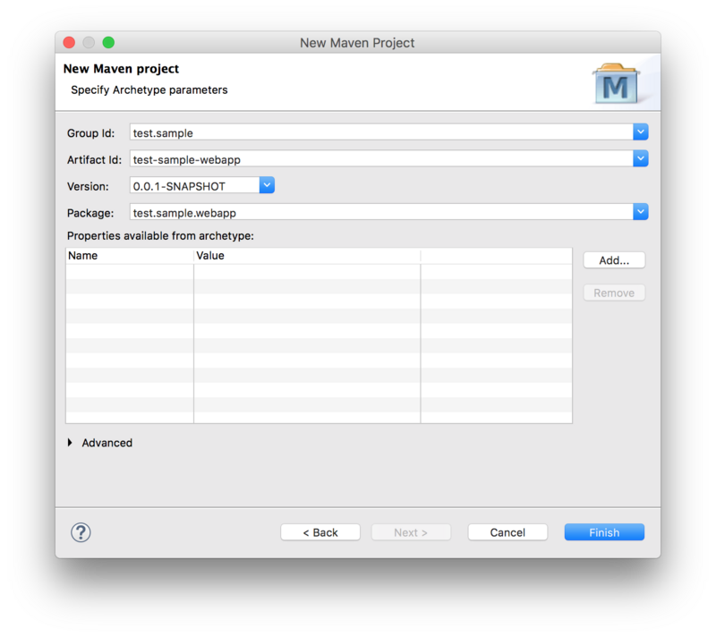

# Eclipse Setup

Make sure your environment is setup for OSLC4J development as instructed on [Eclipse Setup for Lyo-based Development](./eclipse-setup-for-lyo-based-development)

# Sample Projects

As a complement when following the instructions below, you can find sample projects under the [Lyo Adaptor Sample Modelling](https://github.com/OSLC/lyo-adaptor-sample-modelling) git repository.

# Create an OSLC4J project

The steps below guide you through the necessary steps of creating an Eclipse project with the necessary configurations to develop any OSLC4J adaptor.

In the instructions below, we assume the following parameters, which you will need to adjust for your particular project:

* Eclipse Project Name: *adaptor-sample-webapp*
* Base Package Name for Java Classes: *com.sample.adaptor*

We will here only create the code skeleton. The
[Toolchain Modelling Workshop](./toolchain-modelling-workshop) can then be used to generate the necessary code to become a fully functional adaptor.

Creation of the skeleton consists of 2 steps:

1. creating a Maven project from an archetype
1. customising the generated project with the Lyo-specific configuration


## Creating a Maven project from an archetype

To create a Maven project from an archetype via Eclipse

1. select *File -> New -> Other*
1. then select *Maven Project* under *Maven* group.
1. Leave the *Create a simple project* checkbox unchecked.
1. Uncheck the *Use default Workspace location* option and point it to the project root
1. Press *Next*


Next, select the `maven-archetype-webapp` archetype:


Next, Fill in the **Group Id**, **Artefact Id**, and the **Package Base**.

* The **Package Base** value (`com.sample.adaptor` on this page) will be used as a base package for your adaptor code.



You should now have the project in Eclipse and the following folder structure:


## Customise the project POM file

We now need to modify the project *pom.xml* file.

### General POM changes

We need to make sure our project uses UTF-8 and JDK 1.8. We will also use
properties to define a common version for Lyo Core and Lyo Server packages:

```xml
<properties>
  <project.build.sourceEncoding>UTF-8</project.build.sourceEncoding>
  <project.reporting.outputEncoding>UTF-8</project.reporting.outputEncoding>
  <maven.compiler.source>1.8</maven.compiler.source>
  <maven.compiler.target>1.8</maven.compiler.target>
  <version.lyo.core>2.2.0</version.lyo.core>
  <version.lyo.server>2.2.0</version.lyo.server>
</properties>
```
### Java EE 6

We require Java EE 6 or higher and JSTL:

```xml
<dependency>
  <groupId>javax.servlet</groupId>
  <artifactId>javax.servlet-api</artifactId>
  <version>3.1.0</version>
  <scope>provided</scope>
</dependency>
<dependency>
  <groupId>javax.servlet</groupId>
  <artifactId>jstl</artifactId>
  <version>1.2</version>
</dependency>
```

### Lyo repositories

an OSLC4J project will use Lyo dependencies that we need to declare. Before we
can do that, we need to add the Lyo repository. After that, we are ready to add the dependencies.

```xml
  <repositories>
    <repository>
      <id>lyo-releases</id>
      <name>lyo-releases repository</name>
      <url>https://repo.eclipse.org/content/repositories/lyo-releases/</url>
    </repository>
  </repositories>
```

### SLF4J package dependencies

Lyo uses SLF4J for logging, leaving the choice of the actual logging library to
use. We will use the simplest option:

```xml
<dependency>
  <groupId>org.slf4j</groupId>
  <artifactId>slf4j-simple</artifactId>
  <version>1.7.21</version>
  <scope>runtime</scope>
</dependency>
```

### Lyo package dependencies

Lyo dependencies need:

```xml
<dependency>
  <groupId>org.eclipse.lyo.oslc4j.core</groupId>
  <artifactId>oslc4j-core</artifactId>
  <version>${version.lyo.core}</version>
</dependency>
<dependency>
  <groupId>org.eclipse.lyo.oslc4j.core</groupId>
  <artifactId>oslc4j-jena-provider</artifactId>
  <version>${version.lyo.core}</version>
</dependency>
<dependency>
  <groupId>org.eclipse.lyo.oslc4j.core</groupId>
  <artifactId>oslc4j-wink</artifactId>
  <version>${version.lyo.core}</version>
</dependency>
<dependency>
  <groupId>org.eclipse.lyo.oslc4j.core</groupId>
  <artifactId>oslc4j-json4j-provider</artifactId>
  <version>${version.lyo.core}</version>
</dependency>
```

### OAuth support

Finally, your adaptor might need to includes the experimental support for OAuth:

```xml
<dependency>
  <groupId>org.eclipse.lyo.server</groupId>
  <artifactId>oauth-core</artifactId>
  <version>${version.lyo.server}</version>
</dependency>
<dependency>
  <groupId>org.eclipse.lyo.server</groupId>
  <artifactId>oauth-consumer-store</artifactId>
  <version>${version.lyo.server}</version>
  <exclusions>
    <exclusion>
      <groupId>org.slf4j</groupId>
      <artifactId>slf4j-log4j12</artifactId>
    </exclusion>
  </exclusions>
</dependency>
<dependency>
  <groupId>org.eclipse.lyo.server</groupId>
  <artifactId>oauth-webapp</artifactId>
  <version>${version.lyo.server}</version>
  <type>war</type>
</dependency>
```

> Exclusions are due to the [Bug 513477](https://bugs.eclipse.org/bugs/show_bug.cgi?id=513477)

> OAuth is enabled by default. If you want to disable it, open the generated `Application` class and do the following changes:
>
> * comment out line `RESOURCE_CLASSES.add(Class.forName("org.eclipse.lyo.server.oauth.webapp.services.ConsumersService"));`
> * comment out line `RESOURCE_CLASSES.add(Class.forName("org.eclipse.lyo.server.oauth.webapp.services.OAuthService"));`
> * change `catch (ClassNotFoundException e)` to `catch (Exception e)`

### OSLC Client support

If you use OAuth or consume any resources in your Adaptor Interface, an OSLC client dependency is needed:

```xml
<dependency>
  <groupId>org.eclipse.lyo.clients</groupId>
  <artifactId>oslc-java-client</artifactId>
  <version>${version.lyo.core}</version>
</dependency>
```

### Embedded Jetty server for quick debugging

Finally, you should use an embedded servlet container during the debugging to simplify the development process.

Replace the existing `<build>` entry with the Jetty configuration below, using the following customisations:

* *adaptor-sample* is the context path that can be the same as your eclipse project name (or something more appropriate)

* *8080* is the port number you want to run the services on.

This will make your adaptor available under the path http://localhost:8080/adaptor-sample

```xml
<build>
  <plugins>
    <plugin>
      <groupId>org.eclipse.jetty</groupId>
      <artifactId>jetty-maven-plugin</artifactId>
      <version>9.3.9.v20160517</version>
      <configuration>
        <webAppConfig>
          <contextPath>/adaptor-sample</contextPath>
        </webAppConfig>
        <reload>automatic</reload>
        <scanIntervalSeconds>5</scanIntervalSeconds>
        <systemProperties>
          <systemProperty>
            <name>jetty.port</name>
            <value>8080</value>
          </systemProperty>
        </systemProperties>
        <stopKey />
        <stopPort />
      </configuration>
    </plugin>
  </plugins>
</build>
```

## Customise the web configuration

Modify the parameters in `/src/main/webapp/WEB-INF/web.xml` according to the template below.

* *Adaptor Sample* could be the same as your eclipse project name (or something more appropriate)
* *com.sample.adaptor* should be the same as the base package name for your project.
* *8080* should match the port number specified in the POM file for Jetty configuration.

```xml
<?xml version="1.0" encoding="UTF-8"?>
<web-app xmlns:xsi="http://www.w3.org/2001/XMLSchema-instance"
  xmlns="http://java.sun.com/xml/ns/javaee"
  xsi:schemaLocation="http://java.sun.com/xml/ns/javaee http://java.sun.com/xml/ns/javaee/web-app_3_0.xsd"
  id="WebApp_ID" version="3.0">
  <display-name>Adaptor Sample</display-name>
  <context-param>
    <description>Base URI for the adaptor.</description>
    <param-name>com.sample.adaptor.servlet.baseurl</param-name>
    <param-value>http://localhost:8080</param-value>
  </context-param>
  <listener>
    <description>Listener for ServletContext lifecycle changes</description>
    <listener-class>com.sample.adaptor.servlet.ServletListener</listener-class>
  </listener>
  <servlet>
    <servlet-name>JAX-RS Servlet</servlet-name>
    <servlet-class>org.apache.wink.server.internal.servlet.RestServlet</servlet-class>
    <init-param>
      <param-name>javax.ws.rs.Application</param-name>
      <param-value>com.sample.adaptor.servlet.Application</param-value>
    </init-param>
    <load-on-startup>1</load-on-startup>
  </servlet>
  <servlet-mapping>
    <servlet-name>JAX-RS Servlet</servlet-name>
    <url-pattern>/services/*</url-pattern>
  </servlet-mapping>
</web-app>
```
# Final tips

If you get the error *Project configuration is not up-to-date with pom.xml*, simply right click on the eclipse project and select Maven--&gt;Update Project ...

# Run the adaptor

Once the adaptor is developed, you can run it by selecting *Run As --&gt; Maven build ...* from the project's context menu, and setting the goal to `clean jetty:run-exploded`.

You can now access your adaptor from http://localhost:8080/adaptor-sample

* *adaptor-sample* and *8080* will depend on your particular settings, as instructed above.

# OpenApi/Swagger Support (Optional)

Being already a REST web server, an OSLC4J project can relatively easily be documented using [OpenApi/Swagger](https://swagger.io/).

The instructions below provide the minimal settings necessary for an OSLC4J project.

* Additional suggestions are also provided, given that a typical OSLC4J project might differ from that assumed by OpenApi/Swagger.

* One major difference is the fact that OSLC assumes an RDF data model, where resources are defined using OSLC Shapes. Swagger/OpenApi does not explicitly recognise such a model.

The instructions below are based on [Swagger Core JAX RS Project Setup 1.5.X](https://github.com/swagger-api/swagger-core/wiki/Swagger-Core-JAX-RS-Project-Setup-1.5.X), compiled for a typical OSLC4J project, as instructed in this wiki.

## Add Maven dependencies

Add the following Swagger dependency to your maven pom.xml file

```xml
<dependency>
  <groupId>io.swagger</groupId>
  <artifactId>swagger-jaxrs</artifactId>
  <version>1.5.17</version>
</dependency>
```
## Add Swagger-Core's JAX-RS Providers to your Application
Add swagger-core's providers to the OslcWinkApplication class of your server.

```java
public class Application extends OslcWinkApplication {
  private static final Set<Class<?>> RESOURCE_CLASSES = new HashSet<Class<?>>();
    static
    {
      ...
      RESOURCE_CLASSES.add(io.swagger.jaxrs.listing.ApiListingResource.class);
      RESOURCE_CLASSES.add(io.swagger.jaxrs.listing.SwaggerSerializers.class);
      ...
    }
    ...
```

## Configure Swagger's Servlet in the web.xml

Add the following to your web.xml:

* *swagger.api.basepath* depends on your particular settings, as instructed above.

```xml
  <servlet>
    <servlet-name>DefaultJaxrsConfig</servlet-name>
    <servlet-class>io.swagger.jaxrs.config.DefaultJaxrsConfig</servlet-class>
    <init-param>
      <param-name>api.version</param-name>
      <param-value>1.0.0</param-value>
    </init-param>
    <init-param>
      <param-name>swagger.api.basepath</param-name>
      <param-value>http://localhost:8080/adaptor-sample/services/</param-value>
    </init-param>
    <load-on-startup>2</load-on-startup>
  </servlet>
```

## Add OpenApi Annotations (Almost Optional)

The OpenApi documentation can be achieved with as little as adding *@Api* to each REST/OSLC service in your project. This is detailed in the first step below. While the remaining intructions are optional, they are highly recommended to provide a documentation that can best reflect the OSLC services.

### @Api

1. For each REST service (ie. OSLC Service), simply add the *@Api* annotation.
1. (*OPTIONAL*) add the *value* and *description* details. The *value* is used to group the REST methods into common categories, helping in the structuring of the methods in the documentaton. You can give it the same value as that of the @Path annotation, collecting all REST methods for the same service together.

```java
@Api(value = "requirements", description = "OSLC service for resources of type" + "Requirement")
@OslcService(Oslc_rmDomainConstants.REQUIREMENTS_MANAGEMENT_DOMAIN)
@Path("requirements")
```

### @ApiOperation (Optional)

For each REST method, add the *@ApiOperation* Swagger annotation.

**Important**: In [OpenApi](https://swagger.io/docs/specification/paths-and-operations/), an operation is defined as unique through the combination of its path and method. This means that two C.R.U.D. methods for the same path are not allowed – even if they have different parameters (including Accept and Content-Type annotations).

* Example: Your OSLC Service may define two different Java methods to separately handle HTML and RDF/XML content types. OpenApi will only recognise one of these two methods, while ignoring the other.
* Workaround: Annotate ALL methods that are identified as unique with the complete list of media types in the *produces* property of the @ApiOperation annotation. This way, the generated documentation correctly indicates the existance of all methods.

```java
    @GET
    @ApiOperation(value = "GET on Requirement resources",
		produces = OslcMediaType.APPLICATION_RDF_XML + ", " + MediaType.TEXT_HTML)
    @Path("{requirementId}")
    @Produces(OslcMediaType.APPLICATION_RDF_XML)
    public Requirement getRequirement(
```

### @ApiModel (Optional)

For each Java class that models an OSLC-resource (@OslcName annotation), add an *@ApiModel* annotation that refers to the Shape of the resource, since a Shape is a more accurate description of the object, than the one automatically generated by Swagger.

```java
@ApiModel(description = "The  model below is only a object structure as derived by swagger.  For a more accurate RDF Description, refer to the Requirement Resource Shape.")
@OslcNamespace(Oslc_rmDomainConstants.REQUIREMENT_NAMESPACE)
@OslcName(Oslc_rmDomainConstants.REQUIREMENT_LOCALNAME)
@OslcResourceShape(title = "Requirement Resource Shape", describes = Oslc_rmDomainConstants.REQUIREMENT_TYPE)
public class Requirement
...
```
## Access the Swagger Documentation
**You are done!** You should now be able to access the the OpenAPI specification document (yaml file) at:

    http://localhost:8080/adaptor-sample/services/swagger.yaml

You can copy the yaml file to a [Swagger Editor](https://editor.swagger.io), to view the API documentation, as well as generate client/Server SDK code for a number of languages and platforms.

**But**, with a few more steps, you can also integrate [Swagger UI](https://swagger.io/swagger-ui/) into your OSLC server, providing the end-user with an interactive console of the OSLC services.

## Integrating Swagger UI

The following steps allows you to integrate [Swagger UI](https://swagger.io/swagger-ui/) into your OSLC server, to provide the end-user with a visual and interactive presentation of the OSLC services.

1. Download and extract the [Swagger UI GitHub project](https://github.com/swagger-api/swagger-ui) onto your local computer.

1. Copy the content of the '*dist*' folder to '*/src/main/webapp/swagger-ui*', under your web project.

1. Edit the `swagger-ui/index.html` file, replacing the url `http://petstore.swagger.io/v2/swagger.json` with the url of your own yaml file `http://localhost:8080/adaptor-sample/services/swagger.yaml`.

**You are done!** The generated interactive API console can now be accessed via

    http://localhost:8080/adaptor-sample/swagger-ui
