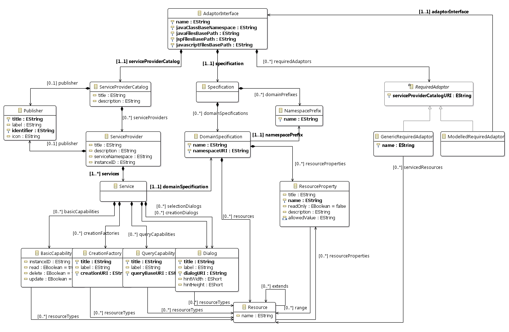

Introduction
============
This workshop presents the use of Lyo Designer to graphically model a complete OSLC-based toolchain (including the interactions between OSLC servers and clients), and/or single server and/or client.
The instructions also include a walkthrough of the generated OSLC4J-compliant code.

For seperations of concerns, Lyo Designer structures the toolchain model around the following three viewpoints
(Illustrations and details can be found later in this workshop):

-   **Domain Specification View** – To define the types of resources,
    their properties and relationships, according the [OSLC Core
    Specification](https://archive.open-services.net/bin/view/Main/OslcCoreSpecification)
    and the [Resource Shape constraint
    language](https://archive.open-services.net/bin/view/Main/OSLCCoreSpecAppendixA#oslc_ResourceShape_Resource).
    - Lyo Designer can also be used to solely model domains, as instructed under the [Domain Specification Modelling Workshop](./domain-specification-modelling-workshop).
-   **Toolchain View** – To allocate resources to tools. For each tool,
    the set of resources being exposes and/or consumed are defined.
-   **Adapter Interface View** – To design the internal details of the
    tool interface. Sufficient information is captured in this view, so
    that an almost complete interface code, which is compliant with the
    OSLC4J software development kit (SDK) can be generated.

Working with the model allows you to work at a higher level of
abstraction, without needing to deal with all the technical details of
the OSLC standard (such as Linked Data, RDF, etc.). However, a basic
understanding of the Linked Data and OSLC concepts remains necessary in
order to build a valid model. For an introduction to Linked Data and
OSLC, the following resources on open-services.net can be recommended:
[Linked Data and OSLC Tutorial (2015
Update)](https://archive.open-services.net/linked-data-and-oslc-tutorial-2015-update/)

This tutorial takes you through the steps from creating the initial
modelling project to the code generation and final execution of the tool
adaptors.

1.  First, you will perform the necessary installation and configuration of
    your Eclipse environment.
2.  Create an empty modelling project, configured to start
    modelling your toolchain.
3.  Graphically specify your toolchain and adaptor
    functionality, from which almost complete code will be generated.
4.  Perform the steps to generate the necessary OSLC4J code.
5.  Perform the final implementation steps to make the adaptors
    ready to run.

Table of Content:
-------------------------
1. [Eclipse Setup](#eclipse-setup)
1. [Create a Toolchain Modelling Project](#create-toolchain-modelling-project)
1. [Model the Toolchain](#model-toolchain)
   1. [Modelling Overview](#modelling-overview)
   1. [General Modelling Instructions](#general-modelling-instructions)
   1. [Domain Specification View](#domain-specification-view)
   1. [Toolchain View](#toolchain-view)
   1. [Adapter Interface View](#adaptor-interface-view)
1. [Validate the model](#validate-model)
1. [Setup OSLC4J projects](#setup-oslc4j-projects)
1. [Generate OSLC4J Java code](#generate-oslc4j-java-code)
1. [Browsing the generated code](#browse-generated-code)
1. [Fill in the internal implementation of each adaptor](#fill-in-internal-implementation)
1. [Run the adaptor](#run-adaptor)

Bug Reporting
=============

The prototype presented here is under development and its features may change over time. Your feedback, suggestions for improvements and bug reports are appreciated. In particular, the graphical notation being used is experimental and certainly needs further improvements. Please send any questions or suggestions to the project mailinglist lyo-dev@eclipse.org, or report Bugs/features on [Github](https://github.com/eclipse/lyo.designer/issues)

References
==========

If you wish to cite this modelling prototype in scientific papers
    and communications, please reference:

-   Jad El-khoury, Didem Gurdur, Mattias Nyberg, ["A Model-Driven Engineering Approach to Software Tool Interoperability based on Linked Data"](http://www.thinkmind.org/index.php?view=article&articleid=soft_v9_n34_2016_8), International Journal On Advances in Software, vol. 9, no. 3 & 4, s. 248-259, 2016.

-   El-Khoury, Jad. ["Lyo Code Generator: A Model-based Code Generator for the Development of OSLC-compliant Tool Interfaces."](http://www.sciencedirect.com/science/article/pii/S2352711016300267) SoftwareX, 2016.

Eclipse Setup
=============

First, make sure your Eclipse environment is setup as expected for general OSLC4J development, as instructed in [Eclipse Setup for Lyo-based Development](./eclipse-setup-for-lyo-based-development)

Then, make sure you [install Lyo Designer](install-lyo-designer)

Create a Toolchain Modelling Project
====================================

We will here create an Eclipse project within which we create the actual
model. The java code that will be ultimately generated will be produced
in another set of projects.

Sample Modelling Project
------------------------

As a complement when following the instructions below, you can find the code for a completed workshop under the [Lyo Adaptor Sample Modelling](https://github.com/OSLC/lyo-adaptor-sample-modelling) git repository.

Projects layout
---------------
You will be modelling a toolchain that can potentially consist of a number of OSLC adaptors, each of which is itself an Eclipse project. A recommended structure of your projects is the following:

    toolchain-project/
        toolchain-project-model/
        adaptor1-project-webapp/
        adaptor2-project-webapp/

Where

* The top `toolchain-project` directory may be a git repository root

* `toolchain-project-model` is the Lyo Toolchain Modelling project

* each `adaptor-project-webapp` contains each of the adaptors generated from the definitions in `toolchain-project-model`.

Create modelling project
---------------
1.  In your Eclipse workspace, switch to the **Modeling** perspective
1.  Create a new modelling project
    1.  Select **New &gt; Modelling Project**
    1.  Choose a project name
1.  Create a toolchain model
    1.  Right click the newly created project, and select **New &gt; other…**
    1.  In the Wizards window, navigate and select *Lyo Designer &gt; OSLC Toolchain Model*, then press **Next**
    1.  choose a suitable file name (say *toolchain.xml*) for the
        toolchain model, then press **Next**
    1.  Set **Model Object** to *Toolchain*
    1.  Press **Finish**
    1.  Right-click the project again, and select **Viewpoints selection**
    1.  select **ToolChainViewpoint**
    1.  Press **OK**
1.  View the initial diagrams
    1. In the Model Explorer, by pressing the triangle/arrow to the left of the *toolchain.xml* file , expand the file structure until the
        *SpecificationDiagram* & *ToolchainDiagram* entries are visible.
        * *Note:* Do not double-click on the file. This will instead open the file in an xml editor.
    1.  You can now open and edit any of these views, by double-clicking
        on the desired entry.

*Note:* Lyo Designer also allows you to break up the model into a set of modelling projects for more complicated organisation. See [Handling Large Models](modelling-howto#handling-large-models) for more details.

Model the Toolchain
===================

You are now ready to graphically specify the desired functionality of
your toolchain and/or adaptor(s). From such a model, the Lyo code
generator can then produce the bulk of the code necessary to realize the
modelled functionality.

The instructions to define the three views that form the complete model
are presented sequentially below. However, the views can be defined in
any other order.

Modelling Overview
------------------

The figure below presents the overall meta-model underlying a toolchain
model (and its corresponding three viewpoints). The model consists of 3
main parts:

-   **Domain Specification** - Modelling the OSLC
    domain specification(s) to be exposed and/or consumed by the
    adaptor, as defined in [the OSLC Core
    Specification](https://archive.open-services.net/bin/view/Main/OslcCoreSpecification?sortcol=table;up=#Service_Provider_Resources).
-   **Server** - modelling the OSLC resources - and their corresponding
    services - to be exposed by the adaptor.
-   **Client** - modelling the interactions - as a client - that the
    adaptor might have with other OSLC servers.

General Modelling Instructions
------------------------------

The toolchain modelling prototype is based on Sirius. The reader is
referred to the [Sirius User
Manual](http://www.eclipse.org/sirius/doc/user/Sirius%20User%20Manual.html)
for detailed instructions on how to use Sirius-based modellers. Below is
a very short extract (Refer to diagram below):

-   A diagram editor is divided in three areas:
    -   The **main graphical area**, which shows the elements and
        supports direct interaction with them;
    -   The **tool palette**, which gives access to additional tools
        (for example creation tools to add new elements to the diagram);
    -   The **tab-bar** at the top of the graphical area, which provides
        additional, more global operations.
-   One interacts with the diagram and its elements through
    -   The **Properties** window (Select the menu **Windows &gt;
        ShowView &gt; Properties** to load the window)
    -   Contextual menus available on the graphical elements.
-   One creates elements and edges in the main graphical area through
    one of the tools in the tool palette.
    -   When a tool is selected and you move the mouse on the diagram,
        you will notice that the mouse cursor’s shape changes to
        indicate whether the action is allowed or not, at this
        particular location. For example some elements can only be
        created at the top-level of the diagram (in the diagram’s
        background itself), and not inside other elements.
    -   To **create an Element** - The basic pattern is to left-click on
        the tool in the palette, and then apply it once on the diagram.
        (No drag-drop)
    -   To **create an Edge** between Elements –
        -   Select the edge operation from the tools pallet
        -   Select the desired source element in the diagram.
        -   Select the desired destination element in the diagram.
        -   An edge is now created between the source and destination.
-   The **tab-bar** contains the **Filters Selection** button, than
    provide alternatives to hide (or show) diagram elements.

Domain Specification View
-------------------------

In this view, you can define the set of domain specifications of
relevance to the tool-chain, including the definition of *Resources* and
*Resource Properties* that form each *Domain Specification*.

The instructions below explain how to define your domains within the same toolchain model. Lyo Designer also allows you to import and reuse existing Domain Specification models, as instructed under the [Domain Specification Modelling Workshop](domain-specification-modelling-workshop)

1.  Using the **tools pallet** (located on the right), create any number
    of **Domain Specifications**.
2.  For each such **Domain Specification**, set the domain properties -
    *Name*, *Namespace Prefix* and *Namespace URI* – as desired.
    1.  For example, the OSLC RM domain specification defines the
        namespace URI of *<http://open-services.net/ns/rm#>* with a
        preferred namespace prefix of *oslc\_rm*.
    2.  **Note**: The *Namespace Prefix* property cannot be
        changed directly. Instead, you need to select the *Namespace
        Prefix* entry in the **Model Explorer** tree first.

3.  Inside each **Domain Specification**, use the tools pallet to create
    any number of **Resource** elements.
    1.  Select the operation **CreateResource** from the tools pallet,
        and then select the containing **Domain Specification** in
        the diagram.
    2.  Set the required attributes for each **Resource** (such as its
        *name*) in the **Properties** window.
    3.  Once created, a **Resource** can be moved to another Domain by a
        simple drag-and-drop action.

4.  Inside each **Domain Specification**, use the tools pallet to create
    any number of (a) **LiteralProperty**, (b) **ReferenceProperty**,
    and (c) **LocalReferenceProperty** elements.
    1.  Select the desired operation from the tools pallet, and then
        select the **Properties** list within the desired **Domain
        Specification** in the diagram.
    2.  Set the required attributes for each **Property** (such as
        *Occurs*, *description*, *range*, …) in the
        **Properties** window.
    3.  Once created, a **LiteralProperty** can be changed to a
        **ReferenceProperty** (or vice versa), by simply changing the
        *Range* and **value type** values of the property in the
        **Properties** window.

5.  To relate a **Property** to a **Resource**, drag-and-drop the
    property from the **Properties** list to the desired resource.
    -   A relation to a **LiteralProperty** is listed inside the
        **Resource** element it is allocated to.
    -   A relation to a **ReferenceProperty** is shown as an arrow
        between the **Resource** and the **Resource** the
        **ReferenceProperty** refers to.
    -   **Note**: A **Resource** can refer to **Properties** (Literal
        or Reference) from any other **Domain Specification**.

Toolchain View
--------------

In this view, you define the set of tools (at least their OSLC
interfaces) that form your toolchain. You can also model the
interactions between the tool interfaces, by defining the resources each
interface produces and/or consumes.

1.  Using the tools pallet, create any number of **Adaptor
    Interface** elements. 
1. For each **Adaptor Interface**, you only need to set its *name* property. All other properties (such as *java Class Base Namespace*, *Java Files Base Path*, etc.) are now deprecated.
1.  For each **Adaptor Interface**, use the **AddManagedResource** &
    **AddConsumedResource** tools to define the resources that the
    interface manages or consumes respectively.

Adapter Interface View
----------------------

For each **Adaptor Interface** in the **Toolchain** view, you can now
detail the internal design of the adaptor by defining its OSLC Service
Providers, Services, etc. This information forms the basis for the code
being generated.

1.  In the Toolchain view, double-click on the **Adaptor Interface** to open its internal design view. If the view is being opened for the first time, you will be prompted for a diagram name.
1. Configure the Adaptor Interface's server and generation settings. All settings can be found under the **Configuration** element in the diagram. The element consists of three sets of configurations as follows:
    1. **General**: Contains the general generation settings:
        1. *Files Base Path*: The path where the generated files will be generated. Set the path relative to your current location, which is the toolchain modelling project. If you have multiple adaptors, you will most likely want to generate each adaptor into a separate project. In this case, set the path to be, for example, *../adaptor1-project-webapp/*. If you are modelling a single adaptor and the model exists in teh same project as the target generation project, you can set the path to *.*
        1. *Java Base Package Name*: the name of the base Java root package from which the code of your adaptor will be generated.
    1. **Server Configuration**: relating to the settings of your OSLC server.
        1. *Do not Regenerate Jsp Files*: Set this property if you don't want the automatic re-generation of the JSP files. Missings files will be generated, but any existing files will be left untouched.
        1. *Root Server Base Url*, *Application Context path* & *Servlet Url Pattern*: Configure the URL of your server, which is a combination of these settings to be *&lt;Root Server Base Url&gt;/&lt;Application Context path&gt;/&lt;Servlet Url Pattern&gt;*. 
        1. *Jetty Port*: Set the server port to be used when running your adaptor as an embedded Jetty server (for quick debugging) using the maven goal *jetty:run-exploded*.
    1. **Project Configuration**: relating to the generation of the development project-specific files, such as the *Pom.xml* and *web.xml* files
        1. *Do Not Generate Project Configuration Files*: Set this property if you don't want the automatic generation of these files. 
        1. *Group Id*, *Artifact Id* & *Version*: define the maven project settings.
        1. *Lyo Version*: Define the version of Lyo libraries to use.
1.  By default, each Adaptor Interface is defined with one
    **ServiceProviderCatalog**, and one **ServiceProvider**. You will build upon this default model to define your own services, etc.
    1.  Set the properties for each of these elements as desired. (See steps below for detailed instructions)
    2.  Note that the model currently supports the definition of one
        (and only one) ServiceProviderCatalog per adaptor.
1.  Use the tools pallet to create any additional **ServiceProviders**.
    Such elements need to be directly associated with an existing
    **ServiceProviderCatalog** element in the diagram.
    1.  From the Pallet, select the **CreateServiceProvider** tool
    1.  In the diagram, select the **ServiceProviderCatalog** to which
        this **ServiceProvider** belongs.
    1.  For the newly created **ServiceProvider**, fill-in the
        **ServiceProvider** properties (*title*, *description*) as
        defined according to OSLC.
    1. For each **ServiceProviderCatalog** and **ServiceProvider** in the model, there will be a corresponding JAX-RS web service, that responds to web requests on a specific relative URL. If you want to control the relative URLs of these web services, specify some of the provided optional properties, as instructed in [Configuring the URLs of the OSLC Services](modelling-howto#configure-service-url).
1.  For each **ServiceProvider**, create any structure of **Services**
    and their contained **[Selection Dialog | Creation Dialog | Creation Factories]** capabilities. 
    A Service element need to be directly associated with existing
    **ServiceProvider** element in the diagram. To create a new **Service**:
    1.  From the Pallet, select the **CreateService** tool
    1.  In the diagram, select the **ServiceProvider** to which this
        Service element belongs.
    1. For each **Service** in the model, there will be a corresponding JAX-RS web service, that responds to web requests on a specific relative URL. If you want to control the relative URLs of these web services, specify some of the provided optional properties, as instructed in [Configuring the URLs of the OSLC Services](modelling-howto#configure-service-url).
1. To define a particular capability, select from the Pallet the desired **[Selection Dialog | Creation Dialog | Creation Factories]** tool.
    1. In the diagram, select the **Service** to which this capabiliy element belongs.
    1. For each **[Selection Dialog | Creation Dialog | Creation Factories]**, there will be a corresponding JAX-RS method under the web service of its containing **Service**. The **URI** property under such an element define the relative URL of the method.
    1.  Define the **Resources** being managed by this capability
        1.  From the Pallet, select the **AddManagedResource** tool
        2.  In the diagram, select the capability that manages the Resource.
1. To define a JAX-RS web service that can perform the RESTful C.R.U.D (Create Read Update Delete) method for a particular OSLC resource, select the **Web Service** tool from the pallet. 
    1. Define the necessary properties
        * *Name* - This denotes the Java class name that implement the service method.
        * *Service URL Pattern* - The relative URL pattern for the web service.
        * *Resource Url Pattern* - The relative URL pattern for the CRUD methods under this web service.
            1. You can use *[ResourceType]* to denote the RDF type of the resource.
            1. You can use the parameter variables necessary to identify a specific resource. For example, *changeRequests{changeRequestId}* leads to the url *<http://localhost:8080/YourAdaptor/services/changeRequests/1>* mapping the value 1 to the *changeRequestId* parameter in the java code.
    1. Define which of the Read|Delete|Update methods to generate.
    1.  Define the **Resources** being managed by this capability
        1.  From the Pallet, select the **AddManagedResource** tool
        2.  In the diagram, select the **Web Service** that manages the Resource.
1.  Define the **Resources** that the adaptor consumes
    1.  From the Pallet, select the **AddComsumedResource** tool
    2.  In the diagram, select the **RequiredAdaptor** element.
1.  View the Toolchain view and note that any added Provided/Consumed
    resources are now also represented as ports in the toolchain view.

Validate the model
==================

At any time, you can validate your model to ensure that all required
properties are defined as expected:

1.  In the **ModelExplorer**, double-click on the toolchain model
    (*toolchain.xml*) file, to open the model using a standard editor.
2.  Select the menu item **Lyo Designer &gt; Validate**
3.  If you receive *Valiation Problems*, press **Details** to read the
    error details, and correct your model accordingly.
4.  You can also validate any part of the complete model, but navigating
    down to the particular element in the model tree diagram, before
    selecting the **validate** menu.
    -   Note: The context menu may contain two **Validate** menu items. The
        first is specific to the Toochain Editor, while the second is
        for general EMF modelling. You are to select to first entry.

Setup OSLC4J projects
=====================

Once your model is complete and validated, you are ready to generate the
Java code. It is no longer necessary to manually create the Eclipse projects for
each of the adaptors, since these are created by the generation process. But make sure your adaptor configuration is correct, as instructed [above](#adaptor-interface-view).

Generate OSLC4J Java code
=========================

Once the toolchain model is defined and validated, you can generate the
corresponding code for each adaptor through the following simple step:

1. Trigger the generation
    - __For complete toolchain__: Right-click on the toolchain model (*toolchain.xml*) file, and select **OSLC Lyo Designer &gt; Generate Complete Toolchain Java Code**
    - __For an adaptor__: Right-click on the adaptor in the Toolchain view, and select **OSLC Lyo Designer &gt; Generate Java Code**
1. You will now be prompted to enter the base path to which the java classes are to be generated.
    * **NOTE:** Alternatively, to avoid such prompt, you can define this path through a *generationPath* property in a *generator.properties* file. The properties file is expected in the same location as the model file.
1. Press **OK**
1. Once successful, you will be prompted with a dialog that confirms generation completion.

**Notes**: 
* Lyo Designer supports an incremental development of the
adaptor model. Any manual changes to the generated code (within
designated placeholders) are maintained upon a subsequent change in the
adaptor model, and resulting code re-generation.
* Lyo Designer allows you to generate different parts of the code into different projects (or file locations). This allows for better reuse of generated code packages. See [Controlling the generation parameters of Domain Specification(s)](modelling-howto#controlling-generation-parameters) for more details.

Upon a successful code generation, all the necessary Java classes for
complete ready-to-run OSLC4J projects are produced. The next section
gives an overview of the generated code, before proceeding with an
explanation of the necessary manual code to be provided.

Browsing the generated code
===========================

Besides the **AdaptorManager** class (see next section), all generated
classes have complete functionality, and need not be modified nor
complemented with additional manual code. However, the classes contain
placeholders that allow the developer to insert additional code and
hence modify the generated default code where necessary. such manual
code remains intact after subsequent generations, if modifications are
placed within the designated placeholders. This allows for the
incremental development of the adaptor model, and its resulting code.

-   To illustrate, open a class file in the package
    *your.basepackage.name*.resources, and note the following
    placeholder:

`// Start of user code imports`\
`// End of user code`

-   Any code entered between these two lines of code is maintained
    across subsequent generations. In this example, the placeholder is
    intended for developer-specific imports, but any Java code can
    be inserted.

The following Java classes are generated based on the adaptor
specification model:

1.  Package: ***your.basepackage.name*.resources**
    -   for each OSLC-resource of relevance to your project, a
        corresponding Java class is defined. The class includes the
        appropriate OSLC annotations, instance attributes, getters,
        setters, etc.
    -   Which resource classes are generated? Each resource for which an
        OSLC-service is defined; as well as - recursively - the resource
        extending such a resource, and the resources defined for any of
        its attributes. that is, all resources needed.

2.  Package: ***your.basepackage.name*.services**
    -   this package contains the JAX-RS classes corresponding to the
        resource services defined in the model, as well as those for the
        ServiceProvider and ServiceProviderCatalog.
    -   Each JAX-RS class contains the necessary methods that correspond
        to Query Capabilities, Creation Factories, Dialogs, as well as
        the CRUD methods to interact with resources - as defined in the
        adaptor model.
    -   Each JAX-RS class contains methods to respond to both HTML and
        RDF/XML requests.

3.  Package: ***your.basepackage.name*.servlet**
    -   Contains necessary classes for the project such as
        ServiceProviderFactory, ServletListener, etc.

4.  Package: ***your.basepackage.name*.clients**
    -   for each required adaptor, a corresponding Java class
        is defined.
    -   Currently, the class simply provides a GET method for each
        resource provided by the required server. This class is a
        starting point to explore the remaining functionality provided
        by the OslcClient class, and its methods will be expanded in
        the future.

5.  Package: ***your.basepackage.name***
    -   The **AdaptorManager** class contains the set of methods that
        will ultimately communicate with the source tool to access its
        internal data, and eventually expose information as
        OSLC resources.
    -   Only skeletons of the methods are generated. it remains the task
        of the developer to manual code these methods, as detailed in
        the next section.

6.  Jsp pages are also generated to handle HTML requests, in the folder
    webcontent/*your/base/package/name*. These pages are very useful for
    debugging purposes:
    -   resource presentations
    -   query results
    -   creation dialogs
    -   selection Dialogs
    -   ServiceProvider presentations
    -   ServiceProviderCatalog presentations

Fill in the internal implementation of each adaptor
===================================================

The manual code the developer needs to implement is concentrated in a
single class - the **AdaptorManager** class (in the
*your.basepackage.name* package). The methods that need to be provided
are:

-   **contextInitializeServletListener** &
    **contextDestroyServletListener** - to implement any application
    initialisation and termination activities such as establishing a
    connection to a database.
-   **getServiceProviderInfos** - returns the set of ServiceProviders
-   for each serviced resource, methods to get, create, search and query
    such resources.

Adding the OAuth support
-------------------------

Since Lyo 2.3.0, OAuth registration code is no longer generated for the adaptors.

In order to enable OAuth on a newly generated adaptor, add the following code to the ''Custom Resource Classes'' protected code block in the <code>Application</code> class:

     RESOURCE_CLASSES.add(Class.forName("org.eclipse.lyo.server.oauth.webapp.services.ConsumersService"));
     RESOURCE_CLASSES.add(Class.forName("org.eclipse.lyo.server.oauth.webapp.services.OAuthService"));

Run the adaptor
===============

Once the manual code is completed, You are now ready to run an adaptor.

1.  Select the menu **Run--&gt;Run Configurations ...**
2.  Select the newly created configuration
3.  Click **Run**
4.  You can now browse and debug your adaptor through the generated HTML
    pages starting with
    <http://localhost:8080/YourAdaptor/services/catalog/singleton>
    -   You need to at least implement the getServiceProviderInfos
        method and some of resource C.R.U.D. methods first.
