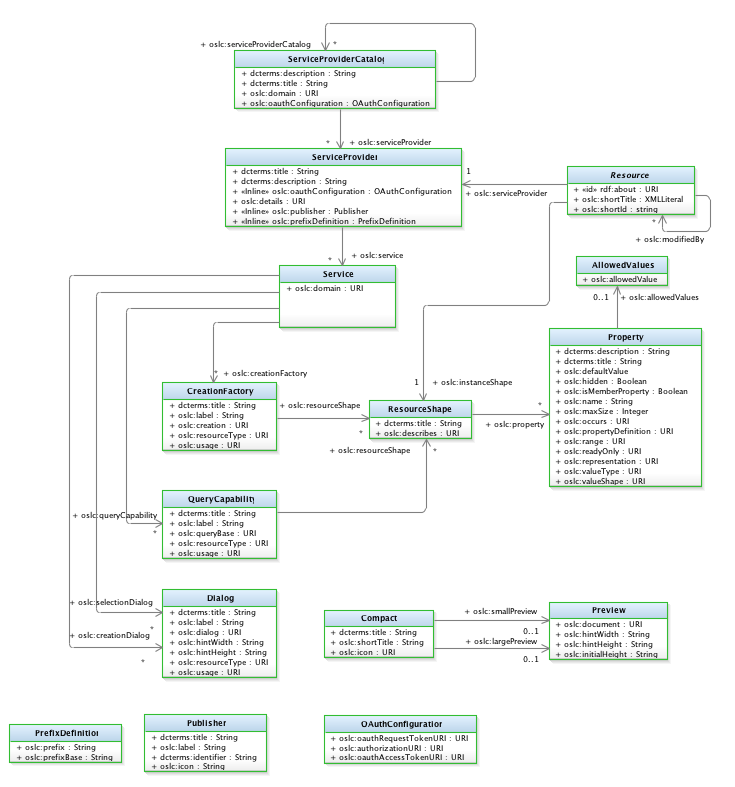

# Artifact Container Associations

OSLC discovery allows a client application to discover the services provided by and OSLC server application. Discovery capabilities include:

* Service Provider Catalog: a list of Service Providers provided by the server. Jazz-apps obtain links to service provider catalogs using the rootservices document (an OSLC extension)
* Service Provider: a container of managed resources accessed through OSLC capabilities. Jazz-app service providers correspond to project areas, the container of managed resources.
* Services: includes creation factory, query capability, delegated creation and selection dialog and resource preview service URLs as shown below

Jazz-apps initiate discovery by adding a friend application. This provides a link to the app's rootservices document which specifies the information needed to establish client/server interactions including:

* Service provider catalogs using oalc_rm:rmServiceProviders, oslc_cm:cmServiceProviders, oslc_am:amServiceProviders for Requirement, Change Request and Architecture Management service providers
* OAuth URLs required to establish OAuth authentication between OSLC client and server applications
* TRS providers

But this isn't enough to be able to create links between resources managed by a server's service providers. Artifact container associations are used to configure a project area for connections with service providers or project areas in another application. This is used in the client applications selection/creation dialog to allow user to select application and artifact container that has the resource to link to or create, based on the chosen link type.  The association describes the relationship i.e. what kind of links can exist between resources managed by the client and server . So when you create a specific link type, the list is scoped based on the associations for that type of relationship.

For iotp-adaptor, the organization as the service provider and users configure the project area to organization association because they are both the unit of user login and authentication.   

Table 1. Associations and links by application

| Application Name | Associations | Links |
| ---------------- | ------------ | ------ |
| Change and Configuration Management | Provides: Implementation Requests Provides: Related Change Requests Provides: Requirements Change Requests | Tracks Requirement Implements Requirement Affects Requirement Related Change Request
| Quality Management | Uses: Defect Uses: Requirement | Test Development Items Validates Requirements |
| DOORS Next Generation | Provides: Related Requirements | References |
