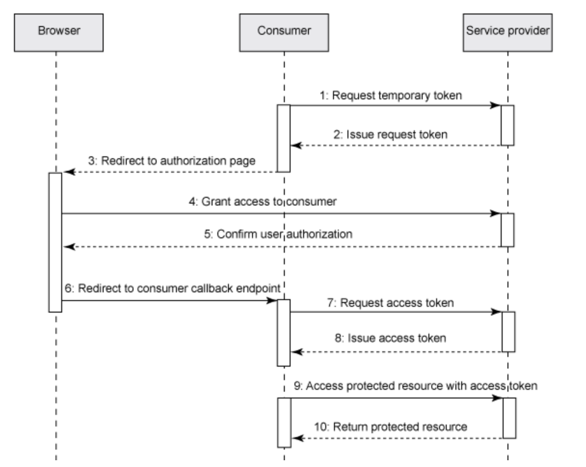

Authentication is used to allow a client to make requests of a server, or to enable servers to interact after approval by an administrator. 

Authorization is based on an HTTP challenge (often 401 Unauthorized) sent by provider to consumer on a request to access protected information. Users are authenticated using their credentials, a user ID and password. 

There are many different user authentication schemes including HTTP Basic, JEE FORM, Kerberos, OAuth, OpenIDConnect (OIDC), etc. In theory any authorization scheme can be used for user/server or consumer/server communication (user/app, app/app). Typically jazz-apps use JEE Form based authentication over SSL to handle user/server authentication and OAuth1.0a for app/app authentication.
  
OAuth is used for server-to-server authentication so that the providing server does not have to expose user credentials to the consuming server. The providing server must establish a consumer key and secret that must be known by the consumer in order to initiate authentication. For the jazz-apps, this is established by adding a friend to the consuming server. The consuming server must obtain a request token and ask the providing server to authenticate it. The providing server then requests the user’s credentials using its user/app authentication scheme, and if successful, provides an access token to the consumer. The consuming app then uses the OAuth Authorization header with the access token to access protected resources.

If SSO is enabled with the Jazz Authorization Server (JAS), then JAS handles all user authorization using OIDC and provides a bearer token that can be used to authenticate any request that is authenticated by the same JAS (OP). In this case, OAuth is not needed, but can still be used, and may be required because some apps do not support OIDC. This may result in additional requests for user credentials.

The jazz.net CE applications establish client/server communication in 2 steps:

1. Creating a relationship at the application/server level ("friendship" or consumer-provider/client-server relationship), which enables the two applications to communicate, and 
1. Creating artifact container associations at the project area level, which for the jazz.net apps specifies for an individual project area which artifact containers (or service providers, often other project areas) on other servers it can access. 

Project area associations are used to establish connections between service providers to enable access through OSLC. These associations are primarily used for creation and selection dialogs, and resource preview, providing the OSLC discovery information the clients need to get the creation and selection dialog URLs, the queryBase URL, etc. This important topic is covered in [Artifact Container Associations](./artifact-container-associations). 

This section deals with authentication in the context of integrating an OSLC server with the jazz.net apps. There are two kinds of authentication to consider:

1. End user to server authentication - typically requests the user's credentials in response to an HTTP authentication challenge
2. Server to server authentication - typically done by adding a friend server and authenticated using OAuth without exposing the user's credentials to the friending server.

Here are some useful links:

* [Authentication of a native client with a Jazz-based application](https://jazz.net/wiki/bin/view/Main/NativeClientAuthentication)
[Jazz Server Authentication Explained](https://jazz.net/library/article/75)
* [Jazz Foundation Core Security](https://jazz.net/wiki/bin/view/Main/JFSCoreSecurity#User_Authentication)
* [Jazz Root Services Specification](https://jazz.net/wiki/bin/view/Main/RootServicesSpec)
* [Authentication of a native client with a Jazz-based application](https://jazz.net/wiki/bin/view/Main/NativeClientAuthentication)
* [Native Client Authentication](https://jazz.net/wiki/bin/view/Main/NativeClientAuthentication)
* [User Authentication for Applications Written with the JAF SDK](https://jazz.net/wiki/bin/view/Main/JAFSdkDelegatingAuth#OAuth)
* [The OAuth Bible](http://oauthbible.com)
* [One-legged OAuth](http://oauthbible.com/#oauth-10a-one-legged) provides quick access to OAuth with some security drawbacks (no user authentication required)
* [Two-legged OAuth](http://oauthbible.com/#oauth-10a-two-legged) follows the OAuth flow but avoids the user authentication step

# Authentication

OSLC servers that wish to integrate with the jazz.net apps should support connections with CE version 5.0.2 and beyond. 5.0.2 is the release designated for longer-term support, it is probably less important to support earlier ones. Therefore integrations should consider support for [OAuth Core 1.0a](https://oauth.net/core/1.0a/). OSLC servers that integrate with the CE servers should assume OAuth 1.0a, and establish the friend relationships using consumer keys provided by your OSLC adaptor/server.

A client or consumer (including OSLC servers acting as clients) - i.e. the application/server making requests like GET, PUT, POST, etc - requires a special consumer key and a "secret" to include with requests in order to authenticate with the server providing the request result.
 
In the CE applications, there are 2 alternatives to establish the friendship:

1) On the server/provider side, the admin creates a consumer key and associated secret.  On the client/consumer side, the admin adds the server/provider as a friend, specifying the key and secret.  A server might use a different consumer key for each unique client relationship, or it might use the same key for multiple clients. 

2) The client app adds the server/provider as a friend, which may create a provisional consumer key and secret. The server (admin) then accepts the provisional consumer key to complete the friendship and authenticate requests from that client. This simplifies the creation of the friend relationship and the required consumer key into more or less a single operation.  

A **Friend** is an application or a Jazz Team Server to which this application is allowed make outbound requests, in order to consume the services provided by the friend server. That is, the friend is a server providing an accepted consumer key and secret for which the consuming application can be an authenticated client.

When a client app has a friend relationship to a server app, it can make requests of that server app, utilizing the agreed upon consumer key for request authentication. These requests are directional - the consumer is the client making the request, and the friend app that provided the consumer key is the server responding to the request. That means the consumer/client can make OSLC creation/selection dialog request, can query resources or GET resource previews of resources managed by the server with the consumer key. Bidirectional server-to-server interactions require a friend to be added to both servers.

A consumer key/secret pair is essentially a login account for an application. If a functional user is associated with the consumer key, consuming apps can use an OAuth Authorization header with the consumer key and secret to access protected resources using [One-legged OAuth](http://oauthbible.com/#oauth-10a-one-legged). The consumer app is interacting as the functional user. Note that the functional user has administration privileges, providing the application with administrative privileges. So the fact that a consumer key can be created via a REST service means there needs to be some protection so the system administrators can confirm that it was really intended to be created, and not created by a hacker or rogue agent. This is why creation of a consumer key requires an administrator to activate a provisional key.

The OAuth spec does not address how client credentials (consumer key and secret) are created, meaning implementations can do whatever they want - it is outside the scope of the specification.

A public key is specified if the client wants to use the RSA-SHA1 signature method (https://tools.ietf.org/html/rfc5849#section-3.4.3). Some may consider that more secure than using a shared secret (and therefore having to store the secret in both the client and the server).

A Trusted consumer key suppresses the confirmation prompt that is normally shown when the user authorizes a request. [https://tools.ietf.org/html/rfc5849#section-2.2](https://tools.ietf.org/html/rfc5849#section-2.2) says "When asking the resource owner to authorize the requested access, the server SHOULD present to the resource owner information about the client requesting access based on the association of the temporary credentials with the client identity", but that would be pretty annoying given the heavy use of OSLC linking that CLM uses, so those prompts can be suppressed for trusted applications.

## What about backlinks? 

If RDNG provides a consumer key for RTC, and RTC has a friend relationship to RDNG using that consumer key [i.e. RTC is an "incoming consumer/client" for DNG], you could create a link from an RTC WorkItem to an RDNG Requirement. But (in a non-config context) this would generally result in a backlink being created in the RDNG Requirement to the RTC WorkItem. 

If RDNG does not have a friend relationship with RTC (and RTC therefore provides no consumer key for RDNG), can this backlink still be created? The backlink is created by doing a POST or PUT from RTC to RDNG, which is fine because RTC has the friend relationship and can make the request with the proper consumer key.

But what can you do with that link in RDNG? Can it be navigated? Does it support resource preview? The link will show up in RDNG as a URL without resource preview, but you can click on the link and navigate to RTC as RTC will redirect the GET on the URL to its web application (if there is no Accept header). Authentication in this case is addressed by the user login, not consumer keys. 

All communication between the CE apps and iotp-adaptor server is one way. The links are all owned by the CE apps, and the iotp-adaptor is a server providing target resources for those links. The iotp-adaptor is never a client of any of the CE apps and cannot store any links to resources in those apps.
 
The iotp-adaptor server needs to be able to provide consumer keys for the CE friend apps. This could be done with a single consumer key that is created by the administrator and used for all client/friend apps. Or the client apps could create provisional keys when creating the friend connection, and these could be automatically accepted and stored in the iotp-adaptor server's consumer store.

# CredentialsFilter and Session Management

The iotp-adaptor server uses a JEE servlet filter to intercept all requests to protected resources. This filter is configured in the application's deployment descriptor (web.xml file):

```
	<filter>
		<display-name>CredentialsFilter</display-name>
		<filter-name>CredentialsFilter</filter-name>
		<filter-class>com.ibm.oslc.adaptor.iotp.impl.CredentialsFilter</filter-class>
	</filter>
	<filter-mapping>
		<filter-name>CredentialsFilter</filter-name>
        <url-pattern>/services/*</url-pattern>
	</filter-mapping>
```
[CredentialsFilter.java](https://github.com/OSLC/iotp-adaptor/blob/master/iotp-adaptor/src/main/java/com/ibm/oslc/adaptor/iotp/impl/CredentialsFilter.java) handles both user and OAuth authentication in its doFilter() method. 

If the request is authenticated with a valid OAuth access token, the request session uses the IoT Platform and Bluemix connectors that were established when the OAuth access token was created. If its not an OAuth request, then HTTP Basic authentication is assumed and the credentials are obtained from the Authorization header and used to login to the IoT Platform and Bluemix. If the user successfully logs in, then the connections are saved in the session for future use, and avoids having repeated logins.

# IoT Platform and Bluemix APIs

IoTPClient.java and BluemixClient.java provide simple convenience APIs that abstract the IoT Platform and Bluemix REST services needed to support iotp-adaptor access needs. It is instances of these classes that are stored in the JEE session and are used by the iotp-adaptorManager for all platform access. Bluemix uses a bearer token for authentication. The Bluemix.login() method logs in the user, establishes the bearer token and uses it for subsequent access. 

IoTPClient.login() uses Cloud Identity Access Management (IAM) to handle login. Cloud IAM requires each application to have a clientId and secret. See [Managing user API keys](https://console.bluemix.net/docs/iam/userid_keys.html#userapikey) for information on how to get an clientId and secret for your application. This information needs to be provided in the src/main/resources/config.properties file. For example:

```
# Cloud IAM application credentials
clientId=iotp-adaptor
secret=C54AB68YA513
```

See [Adoption Application & Quick Start Guide](https://w3-connections.ibm.com/wikis/home?lang=en-us#%21/wiki/38e9d23f-e3d9-4ddd-83a6-1e894ca99766/page/Adoption%20Application%20%26%20Quick%20Start%20Guide) for more information on IBMid.

# OAuth Authentication

Configuring OAuth consumers enables websites or applications (consumers) to access protected resources from a web server (provider) through an API that does not require users to disclose their their service provider credentials to the consumers. The server provides the consumer key which is used by clients to provide authentication tokens for their requests.

In the Web server, create a consumer (inbound) key that can be used to allow consumer applications to access this server.

Adding a friend relationship allows you to specify other OSLC servers with which you want to establish client-to-server communication. Enter the location information of another Jazz Team Server or CLM application and a code phrase to use as the OAuth secret. Then request access to that server to create an OAuth consumer key and store the information in the friends list. After the OAuth key is authorized by the other server (using an administrator's credentials), this server will be able to interact with the other Jazz Team Server or CLM application.

The iotp-connecter server makes use of eclipse/Lyo ConsumersService and OAuthService web apps to provide an implementation of OAuth and to handle prompting for user credentials when needed. These additional REST services are configured in the Application.java file:

```
        // Start of user code Custom Resource Classes
        // OAuth service and Swagger.io service
        try {
			RESOURCE_CLASSES.add(Class.forName("org.eclipse.lyo.server.oauth.webapp.services.ConsumersService"));
	        RESOURCE_CLASSES.add(Class.forName("org.eclipse.lyo.server.oauth.webapp.services.OAuthService"));
	        RESOURCE_CLASSES.add(io.swagger.jaxrs.listing.ApiListingResource.class);
	        RESOURCE_CLASSES.add(io.swagger.jaxrs.listing.SwaggerSerializers.class);
		} catch (ClassNotFoundException e) {
			// TODO Auto-generated catch block
			e.printStackTrace();
		}
        // TRS service	
        RESOURCE_CLASSES.add(TrackedResourceSetService.class);
        
         // trigger Jena init
         ModelFactory.createDefaultModel();
         // force plain XML writer
         RDFWriterFImpl.alternative(null);
        // End of user code
```


## OAuth Server-to-Server Authentication

An OSLC server may need to support connections with CE versions prior to 6.0. To do so they would need to support OAuth 1.0a. CE clients should assume OAuth 1.0a, and establish the friend relationships using consumer keys provided by the iotp-adaptor server.

 Establishing the consumer/friend relationship requires access to a jazz.net root services document that provides the following URLs the friend server is expected to support for OAuth authentication as defined in [Jazz Root Services Specification](https://jazz.net/wiki/bin/view/Main/RootServicesSpec) and documented further in [Jazz Foundation Core Security](https://jazz.net/wiki/bin/view/Main/JFSCoreSecurity):

```
    <jfs:oauthRealmName>Server Provider’s Realm</jfs:oauthRealmName>
    <jfs:oauthDomain>https://ce4iot.rtp.raleigh.ibm.com:9443/iotp</jfs:oauthDomain>
    <jfs:oauthRequestConsumerKeyUrl rdf:resource="https://ce4iot.rtp.raleigh.ibm.com:9443/iotp/services/oauth/requestKey" />
    <jfs:oauthApprovalModuleUrl rdf:resource="https://ce4iot.rtp.raleigh.ibm.com:9443/iotp/services/oauth/approveKey" />
    <jfs:oauthRequestTokenUrl rdf:resource="https://ce4iot.rtp.raleigh.ibm.com:9443/iotp/services/oauth/requestToken"/>
    <jfs:oauthUserAuthorizationUrl rdf:resource="https://ce4iot.rtp.raleigh.ibm.com:9443/iotp/services/oauth/authorize" />
    <jfs:oauthAccessTokenUrl rdf:resource="https://ce4iot.rtp.raleigh.ibm.com:9443/iotp/services/oauth/accessToken"/>
```

This information provides the jazz-based consumer app with the information it needs to execute the OAuth authentication sequence, and provides the service provider consumer key and secret needed to start the sequence.

Consumer keys can have an associated functional user id. If they do, client applications can access protected resources using an Authorization OAuth header containing the consumer key and secret. The functional user’s credentials and licenses are automatically used to authenticate the request. This is not the recommended approach however because all client/server interaction would be based on a single functional user, not the user actually using the system. See [OAuthClient.java](https://github.com/eclipse/lyo.client/blob/master/org.eclipse.lyo.client.java.oauth.sample/src/main/java/org/eclipse/lyo/client/oauth/sample/OAuthClient.java) for an example.

A client (including OSLC servers acting as clients) needs to add a friend relationship with a server it wants to access, and needs a consumer key that can be used to authenticate those requests.

CE apps provide a convenience for creating consumer/friend relationships. A client app can create a friend with a provisional consumer key. The server can then choose to accept the provisional consumer key as a consumer key for authenticating requests from that client. This simplifies the creation of the friend relationship and the required consumer key into more or less a single step.

When a client app has a friend relationship to a server app, it can make requests of that server app, utilizing the agreed upon consumer key and secret for request authentication. These requests are directional - the friend is the client making the request, and the app with the consumer key is the server responding to the request. That means the friend/client can make OSLC creation/selection dialog request, can query resources or get resource previews of resources managed by the server with the consumer key.

[Configuring OAuth consumers](https://jazz.net/help-dev/clm/topic/com.ibm.jazz.repository.web.admin.doc/topics/c_configuring_oauth.html) enables websites or applications (consumers) to access protected resources from a web server (service provider) through an API that does not require users to disclose their their service provider credentials to the consumers. The server provides the consumer key which is used by clients to provide authentication tokens for their requests.

In the Web server, create a consumer (inbound) key that can be used to allow consumer applications to access this server.

Adding a friend relationship allows you to specify other Jazz-based servers with which you want to establish client-to-server communication. Enter the location information of another Jazz Team Server or CLM application and a code phrase to use as the OAuth secret. Then request access to that server to create an OAuth consumer key and store the information in the friends list. After the OAuth key is authorized by the other server, this server will be able to interact with the other Jazz Team Server or CLM application.

All communication between the CE apps and an OSLC server is one way. The links may be all owned by the CE apps, and the OSLC server is a server providing those links. The OSLC server may not be a client of any of the CE apps and need not store any links to resources in those apps.
 
An OSLC server will need to be able to provide consumer keys for the CE friend apps. This could be done with a single consumer key that is created by the administrator and used for all client/friend apps. Or the client apps could create provisional keys when creating the friend connection, and these could be automatically accepted and stored in the OSLC server, perhaps in encrypted in an OAuth consumer store such as [oauth-consumer-store](https://github.com/eclipse/lyo.server/tree/master/org.eclipse.lyo.server.oauth.consumerstore) provided by eclipse/Lyo.

To determine how your OSLC server needs to interact with the CE apps, explore the connection between RDNG and RTC, and duplicate that.

RTC server provides a consumer key for client/friend RDNG - RNDG can create links to RTC work items. The consumer/friend relationship allows the servers to communicate but the ability to consume is directional.

## OAuth Notes

This section provides some additional notes on OAuth. 

OAuth provides an authentication mechanism for a consumer to access a service without exposing the user’s service credentials to the consumer application.

* Service Provider: A web application that allows access via OAuth.
* User: An individual who has an account with the Service Provider.
* Consumer: A website or application that uses OAuth to access the Service Provider on behalf of the User.
* Protected Resource(s): Data controlled by the Service Provider, which the Consumer can access through authentication.
* Consumer Developer: An individual or organization that implements a Consumer.
* Consumer Key: A value used by the Consumer to identify itself to the Service Provider.
* Consumer Secret: A secret used by the Consumer to establish ownership of the Consumer Key.
* Request Token: A value used by the Consumer to obtain authorization from the User, and exchanged for an Access Token.
* Access Token: A value used by the Consumer to gain access to the Protected Resources on behalf of the User, instead of using the User's Service Provider credentials.
* Token Secret: A secret used by the Consumer to establish ownership of a given Token.
* OAuth Protocol Parameters: Parameters with names beginning with oauth_.

Consumer uses a Consumer Key and Consumer Secret to authenticate the Consumer with the Service Provider in order to provide access the service, instead of using a User’s credentials directly. 

OAuth defines three request URLs:

1. Request Token URL: The URL used to obtain an unauthorized Request Token, described in Section 6.1.
1. User Authorization URL: The URL used to obtain User authorization for Consumer access, described in Section 6.2.
1. Access Token URL: The URL used to exchange the User-authorized Request Token for an Access Token, described in Section 6.3.

The three URLs MUST include scheme, authority (host), and path

Service Provider:

* enable Consumer Developers to establish Consumer Key and Consumer Secret - jazz.net apps provide an admin page where an administrator can create trusted consumer keys with a secret and functional user id.
* The URLs the Consumer will use when making OAuth requests, and the HTTP methods (i.e. GET, POST, etc.) used in the Request Token URL and Access Token URL. - specified in Jazz Root Services Specification
* Signature methods supported by the Service Provider.
* Any additional request parameters that the Service Provider requires in order to obtain a Token. Service Provider specific parameters MUST NOT begin with oauth_.
* Sends OAuth response parameters in entity response body as encoded name=value pairs separated by &

Consumer:

* Must have access to a Consumer Key and Secret
* Must encode all parameter names and values
* Sends OAuth Protocol Parameters to the Service Provider in one of three methods:
    1. HTTP Authorization Header as defined in OAuth HTTP Authorization Scheme
    2. POST entity request body with content-type: application/x-www-form-urlencoded
    3. URL query parameters

Authorization Header:
		Authorization: OAuth realm="http://sp.example.com/",
               oauth_consumer_key="0685bd9184jfhq22",
               oauth_token="ad180jjd733klru7",
               oauth_signature_method="HMAC-SHA1",
               oauth_signature="wOJIO9A2W5mFwDgiDvZbTSMK%2FPY%3D",
               oauth_timestamp="137131200",
               oauth_nonce="4572616e48616d6d65724c61686176",
               oauth_version="1.0"

### Authenticating with OAuth

The OAuth authentication sequence show show the consumer and service provider interact in order to authenticate a request.



The **Request Token** is used by the Consumer to ask the User to authorize access to the Protected Resources. The User-authorized Request Token is exchanged for an Access Token, MUST only be used once, and MUST NOT be used for any other purpose. It is RECOMMENDED that Request Tokens have a limited lifetime.

The **Access Token** is used by the Consumer to access the Protected Resources on behalf of the User. Access Tokens MAY limit access to certain Protected Resources, and MAY have a limited lifetime. Service Providers SHOULD allow Users to revoke Access Tokens. Only the Access Token SHALL be used to access the Protect Resources.

OAuth Authentication is done in following steps:

1. The consumer requests a temporary token for the OAuth handshake. This token is used to maintain the handshake session.
2. After validating the consumer, the service provider issues a short-term request token.
3. The consumer sends an HTTP redirect response to the user's browser and leads the user to the service provider for authorization.
4. The user reviews the authorization request and grants access to the consumer on the service provider site if he trusts the consumer.
5. The service provider confirms the authorization and sends an HTTP redirect response to the user's browser.
6. The user's browser is redirected to the consumer's callback URL, where the consumer can complete the remaining part of the handshake.
7. The consumer requests the access token from the service provider with a verifier passed in the previous step.
8. Upon successful validation, the service provider issues the access token to access the protected resources.
9. After the OAuth handshake completes, the access token is issued and the consumer can use the access token to access the protected resources on behalf of the user.
10. The service provider validates each incoming OAuth request and returns the protected resources if the consumer is authorized.1: Obtaining the Unauthorized Request Token

