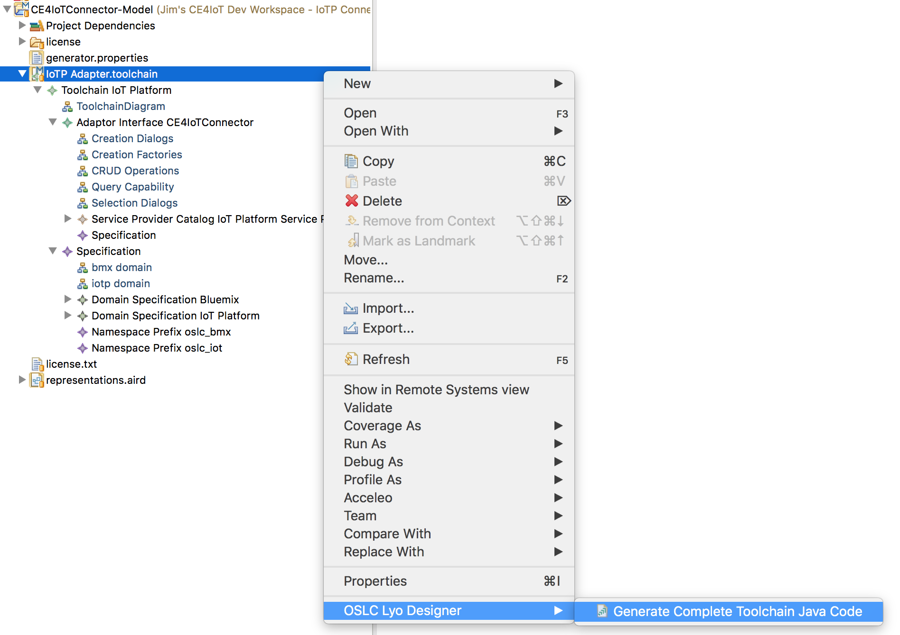
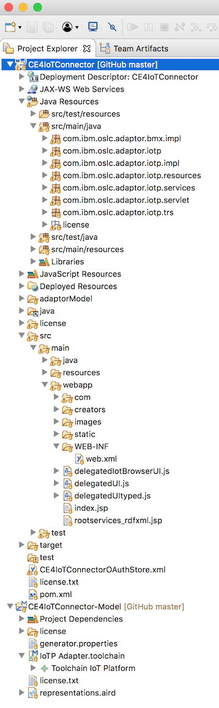

# Code Generator

## Generating the iotp-adaptor Implementation

Select the IoTP Adapter toolchain, right click and invoke OSLC Lyo Designer > Generate Complete Toolchain Java Code: 



The code generator will popup a dialog and ask you to select the target folder to generate into. Select the iotp-adaptor eclipse maven project and click OK.

The code will be generated in the iotp-adaptor project using the following folder/package structure:



We'll be exploring this code in [Exploring the generated code](./exploring-the-code). The rest of this document covers some additional things that are needed after the first generation in order to support integration with the CE jazz.net apps.

## Add the OAuth REST Service

Integration with the jazz.net apps requires first adding a friend server to the jazz.net app in order to:

1. Establish a secure connection between the servers so they can send and receive HTTP requests
2. Tell the CE jazz.net apps the URLs of the ServiceProviderCatalog and TRS provider resources. This is done in the rootservices document which is covered further in [Creating the rootservices document](./rootservices).

The CE jazz.net applications support a number of approaches to  establishing secure connections between servers. This important, and often challenging topic is covered in further detail in [Authentication](authentication). 

iotp-adaptor uses [OAuth1.0a](https://oauth.net/core/1.0a/) as the mechanism for establishing secure connections with the CE jazz.net apps because that's what's supported by eclipse/Lyo OSLC4J, and that's what's commonly configured for CE and other OSLC server installations. 

To add JAX-RS REST services for OAuth1.0a and the iotp-adaptor TRS provider, edit com.ibm.oslc.applicaiton.iotp.servlet/Application.java and add the following user code. Be sure any code you customize is inside Start of user code and End of user code comments:

```
        RESOURCE_CLASSES.add(ResourceShapeService.class);

        // Start of user code Custom Resource Classes
        // OAuth service and Swagger.io service
        try {
            RESOURCE_CLASSES.add(Class.forName("org.eclipse.lyo.server.oauth.webapp.services.ConsumersService"));
            RESOURCE_CLASSES.add(Class.forName("org.eclipse.lyo.server.oauth.webapp.services.OAuthService"));
            RESOURCE_CLASSES.add(io.swagger.jaxrs.listing.ApiListingResource.class);
            RESOURCE_CLASSES.add(io.swagger.jaxrs.listing.SwaggerSerializers.class);
        } catch (ClassNotFoundException e) {
            // TODO Auto-generated catch block
            e.printStackTrace();
        }
        // TRS service  
        RESOURCE_CLASSES.add(TrackedResourceSetService.class);
        
         // trigger Jena init
         ModelFactory.createDefaultModel();
         // force plain XML writer
         RDFWriterFImpl.alternative(null);
        // End of user code
```

The OAuth classes have to be added by name instead of through imports because they are defined in a separate, reusable Web application WAR file, not a Java JAR file.

***Important***: When eclipse/Lyo OSLC4J updated to Apache Jena 3, the behavior of the serialization of RDF/XML changed in a way that cannot be consumed by the jazz.net apps. You'll notice this if the jazz.net apps can't read your server provider catalogs, even though the RDF/XML looks completely correct. RDF/XML can have many valid, but syntactically different formats. The following statements configre Jena 3 to use RDF/XML serialization formats that can be consumed by the jazz.net apps (which are still using an earlier version of Jena).

```
         // trigger Jena init
         ModelFactory.createDefaultModel();
         // force plain XML writer
         RDFWriterFImpl.alternative(null);
```

You are now ready to implement each of the domain classes. Details are provided in [Implementing a Domain Class](./implement-domain-class). But first, there's a few details about the code generator that need to be understood in terms of generated vs. user code.

## Adding User Code to Generated Classes and JSPs

The Lyo Designer M2T templates contain markers that indicate where users or developers can add code to customize or complete the implementation of generated modules. When the code generator runs, these markers are added as structured comments in the generated code to indicate the boundaries where developers can add additional or customized code. For example, here's the generated code for the getDeviceType method that is generated in the iotp-adaptorManager.java file:

```
    public static DeviceType getDeviceType(HttpServletRequest httpServletRequest, final String iotId, final String deviceTypeId)
    {
        DeviceType aResource = null;
        // Start of user code getDeviceType
        // TODO Implement code to create a DeviceType        
        // End of user code
        return aResource;
    }
```
These generated TODO comments will show up as java Task elements in the eclipse Markers view. Developers will replace these TODO comments with the actual implementing code. For example, here's the implementation for getDeviceType:

```
    public static DeviceType getDeviceType(HttpServletRequest httpServletRequest, final String iotId, final String deviceTypeId)
    {
        DeviceType aResource = null;
        
        // Start of user code getDeviceType
		try {
			if (deviceTypeId == null) {
				throw new Exception("Device ID must not be null");
			}
			final IotpServiceProviderInfo info = IoTAPIImplementation.getIotpServiceProviderInfo(httpServletRequest, iotId);
			IoTPClient client = (IoTPClient)httpServletRequest.getSession().getAttribute(IoTPClient.IOTPCLIENT_ATTRIBUTE);
			String uri = "device/types/" + deviceTypeId;
			JsonElement deviceType = client.readIoTResource(info.name, uri);
			if (deviceType == null) return aResource;
			// Also get the draft serviceInterface and logicalInterfaces
			JsonElement physicalInterface = client.readIoTResource(info.name, "draft/"+uri+"/physicalinterface");
			JsonElement logicalInterfaces = client.readIoTResource(info.name, "draft/"+uri+"/logicalinterfaces");
			aResource = new DeviceType(httpServletRequest, info, deviceTypeId, deviceType, physicalInterface, logicalInterfaces);
		} catch (Exception e) {
			e.printStackTrace();
			throw new WebApplicationException(e, Status.INTERNAL_SERVER_ERROR);
		}
        // End of user code
        return aResource;
    }
```

The following guidelines should be carefully followed for any code that was generated by any [eclipse Modeling M2T](https://www.google.com/url?sa=t&rct=j&q=&esrc=s&source=web&cd=1&cad=rja&uact=8&ved=0ahUKEwigxoT1yabaAhWvtlkKHR84BjwQFggpMAA&url=https%3A%2F%2Fwww.eclipse.org%2Fmodeling%2Fm2t%2F&usg=AOvVaw0DTaDfGB_DiZD-YDwvKIW0) - based code generator, including Lyo Designer. If these guidelines are not followed, it is very likely that regenerating the code will loose changes and result in defects that are difficult to detect.

√ Recognize files that were generated by Lyo Designer by the following text at the end of the copyright notice at the beginning of the source file:
` * This file is generated by org.eclipse.lyo.oslc4j.codegenerator`

√ Only change code inside protected user code regions that were generated by Lyo Designer
For example:

```
    // Start of user code class_attributes
    // End of user code
```

Any code changes you make outside these protected regions will be lost when the code is regenerated. This includes the addition of new variables or methods.

√ Never add your own protected regions in the source code. They will be lost on regeneration, just like any other changes made outside protected regions. The only way additional protected regions can be added to a source file is through changes in the Lyo Designer .m2t templates. Create a bug on [Lyo Tools](https://bugs.eclipse.org/bugs/enter_bug.cgi?product=Lyo) if needed. 

√ Don't make any changes to code outside protected regions, including deleting code. These changes will be lost on regeneration.

√ Never use the Java editor Source > Organize Imports function, or any other function that automatically adds code to the source file. This will surely create issues with code changes outside protected user code regions.

√ Lyo Designer will attempt to identify and preserve protected user code if regenerating the code results in deletion of the user code.

For example, say you had user code in the body of a method. If you change something in the model so that method is renamed (this happens a lot), then Lyo Designer will notice that there was protected user code in the method that is going to be deleted and will preserve the content in a <file>.java.lost text file. You can use these files to recover the user code, and copy and past the code into the new, renamed method.

√ Lyo Designer adds `// TODO` comments in protected user code areas that typically require additional information. Search for these or explore the eclipse Markers view, Java Tasks, to ensure you have completed the implementation of the generated code.

## Recovering lost code

Sometimes changes to the model will result in renaming a class or method, or the name of a generated method will change because of a change in the Adaptor Interfaces. In this case the Lyo Designer code generator will detect that some code may be lost and will generate a special text file called {Java class name}.java.lost.

This file will contain all the generated comment markers and user code that was lost. You should examine these files carefully after code generation, and copy the lost code into the appropriate place in the newly generated code. 

Be sure to delete these files after you have addressed any lost user code so they don't get stored in the SCM system or get overwritten with a new code generation before you have processed them.

## Regenerating Code

Sometimes you might want to remove any changes you have made and start over with a freshly generated file. This is common for generated JSP pages. Since its hard to predict the exact style, format and content of JSP pages that are generated for creation and selection dialogs, as well as small and large preview dialogs. Almost all of these JSP pages are inside protected user code. So if you change something in the model that would require these JSP pages to be completely regenerated, you can simply delete the files and let the generator re-create them. Otherwise the generator will see that whole file as protected and not change anything.

## Cleaning up Orphaned source files

Sometimes when resources are renamed or deleted, Java and JSP files might be left laying around. The Lyo Designer code generator never deletes any files. These need to be manually cleaned up.

It can be hard to detect these files because of somewhat long and complex file names. One easy way to find them is to list the files (`ls -t` or `ls -lrth`) sorted by date, or examine their date property in the eclipse properties view. The ones that have dates older than the most recent code generation are the orphaned files that can/should be deleted.
