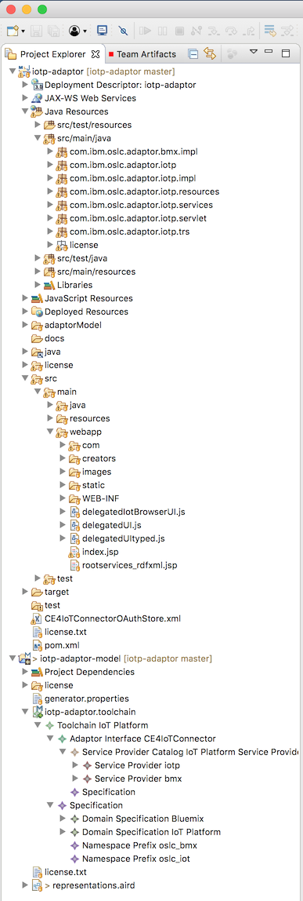

# Exploring the generated code

This section explores the iotp-adaptor code generated by Lyo Designer, and provides details on completing the implementation. 

## Overall architecture and packaging

The Lyo Designer code generator generates code into a given folder, it does not generate a complete JEE project. So before using Lyo Designer to generate the code, you need to create the folder and overall structure of a JEE dynamic web application. See [eclipse project](https://github.com/eclipse/lyo.designer/wiki/User-Manual-for-Domain-Specification-Modelling#create-a-modelling-project) for details on how to setup a suitable eclipse project.

Here's the overall structure of the iotp-adaptor eclipse project:



## Web application and servlets

The iotp-adaptor is a JEE dynamic web application that utilizes the eclipse/Lyo OSLC4J SDK. Much of the web application is provided through some key servlets:

* Application - The javax.ws.rs.Application used by the Wink RestServlet to provide the REST services
* BmxServiceProvidersFactory - servlet providing the IBM Cloud (formerly Bluemix) service providers, corresponding to the IBM Cloud organizations
* IotpServiceProvidersFactory - servlet providing the IBM Watson IoT Platform service providers, corresponding to the Watson IoT Platform organizations
* ServiceProviderCatalogSingleton - servlet providing the service provider catalog that includes the IoT Platform and Bluemix service providers
* ServletListner - handles events in the web application container
* RootServicesService - provides the rootservices resource needed to integrate iotp-adaptor with the jazz-apps.

The web application is defined in the web.xml deployment descriptor. There are a few application parameters that should be set in the deployment descriptor including the URL scheme, port and application base URL.

```
  <context-param>
    <description>Scheme used for URI when registering ServiceProvider.  Can be overridden by System property of the same name.</description>
    <param-name>com.ibm.oslc.adaptor.iotp.servlet.scheme</param-name>
    <param-value>https</param-value>
  </context-param>
  <context-param>
    <description>Base URI for the adaptor.</description>
    <param-name>com.ibm.oslc.adaptor.iotp.servlet.baseurl</param-name>
    <param-value>https://rlia4iot.raleigh.ibm.com:9443</param-value>
  </context-param>
  <context-param>
    <description>Port used for URI when registering ServiceProvider.  Can be overridden by System property of the same name.</description>
    <param-name>com.ibm.oslc.adaptor.iotp.servlet.port</param-name>
    <param-value>9443</param-value>
  </context-param>
```

OSLC4J and therefore iotp-adaptor, use JAX-RS and Apache Wink to implement RESTful web services. These elements in the web.xml deployment descriptor establish the base web application.

```
  <servlet>
    <description>JAX-RS Tools Generated - Do not modify</description>
    <servlet-name>JAX-RS Servlet</servlet-name>
    <servlet-class>org.apache.wink.server.internal.servlet.RestServlet</servlet-class>
    <init-param>
      <param-name>javax.ws.rs.Application</param-name>
      <param-value>com.ibm.oslc.adaptor.iotp.servlet.Application</param-value>
    </init-param>
    <load-on-startup>1</load-on-startup>
  </servlet>
```

All of the generated web services are mapped to the JAX-RS servlet using the /services/* URL pattern:

```
  <servlet-mapping>
    <servlet-name>JAX-RS Servlet</servlet-name>
    <url-pattern>/services/*</url-pattern>
  </servlet-mapping>
```

In order to integrate with the CE jazz-apps, it iotp-adaptor needs to include a rootservices document. This is added to the web.xml file using the RootServicesService servlet.

```
  <servlet>
    <servlet-name>RootServicesService</servlet-name>
    <servlet-class>com.ibm.oslc.adaptor.iotp.impl.RootServicesService</servlet-class>
  </servlet>
  <servlet-mapping>
    <servlet-name>RootServicesService</servlet-name>
    <url-pattern>/rootservices</url-pattern>
  </servlet-mapping>
```

In order to support authentication, all service requests are directed through the CredentialsFilter. This servlet filter handles all the authorization challenges by delegating to the Watson IoT Platform. I also handles an OAuth1.0a authentication requests that come from the OSLC4J oauth-webapp.

```
  <filter>
    <display-name>CredentialsFilter</display-name>
    <filter-name>CredentialsFilter</filter-name>
    <filter-class>com.ibm.oslc.adaptor.iotp.impl.CredentialsFilter</filter-class>
  </filter>
  <filter-mapping>
    <filter-name>CredentialsFilter</filter-name>
    <url-pattern>/services/*</url-pattern>
  </filter-mapping>
  <servlet>
```

### Application.java

There are some additional application features that are added to the com.ibm.oslc.adaptor.iotp.servlet.Application class. These web application features include:

* OAuth1.0a authentication using OSLC4J oauth-webapp
* The iotp-adaptor TRS provider service
* Swagger.io services

```
        // Start of user code Custom Resource Classes
        // OAuth service and Swagger.io service
        try {
			RESOURCE_CLASSES.add(Class.forName("org.eclipse.lyo.server.oauth.webapp.services.ConsumersService"));
	        RESOURCE_CLASSES.add(Class.forName("org.eclipse.lyo.server.oauth.webapp.services.OAuthService"));
	        RESOURCE_CLASSES.add(io.swagger.jaxrs.listing.ApiListingResource.class);
	        RESOURCE_CLASSES.add(io.swagger.jaxrs.listing.SwaggerSerializers.class);
		} catch (ClassNotFoundException e) {
			// TODO Auto-generated catch block
			e.printStackTrace();
		}
        // TRS service	
        RESOURCE_CLASSES.add(TrackedResourceSetService.class);
        
         // trigger Jena init
         ModelFactory.createDefaultModel();
         // force plain XML writer
         RDFWriterFImpl.alternative(null);
        // End of user code
```
The iotp-adaptor also provides support for accessing a Swagger.io interface for the JAX-RS RESTful web services using the @Api annotation. See [OpenApi/Swagger Support](https://wiki.eclipse.org/Lyo/creating_OSLC4J_project#Access_the_Swagger_Documentation) for how to configure your OSLC adaptor for Swagger.io support.

These additional services are available at the following URLs:

* OAuth Administration: `https://rlia4iot.raleigh.ibm.com:9443/iotp/services/oauth/admin`, you can manage consumer keys here.
* TRS Provider: https://rlia4iot.raleigh.ibm.com:9443/iotp/services/trs
* Swagger.io: https://rlia4iot.raleigh.ibm.com:9443/iotp/swagger-ui/

## Services

Most of the REST services are defined in a set of generate services classes.

* BluemixService - provides the basic CRUD and query REST services on Bluemix resources (e.g., Node-RED flows)
* BluemixSerivceProviderServices - provides the REST services for the Bluemix ServiceProviders (based on the organizations)
* IoTPlatformService - provides the basic CRUD and query REST services on IoT Platform resources (e.g., DeviceType, Device, etc.)
* IoTPlatformSerivceProviderServices - provides the REST services for the IoT Platform ServiceProviders (based on the organizations)
* ResourceShapeService - provides the REST services for accessing all the domain class resource shapes
* ServiceProviderCatalogService - provides the REST service to access the ServiceProviderCatalog which includes the Bluemix and IoT Platform ServiceProviders.

## Resource classes

All the iotp-adaptor resources are generated into the com.ibm.oslc.adaptor.iotp.resources package. These classes provide the interface and implementation of all the bmx and iotp domain classes. See [Implementing a Domain Class](./implement-domain-class) for details on what additional development needs to be done to complete the domain class implementations.

## The CE4IoTConnectorManager

The CE4IoTConnectorManager class is where most of adaptor code is implemented. The stubbed methods generated in this class define the low-level CRUD operations used to implement the REST services. There is a set of method created for each domain class to create, get, update, delete and query instances of that class. See [Implementing a Domain Class](./implement-domain-class) for details on how these methods are implemented using the IoT Platform and Bluemix REST APIs.

## Other Implementation Classes

There are a number of other classes that implement capabilities needed by CE4IoTConnectorManager. These are summarized briefly here. See the source code for details.

| Class | Description |
| ----- | ----------- |
| BmxServiceproviderInfo | Specifies the information needed in a Bluemix service provider: its name, id, and organization id. |
| IotpServiceproviderInfo | Specifies the information needed in a IoT Platform service provider: its name, id, platform base, api version, etc. |
| Credentials | provides the user's credentials, their name and password |
| CredentialsFilter | the servlet filter class that handles user and OAuth authentication |
| HttpUtils | Provides some HTTP utilities that facilitate user authorization including getting credentials and sending unauthorized responses |
| IoTPAPIImpelementation | Implements methods to create service provider info instances (described above) from the Bluemix and IoT platform organizations the user is a member of |
| IoTPClient | provides a minimal Java API for logging into the Watson IoT Platform and doing CRUD operations on platform resources using the IoT Platform REST APIs. |
| RootServicesService | A servlet that implements the rootservices resource needed to integrate with the IBM jazz-apps |


