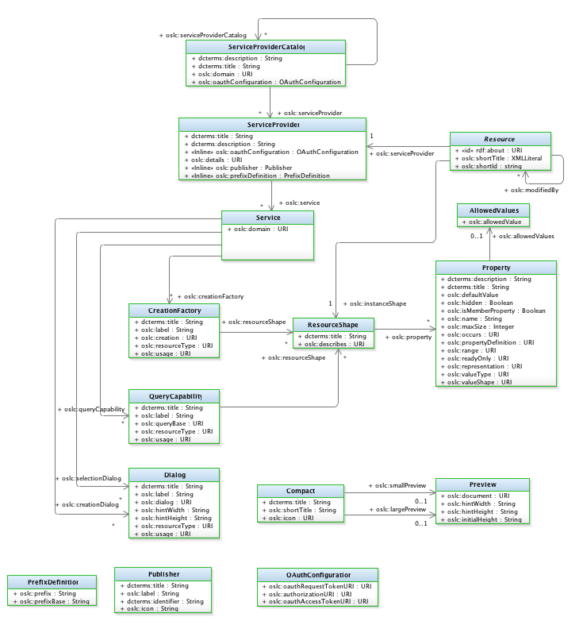

All the jazz.net application provide and expect a `rootservices` resource that provides some initial configuration and discovery information the applications need to function, and to integrate with other applications. See the [Root Services Specification](https://jazz.net/wiki/bin/view/Main/RootServicesSpec) for details. Note that access to this specification requires jazz.net login. There is no RDF or OWL vocabulary at http://jazz.net/ns for rootserices documents.  

The URL for the rootservices document has to be provided when adding a Friend to an consuming jazz.net application. This rootservices document provide the information the consuming server needs in order to use OSLC services provided by the server.

CE4IoTConnector, and other servers that want to integrate with the jazz.net apps need to provide at least three categories of information:

1. The URLs to the provided service provider catalog - for artifact container associations
2. The OAuth authentication URLs - for OAuth authentication when adding a friend
3. The TRS provider - for adding LQE data sources

## Sample CE4IoTConnector rootservices resource

Here's a sample of the CE4IoTConnector rootservices document, and a sample of the minimum information a server needs to provide for the jazz.net apps to be able to integrate with them:

```
<?xml version="1.0" encoding="UTF-8"?>
<rdf:Description rdf:about="https://ce4iot.rtp.raleigh.ibm.com:9443/iotp/rootservices"
    xmlns:iotp="http://jazz.net/ns/iot#"
    xmlns:bmx="http://jazz.net/ns/bmx#"
    xmlns:oslc="http://open-services.net/ns/core#"
    xmlns:oslc_am="http://open-services.net/ns/am#"
    xmlns:oslc_rm="http://open-services.net/xmlns/rm/1.0/"
    xmlns:oslc_cm="http://open-services.net/xmlns/cm/1.0/"
    xmlns:trs="http://open-services.net/ns/core/trs#"
    xmlns:dc="http://purl.org/dc/terms/"
    xmlns:jfs="http://jazz.net/xmlns/prod/jazz/jfs/1.0/" 
    xmlns:rdf="http://www.w3.org/1999/02/22-rdf-syntax-ns#">
	
    <dc:title>OSLC AM CE4IoTConnector Jazz Root Services</dc:title>
    
    <!-- OAuth URLs for establishing server-to-server connections -->
    <jfs:oauthRealmName>IoTPlatform</jfs:oauthRealmName>
    <jfs:oauthDomain>https://ce4iot.rtp.raleigh.ibm.com:9443/iotp</jfs:oauthDomain>
    <jfs:oauthRequestConsumerKeyUrl rdf:resource="https://ce4iot.rtp.raleigh.ibm.com:9443/iotp/services/oauth/requestKey" />
    <jfs:oauthApprovalModuleUrl rdf:resource="https://ce4iot.rtp.raleigh.ibm.com:9443/iotp/services/oauth/approveKey" />
    <jfs:oauthRequestTokenUrl rdf:resource="https://ce4iot.rtp.raleigh.ibm.com:9443/iotp/services/oauth/requestToken"/>
    <jfs:oauthUserAuthorizationUrl rdf:resource="https://ce4iot.rtp.raleigh.ibm.com:9443/iotp/services/oauth/authorize" />
    <jfs:oauthAccessTokenUrl rdf:resource="https://ce4iot.rtp.raleigh.ibm.com:9443/iotp/services/oauth/accessToken"/>

	<!-- Service Providers - ServiceProviderCatalog URLs for each domain -->
    <oslc_am:amServiceProviders rdf:resource="https://ce4iot.rtp.raleigh.ibm.com:9443/iotp/services/catalog/singleton" />
    <oslc_rm:rmServiceProviders rdf:resource="https://ce4iot.rtp.raleigh.ibm.com:9443/iotp/services/catalog/singleton" />
    <oslc_cm:cmServiceProviders rdf:resource="https://ce4iot.rtp.raleigh.ibm.com:9443/iotp/services/catalog/singleton" />

    <!-- IoT Platform Tracked Resource Set Provider -->
    <iotp:trackedResourceSetProvider>
        <trs:TrackedResourceSetProvider>
            <trs:trackedResourceSet rdf:resource="https://ce4iot.rtp.raleigh.ibm.com:9443/iotp/services/trs" />
            <dc:title>TRS 2.0 for IoT Platform Resources</dc:title>
            <dc:description>TRS 2.0 feed for IoT Platform resources</dc:description>
            <dc:type     rdf:resource="http://open-services.net/ns/cm#" />
            <oslc:domain rdf:resource="http://open-services.net/ns/cm#" />
            <oslc:domain rdf:resource="http://open-services.net/ns/am#" />
        </trs:TrackedResourceSetProvider>
    </iotp:trackedResourceSetProvider>
</rdf:Description>
```

## OAuth Authentication

The rootservices document is an unprotected resource, a resource that does not require authentication in order to be accessed. The reason for this is that the URLs for the OAuth authentication sequence must be accessible, and so these are provided in an unprotected resource.

The [OAuth1.0a](https://oauth.net/core/1.0a/) sequence requires a set of URLs that the server provides and clients use to authenticate communication. The names of the properties in the rootservices resource correspond closely to their names in the OAuth1.0a protocol.

```
    <jfs:oauthRealmName>IoTPlatform</jfs:oauthRealmName>
    <jfs:oauthDomain>https://ce4iot.rtp.raleigh.ibm.com:9443/iotp</jfs:oauthDomain>
    <jfs:oauthRequestConsumerKeyUrl rdf:resource="https://ce4iot.rtp.raleigh.ibm.com:9443/iotp/services/oauth/requestKey" />
    <jfs:oauthApprovalModuleUrl rdf:resource="https://ce4iot.rtp.raleigh.ibm.com:9443/iotp/services/oauth/approveKey" />
    <jfs:oauthRequestTokenUrl rdf:resource="https://ce4iot.rtp.raleigh.ibm.com:9443/iotp/services/oauth/requestToken"/>
    <jfs:oauthUserAuthorizationUrl rdf:resource="https://ce4iot.rtp.raleigh.ibm.com:9443/iotp/services/oauth/authorize" />
    <jfs:oauthAccessTokenUrl rdf:resource="https://ce4iot.rtp.raleigh.ibm.com:9443/iotp/services/oauth/accessToken"/>
```

## Service Providers

Once the consumer app has successfully added, authenticated and accepted the provisional consumer key, the jazz.net applications can now communicate with the CE4IoTConnector server. But in order for the consumer to use any of the server's OSLC services, it needs to discover what services are provided and get the URLs used to access the services. 

The rootservices document defines a number of service providers for this purpose, each of which provides the URL to the ServiceProviderCatalog for a given set of domain services.

```
    <oslc_am:amServiceProviders rdf:resource="https://ce4iot.rtp.raleigh.ibm.com:9443/iotp/services/catalog/singleton" />
    <oslc_rm:rmServiceProviders rdf:resource="https://ce4iot.rtp.raleigh.ibm.com:9443/iotp/services/catalog/singleton" />
    <oslc_cm:cmServiceProviders rdf:resource="https://ce4iot.rtp.raleigh.ibm.com:9443/iotp/services/catalog/singleton" />
```

CE4IoTConnector resources are all modeled to be subclasses of oslc_am:Resource, but are "marked" to masquerade as oslc_rm:Requirement and oslc_cm:ChangeRequest in order to be able to participate as link targets to standard OSLC domain link types supported by the jazz.net applications. See [The toolchain model](./toolchain-model) for details.

The service provider catalog URLs are used to access OSLC discovery resources to so the client can discover what OSLC services are available, and at what URL.



## TRS Provider

The rootservices document also provides discovery information for the Tracked Resource Sets (TRS) the server provides. Each TRS provides the following information as defined in the [OSLC Tracked Resource Set Specification](http://open-services.net/wiki/core/TrackedResourceSet-2.0/):

* trackedResourceSet: The base URL for accessing the TRS base resources and changeLog.
* title: the title of the TRS provider, shown in the LQE data source views
* type: the type of the TRS resources
* domain: the OSLC domain(s) of the TRS resources

The CE4IoTConnector provides a simple TRS provider for AM and CM resources:

```
    <iotp:trackedResourceSetProvider>
        <trs:TrackedResourceSetProvider>
            <trs:trackedResourceSet rdf:resource="https://ce4iot.rtp.raleigh.ibm.com:9443/iotp/services/trs" />
            <dc:title>TRS 2.0 for IoT Platform Resources</dc:title>
            <dc:description>TRS 2.0 feed for IoT Platform resources</dc:description>
            <dc:type     rdf:resource="http://open-services.net/ns/cm#" />
            <oslc:domain rdf:resource="http://open-services.net/ns/cm#" />
            <oslc:domain rdf:resource="http://open-services.net/ns/am#" />
        </trs:TrackedResourceSetProvider>
    </iotp:trackedResourceSetProvider>
</rdf:Description>
```

## Implementing the rootservices Document

The CE4IoTConnector rootservices resource is provided the RootServicesService servlet which sets some request attributes and the dispatches to `/rootservices_rdfxml.jsp`. The URL to the RootServicesServices servlet is specified in the web.xml file. By convention the URL is the base URL of the server followed by `/rootservices`.

```
	<servlet>
		<servlet-name>RootServicesService</servlet-name>
		<servlet-class>com.ibm.oslc.adaptor.iotp.impl.RootServicesService</servlet-class>
	</servlet>
	<servlet-mapping>
		<servlet-name>RootServicesService</servlet-name>
		<url-pattern>/rootservices</url-pattern>
	</servlet-mapping>
```

The `/rootservices_rdfxml.jsp` file is a simple JSP page that uses the request attributes set by the servlet and then simply outputs the RDF/XML directly.

```
<%@ page contentType="application/rdf+xml" language="java" pageEncoding="UTF-8" %>
<%
String baseUri = (String) request.getAttribute("baseUri");
String catalogUri = (String) request.getAttribute("catalogUri");
String oauthDomain = (String) request.getAttribute("oauthDomain");
String about = (String) request.getAttribute("about");
%>
<rdf:Description rdf:about="<%= about %>"
    xmlns:iotp="http://jazz.net/ns/dm/iotp#"
    xmlns:oslc_am="http://open-services.net/ns/am#"
    xmlns:oslc_rm="http://open-services.net/xmlns/rm/1.0/"
    xmlns:oslc_cm="http://open-services.net/xmlns/cm/1.0/"
    	xmlns:trs="http://open-services.net/ns/core/trs#"
    xmlns:dcterms="http://purl.org/dc/terms/"
    xmlns:jfs="http://jazz.net/xmlns/prod/jazz/jfs/1.0/" 
	xmlns:rdf="http://www.w3.org/1999/02/22-rdf-syntax-ns#">

	<dcterms:title>OSLC AM CE4IoTConnector Jazz Root Services</dcterms:title>
	<oslc_am:amServiceProviders rdf:resource="<%= catalogUri %>" />
	<oslc_rm:rmServiceProviders rdf:resource="<%= catalogUri %>" />
	<oslc_cm:cmServiceProviders rdf:resource="<%= catalogUri %>" />
	<jfs:oauthRealmName>IoTPlatform</jfs:oauthRealmName>
	<jfs:oauthDomain><%= oauthDomain %></jfs:oauthDomain>
	<jfs:oauthRequestConsumerKeyUrl rdf:resource="<%= baseUri + "/services/oauth/requestKey" %>" />
	<jfs:oauthApprovalModuleUrl rdf:resource="<%= baseUri + "/services/oauth/approveKey" %>" />
	<jfs:oauthRequestTokenUrl rdf:resource="<%= baseUri + "/services/oauth/requestToken" %>"/>
	<jfs:oauthUserAuthorizationUrl rdf:resource="<%= baseUri + "/services/oauth/authorize" %>" />
	<jfs:oauthAccessTokenUrl rdf:resource="<%= baseUri + "/services/oauth/accessToken" %>"/>
	<!-- IoT Platform Tracked Resource Set Provider -->
	<iotp:trackedResourceSetProvider>
		<trs:TrackedResourceSetProvider>
			<trs:trackedResourceSet rdf:resource="<%= baseUri + "/services/trs" %>" />
		</trs:TrackedResourceSetProvider>		
	</iotp:trackedResourceSetProvider>
</rdf:Description>```


