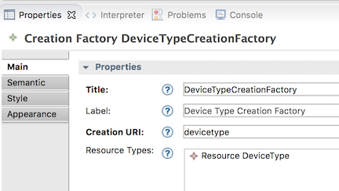

# Modeling the CE4IoTConnector Toolchain

* Domain specifications
* Basic CRUD operations
* Selection Dialogs
* Creation Dialogs
* Toolchain services

## eclipse/Lyo Designer Overview

The [eclipse/Lyo Designer Toolchain Modeler and Code Generator](https://wiki.eclipse.org/Lyo/AdaptorCodeGeneratorWorkshop) is used for developing an OSLC4J provider using a code generator based on an EMF model of OSLC domain specifications. Here are some useful resources regarding OSLC, eclipse/Lyo and the ToolChain modeler.

* [Linked Data and OSLC Tutorial](http://open-services.net/linked-data-and-oslc-tutorial-2015-update/), 2015, Jad El-Khoury:  good overview of OSLC 2.0 but does not cover Lyo Designer
* [Linked Data and OSLC for Tool Interoperability - Part 1/2](https://www.youtube.com/watch?v=qQRZtd4EC7E&t=280s) November 2015, Jad El-Khoury
* [Linked Data and OSLC for Tool Interoperability - Part 2/2](https://www.youtube.com/watch?v=k0cOAkEWvBs) This 2-part series doesn’t cover OSLC 3 or the code generator
* [Modeling Support for Linked Data Approach to Tool Interoperability](https://www.thinkmind.org/index.php?view=article&articleid=alldata_2016_3_10_90030) - supporting article for the Lyo Designer Toolchain code generator
* [Adapter Code Generator Workshop](https://wiki.eclipse.org/index.php?title=Lyo/AdaptorCodeGeneratorWorkshop&oldid=410372) - the old tutorial that use EMF editors and does not use the Toolchain editors built on the Sirius modeling tools framework
* [Toolchain Modeling and Code Generation Workshop](https://wiki.eclipse.org/Lyo/ToolchainModellingAndCodeGenerationWorkshop) - generate a complete OSLC toolchain. This is the key documentation for the Toolchain Modeler and Code Generator
* [Lyo Designer Domain Specification Modeling](https://wiki.eclipse.org/Lyo/DomainSpecificationModelling) - provides additional documentation on Lyo Designer, in particular, how to handle large or reusable domain models
* [An OSLC4J Code Generator - Presentation & Demo](https://www.youtube.com/watch?v=nEImx_c6K5U) by Jad El-Khoury, KTH - 24/02/2014 KTH, Stockholm, Sweden - does cover the code generator, but not the toolchain

Jad El-Khoury maintains an adaptor that is code generated under a public repository http://git.md.kth.se:8080/scm/git/se.kth.md.iee.pub; folder (\src\BugzillaAdaptor). The generator is based on the original OSLC4J Bugzilla adaptor. Relative to the reference implementation, the generator covers most features, but does not address rootservices or integration with the IBM CE apps. To access and install the BugzillaAdaptor:

* git clone http://git.md.kth.se:8080/scm/git/se.kth.md.iee.pub
* Then import existing projects into your workspace browsing to ~/git/se.kth.md.iee.pub. There will be four eclipse projects that can be imported from there.f

The toolchain code generator creates an {adapter}Manager class that has to be implemented after code generation to get, create and search domain model elements. See [Exploring the generated code](./exploring-the-code) and [Implementing a Domain Class](./implement-domain-class) for details.

The eclipse setup information at [Lyo Designer Workshop](https://wiki.eclipse.org/Lyo/AdaptorCodeGeneratorWorkshop/EclipseSetup) includes all the packages necessary to also run an OSLC4J application. To build the generator itself, all that is necessary is (1) Acceleo (2) EMF Facet SDK and (3) EMF - Eclipse Modeling Framework SDK (Diagram Editor for Ecore is optional). The Lyo Designer editor is a Sirius 5.x model editor.

Lyo Designer is based on EMF model and Acceleo code generator. Acdeleo is an eclipse project that implements the OMG MOF to Text generation (M2T) framework. M2T is the language and framework used to develop the Lyo Designer code generation templates.

## Overview of code generation process

Here's a brief overview of the process for using Lyo Designer to create a toolchain model and generate the implementation.

1. Create a new [eclipse project](https://wiki.eclipse.org/Lyo/ToolchainModellingAndCodeGenerationWorkshop#Sample_Modelling_Project) this is ready for code generation
2. Create an adapter model
3. Define the adaptor model
4. Configure adaptor code generator
5. Generate the adaptor implementation code
6. Fill in the internal implementation of the adaptor
7. Run the adaptor

The Toolchain **adapter model** provides starting point for creating the domain model. The **code generator** uses the adapter model and the M2T templates to generate the code.

The toolchain model is structured around the following three viewpoints:

1. **Domain Specification View** – To define the types of resources, their properties and relationships, according the OSLC Core Specification and the Resource Shape constraint language.
1. **Adapter Interface View** – To design the internal details of the tool interface. Sufficient information is captured in this view, so that an almost complete interface code, which is compliant with the OSLC4J software development kit (SDK) can be generated.
1. **Toolchain View** – To allocate resources to tools. For each tool, the set of resources being exposes and/or consumed are defined.

## Install the code generator

See [eclipse environment setup](./environment-setup) for detailed instructions on how to install the Lyo Code Generator and Toolchain. Here's a brief summary:

1. Install eclipse OXYGEN.3, Eclipse IDE for Java EE Developers
1. Set JAVA_HOME
1. Follow [General Setup for OSLC4J development](https://wiki.eclipse.org/Lyo/General_Setup_for_OSLC4J_Development)
1. Install the code generator using one of these eclipse update sites:
 * released version: http://download.eclipse.org/lyo/p2/stable/
 * latest build: http://download.eclipse.org/lyo/p2/edge
 * Install features (1) Lyo Code Generator and (2) Lyo Toolchain

## Using the Toolchain Modeler

The [Lyo Designer Workshop](https://wiki.eclipse.org/Lyo/ToolchainModellingAndCodeGenerationWorkshop) provides details on how to install, setup and use Lyo Designer to create an adaptor model and generate the code. We won't duplicate that information here. What's included here are some notes on using the Toochain modeler, including things that are unique to iotp-adaptor, possible issues and some things that aren't yet fully documented.

1. Don't use "Application" or "Service" as a resource name as it would conflict on import with the generated servlet name Application.java and Service.java. For Bluemix, use App and CFService.
1. The generator doesn’t deal with resource renames or deletes - the old classes from a previous generation are left. You need to delete them all and re-generate if a lot of renames were done. Also delete src/main/webapp/com*, the generated JSP pages. Its easy to see which files were recently generated by looking at their modification times in the eclipse Properties view. 
1. Reused domains usually get new classes generated in each reuse instead of reusing already generated libraries. Lyo Designer does provide a way to [generate reusable domains](https://wiki.eclipse.org/Lyo/DomainSpecificationModelling#Handling_Large_Models) packages and classes.
2. Import the org.eclipse.lyo.tools.domainmodels project into your workspace from git://git.eclipse.org/gitroot/lyo/org.eclipse.lyo.tools.git
1. In your modeling project, right click on the “Project Dependencies” in the Project Explorer tree, and select “Add Model”
 1. Select “Browse Workspace”
 1. Select the oslcDomainsSpecification.xml file under the org.eclipse.lyo.tools.domainmodels project. A set of standard OSLC domains are now available in your project to use, under Project Dependencies 
1. In your own specification diagram, you can now drag and drop any domain under the xml tree to visually present it if needed. Use different diagrams for different domains, or the same diagram for multiple domains if you are creating a bridge ontology to integrate domains
1. In your Adaptor Models, you can also drag-drop resources to allocate them to different adaptors. It may not be intuitive when you can drag-drop resources from the “Project Explorer” tree into the diagram, but you can experiment.
1. Note also that you can also explore the OSLC models by expanding the oslcDomainsSpecification.xml file within the org.eclipse.lyo.tools.domainmodels project – just like a toolchain model – but it only contains domain specifications


A **ServiceProvider** represents a container of managed resources and specifies the Services the server provides on those resources. A **Service** provides basic CRUD operations, creation factory, query capability and delegated creation and/or selection dialogs on specified OSLC domain resources. Here's some guidelines on using multiple service providers and multiple services.

1. A service provider represents a container of resources and the provided OSLC services. Typical resource containers would be jazz.net application Project Areas, IoT Platform and IBM Cloud Organizations, LDP Containers, etc.
1. Each service provider would have separate services for each supported domain. There will often be only one. However CE4IoTConnector has two since it integrated the IoT Platform and IBM Cloud domains.
1. Each service can have zero or more BasicCapability, CreationFactory, QueryCapability and/or Dialog capabilities
1. Each capability can manage zero or more resources and may specify information about the managed resources using ResourceShapes. 
2. Creation and Selection Dialog can use different dialogs for different resources if they have different shapes. or you can choose to use the same dialog for all resources and edit the generated JSP files to use a selection list to select the desired resource type.
1. QueryCapability - use the same QueryCapability for all the resources in the service’s domain unless the capability is different (supports different query clauses) and therefore needs a different queryBase URI. Different QueryCapabilities could also be required to support different collections (or LDPC) in the implementation.
1. CreationFactory - Use a different CreationFactory capability for each container the service’s domain resources should be contained in.
1. Not all resources in the service’s domain will necessarily have Creation and Selection dialogs, a query capability or creation factories. Abstract resources, or resources that should only be created by some underlying domain specific tool may not expose these capabilities through OSLC.

The IoT Platform organization is the iotp-adaptor service provider (like CE project area) that provides creation dialog, selection dialog, query base, and CRUD operations for IoT Platform resources managed by the organization. Organization is a good choice because it is the container of managed resources and provides role based access control permissions on those resources. 

Similarly the IBM Cloud (formerly Bluemix) organization is the service provider for Node-RED flows.

Therefore there is no OSLC domain resource for IoT platform or Bluemix organizations since these are the adaptor's service providers.

IoT Platform DeviceTypes may have a few fixed properties, but most are defined by the application interface schamas that expose the device or thing data to applications. 

All generated classes representing resources extend OSLC4J **AbstractResource**, which itself implements the IExtendedResource interface. IoT Platform and Bluemix resources are most closely aligned to OSLC Architecture Management resources. In order to allow these resources to be targets of Architecture Management links, all the linkable IoT Platform and Bluemix resources also subclass **oslc_am:Resource**.
 
## IoT Platform and Bluemix specification models

The iotp-adaptor domain model is based on the IBM Watson IoT Platform and Bluemix REST APIs. The domain model represents the information we want to expose for OSLC linking from these APIs. 

### Bluemix Domain

The Bluemix domain models Node-RED flows and the associated Bluemix resources. We include Node-RED flows in the CE4IoTConnector because it is not unusual to read data from and write data to IoT Platform devices in flows, or to implement rule actions using Node-RED flows. All Bluemix domain classes extend oslc_am:Resource and are therefore OSLC Architecture Management resources.


The namespace for the Bluemix domain is http://jazz.net/ns/bmx#, and the preferred prefix is oslc_bmx.

* **Space** represents a development space in which a solution can be developed. Spaces are often used to represent dev, test, pre-production and production lifecycle instances of the app
* **CFService** is a Cloud Foundry service that is provisioned in the space, and bound to the application that uses it.
* **App** is an IBM Cloud application and typically represents the project deliverable
* **NodeREDApp** is an extension of Bluemix App representing a Node-RED flow
* **Flow** is a particular flow tab in a Node-RED flow.

### IoT Platform Domain

The IoT Platform [Organization Admin](https://docs.internetofthings.ibmcloud.com/apis/swagger/v0002/org-admin.html) and [Information Management](https://docs.internetofthings.ibmcloud.com/apis/swagger/v0002/state-mgmt.html) APIs provide the foundation for defining the IoT Platform domain model. 

Note: Due to the historical evolution of the Watson IoT Platform, there are some inconsistencies in the organization and implementation of the REST APIs:

* DeviceType and Device resources are defined in Organization Admin, all the other related resources are defined in Information Management
* Device does not support a modification time, and its creation time is assumed to be its registration date
* Resources defined in the Information Management APIs have draft versions that can be activated using the PATCH method. iotp-adaptor uses the /draft version of all these resources since it is a development time tools. Activation of draft resources can be done from the IoT Platform UI.
* DeviceType and Device GET methods do not provide ETags, but all the resources defined in the Information Management APIs do.


The namespace for the IoT Platform Domain is http://jazz.net/ns/iot#, and the preferred prefix is oslc_iot.

* **DeviceType** represents a description of a number of similar device instances. A DeviceType references a PhysicalInterface resource which defines its interface with a physical device on the edge of the Internet. The PhysicalInteface references an EventType resource which references an event Schema resource which defines the MQTT messages payloads the device can send and receive.
* **Device** an instance of a DeviceType that inherits, but can override, its DeviceInfo and Metadata. Devices actually receive MQTT events at their PhysicalInterface and provide the data on their LogicalInterfaces to applications, including Node-RED flows. Note that Device is id-dependent on its DeviceType in the IoT Platform. That is, the URL that identifies the device includes the DeviceType id as an element in its pathname, and the Device id is only considered unique in the context of a specific DeviceType. This has implications for the URLs for OSLC Device services which are covered below.
* **DeviceInfo** provides a standard set of DeviceType and Device information defined by the Watson IoT Platform. Notice that DeviceInfo is a Local Reference Property in the specification model. This means that it is a structured property of a DeviceType and Device, but does not have a URL and is therefore not a linkable resource. 
* **MetaData** DeviceTypes and Devices can have additional meta-data that provides additional properties in the form of simple name/value pairs that can be used to provide additional runtime information about a device. For example, MetaData could be used to specify maximum and minimum values for a Device property, Device property set-points, or any other information that is needed. MetaData is the user-defined device properties that are about the Device, not its inputs or outputs.
* **MetaProperty** one or more name/value pairs that make up the MetaData metaProperties of a Device.
* **PhysicalInterface** defines the physical interface of a device, or the input side of the device. Devices receive MQTT events at their physical interface, and the event payloads are specified by the PhysicalInterface EventType and its Schema
* **EventType** defines the MQTT events that a Device can receive on its PhysicalInterface with the schema defining the payload of the MQTT event.
* **Schema** define the structure of data for an EventType, ThingType or LogicalInterface
* **LogicalInterface** the output side of a Device that specifies the interface used by applications. The IBM Watson IoT Platform separates the logical and physical interfaces for a Device in order to decouple the physical device characteristics from its application interfaces so they can change independently. This reduces the impact of change in a system. The data available to applications at the LogicalInterface is defined by its schema.
* **ThingType** references a Schema resource that defines the input side of the ThingType. This Schema can define a composition of other device and thing types, or any data that is needed by the application. 
* **Thing** an instance of a ThingType that has actual runtime data defined by its ThingType. Like Device, Thing is also id-dependent on its ThingType.
* **Rule** an IoT platform rule that has a condition that specifies when the rule will fire, and an action that will be invoked. The condition is expressed using [http://jsonata.org](http://jsonata.org). The action property is for future use. Currently applications can subscribe to MQTT message events produced when the rule fires (when its condition evaluates to true). Note that Rule is id-dependent on the LogicalInteface that specifies the data used in evaluating the condition. The condition expression can reference this data using the $state variable.
* **DeviceTypeMapping** uses [http://jsonata.org](http://jsonata.org) to specify the mapping between a Device PhysicalInterface and any of its LogicalInterfaces.
* **ThingTypeMapping** uses [http://jsonata.org](http://jsonata.org) to specify the mapping between a Thing Schema and any of its LogicalInterfaces.

## Updating the Toolchain specification model

Here are some simple guidelines on updating the Toolchain specification mode:

* If necessary or desired, create another specification diagram in order to visualize specific resources
* Make some space in the domain specification element so there's room for additional resources
* Add all the domain classes
* For each class, add any missing properties to the domain specification first, then drag and drop onto the classes that need that property.
* Save
* Validate
* Regenerate the code

## OSLC Basic CRUD Capabilities

This capability defines what IoT Platform and Bluemix resources support HTTP create, read, write and/or delete operations (i.e., HTTP POST, GET, PUT, and DELETE methods).

All of the OSLC services are defined in Adaptor Interfaces, in this case, and Adaptor Interface named CE4IoTConnector. The CE4IoTConnectorModel uses a separate Adaptor Interface diagram for each service in order to make it easier to develop and update the services. The Toolchain editor by default puts all services and resources on every Adaptor Interface diagram. So you have to select and hide the model elements you don't want to be visible on any individual diagram. When you add a new resource or service to any of these adaptor interface diagrams, it will appear on all the diagrams. You'll need to edit each diagram and hide the resources you don't want to see on that diagram.


Most of the resources are handled by a single BasicCapability (DeviceType, PhysicalInterface, etc.) However Device and Rule have to have a separate BasicCapability because their Instance ID can't be the default, which is the id of the resource. Device is id-dependent on its DeviceType, so its instance ID has to be `{typeId}/devices/{deviceId}`. Similarly Rule is id-dependent on the LogicalInterface that defines the data available for its condition. Its instance ID has to be `{logicalInterfaceId}/rules/{ruleId}`. In each of these cases, the JAX-RS REST service for these resources will have two parameters in their CURD operation URLs. We use these two parameters to construct the URL needed to access the resources in the IBM Watson IoT Platform. For example, here's how to specify these additional parameters for Device:


Another BasicCapability is created for the Bluemix Service Provider and Service for Node-RED flows.

Notice there's a number of resource depicted on the diagram, but not added to any BasicCapability. There are resources that might be defined in some domain, but that we are not at this time providing any HTTP method access at this time. These could represent "marker" resources (more on this later) or abstract resources that do not have concrete instances. Or they could be resources that we define in the domain, but don't support yet for some reason.

A BasicCapability can be marked Read, Delete and/or Update. These determine if REST services are created for HTTP methods GET, DELETE and PUT. POST for create services are handled separately in creation factories.

## OSLC Creation Factories

Not all OSLC resources are supported by creation factories since they already have browser based editors that are more appropriate for creating resources in the Watson IoT Platform dashboard. But these are provided for scripting creation using OSLC if needed.


Each resource has its own creation factory in order to specify the queryBase URL. For example, DeviceTypeCreationFactory can create instances of DeviceType with Creation URI: `devicetype`. That means the URI for the HTTP POST method to create DeviceType resources would look something like: `http://localhost:8080/iotp/services/iotp/rhu3zv/resources/devicetype` where rhu3zv is the name of the service provider, in this case, the organization ID for the Watson IoT Platform.



Notice there are no creation factory services for the Bluemix Service Provider. This is because we threat Bluemix Space and NodeREDApp as resources that must be created using IBM Cloud UI.

However, there is issue for Device, Thing and Rule creation factories (and query capabilities). These all need additional URI parameters for id-dependent components: DeviceType, ThingType and LogicalInterface respectively. For the BasicCapability CRUD operations, we could include these ID components as additional parameters in the Instance ID property as shown above. However, this does not work for creation factories as the Creation URI property cannot have additional path parameters. 

As Lyo Designer is currently designed, The initial construction of the ServiceProviderCatalog expects a fixed set of ServiceProviders and its Services. Therefore additional URI parameters such as typeId have no value is at service registration that can be resolved. This maybe makes sense as an initial set. But that does not mean that one cannot update the set of Service Providers and services dynamically. 

However, there is a simple work around in this case. The Watson IoT Platform REST API design for these resources have a somewhat odd implementation pattern we can exploit to work around this situation. If you look at the [Organization Administration](https://docs.internetofthings.ibmcloud.com/apis/swagger/v0002/org-admin.html#!/Device_Configuration/get_device_types_typeId_devices_deviceId) REST API and expand the GET method for Device Configuration, you can see the GET method requires the device type id in the URL: `GET /device/types/{typeId}/devices/{deviceId}`, this is what me mean by the device being id-dependent on its device type. But the model schema for Device shows that the typeId is also a property of the Device. We can use this property to construct the URL for accessing the Device from the IoT Platform in our implementation, and don't need to include it in the URL path.

This is not a general solution to this problem, only something that works because of a somewhat unique design of the Watson IoT Platform REST APIs. Some other options that could be considered, but that have not yet been tried are:

1. Define a new “DeviceType” ServiceProvider, and move the DeviceCreationFactory under it. This would require the CE4IoTConnectorManager:getServiceProviderInfos() to be dynamic since device types could be added anytime.
2. Set one value of the {typeId} parameter in the paramterValueMap, in the method ServiceProviderCatalogSingleton:initServiceProviders. This results in registering single CreationFactory in the ServiceProviderCatalog, Service Provider and Service, even though there are many. Hoever, REST requests with the varying {typeId} will be handled just fine by Jax-RS.


## OSLC Creation Dialogs

Like CreationFactories, not all OSLC resources have creation dialogs, only the ones we wish to support creation of new IoT Platform resources when creating links from CE tools.

While it is possible to use a different CreationDialog capability for each resource, and this would generate a separate JSP page for each resource, this turns out to be less practical for many resources. The reason is that the Continuous Engineering jazz.net applications do not provide any means of selecting a specific resource type from their creation dialogs. 

For example, here's the dialog RDNG uses to create an implementedBy link from a Requirement to an IoT Platform resource. If we select create a new, there's no way for RDNG to say what kind of IoT Platform resource to create, and therefore no way to specify which creation dialog to get.

An easy way to solve this is to provide only a single creation dialog, and add an HTML select element to select the kind of resource to create in the CE4IoTConnector creation dialog itself. 

```
  <body style="padding: 10px;">
  Type: <select id="selectType">
  	<option value="device">Device</option>
  	<option value="devicetype">DeviceType</option>
  	<option value="thing">Thing</option>
  	<option value="thingtype">ThingType</option>
  	<option value="logicalinterface">LogicalInterface</option>
  	<option value="physicalinterface">PhysicalInterface</option>
  	<option value="eventtype">EventType</option>
  	<option value="schema">Schema</option>
  	<option value="rule">Rule</option>  	
  </select>
```
We'll cover this in more detail when looking at the [generated code](./exploring-the-code). For now, we'll have Lyo Designer just generate a single creation dialog for generic resources, and edit the generated dialogs to add the type select element and the code for processing it.
 


Notice that there is no creation dialog for the Bluemix Service Provider's Services. This is because Space and NodeREDApp are read-only in our design. This is because the mechanics of creating spaces and Node-RED flows is somewhat complex and better handled directly by IBM Cloud.

### Marker Types

There is another curious thing about the the creation dialog: its used to create instances of IoT Platform resources. But the adapter interface model shows the ResourceCreation dialog is used to create oslc_cm:ChangeRequest, `oslc_rm:Requirement` and `oslc_am:Resource`. Why is that?

This is done in oder to allow IoT Platform resources to be the target of link types that are supported by the jazz.net apps: RTC, RDNG, RQM and RDM. This will require some explanation.

All these tools use jazz.net project areas as the source of their service providers. Each project area can be configured with artifact containers that represent services providers accessible from the same or friend servers. Each artifact container or service provider can specify creation dialogs for its resources, including CE4IoTConnector. 

The link types supported by the jazz.net apps are based on the OSLC domain specifications (RM, CM, AM and QM), and are extended by the vocabularies defined in the [http://jazz.net/ns](http://jazz.net/ns) namespaces. The jazz.net apps in most cases have fixed expectations about the resources they expose through OSLC to other servers, and the link types and target resource types they are expecting through artifact container associations from other friend servers. 

For example, RDNG supports Requirement and RequirementCollection OSLC RM resources, and Module resources as a jazz.net extension. RDNG also supports a set of link types defined by the OSLC domain specifications and the jazz.net extensions. So when RDNG has an artifact container association to say a server that provides OSLC access to OSLC change management resources, it will enable the creation of implementedBy links between requirements and change request resources. Similarly RDNG will support references links to resources in artifact container associations with OSLC requirements management resources. And similarly again, RDNG supports a number of link types to resources in artifact container associations with OSLC architecture management resources as defined in [http://jazz.net/ns/dm/linktypes#](http://jazz.net/ns/dm/linktypes#). 

RDNG, and many of the other jazz.net tools, do support custom artifact types and link types. But RDNG does not at this time support extensible link types across server boundaries, it only supports them within a project area, or with resources in other requirements management project areas on the same server that have exactly the same custom link types. As a result, RDNG would not know anything about link types and resources defined in the IoT Platform and/or Bluemix domains, it would only support the link types defined in [http://jazz.net/ns/dm/linktypes#](http://jazz.net/ns/dm/linktypes#) since all the linkable resources in the IoT Platform and Bluemix domains extend oslc_am:Resource.

So we specified the resource that can be created by the CE4IoTConnector creation dialog to be oslc_rm:Requirement, oslc_cm:ChangeRequest and oslc_am:Resource to "mark" the creation dialog to allow RDNG and other jazz.net apps to recognize the creation dialog as a valid "picker" for resources that are acceptable as the targets for app supported link types.

Now you might ask, why wasn't oalc_am:Resource enough? That would have provided a pretty rich set of link types defined in [http://jazz.net/ns/dm/linktypes#](http://jazz.net/ns/dm/linktypes#) that are already supported by the jazz.net apps. And the IoT Platform and Bluemix resources are certainly a lot more like AM resources than they are requirements or change requests.

The reason is an artifact of the CE4IoTConnector design. CE4IoTConnector is an OSLC adapter that follows what we might call the "pure facade" adapter. That is, CE4IoTConnector node no user management and has no persistence of its own, this just an OSLC facade on Watson IoT Platform and IBM Cloud, delegating everything these components. 

What this means is that CE4IoTConnector does not have any means of storing links, partly because it has no storage capability of its own, and the Watson IoT Platform and IBM Cloud don't (easily) provide extensibility features that could be used to store these links. So all the links have to stored in the CE jazz.net apps. 

This constraint has implications because of the link ownership implementations of the CE jazz.net tools. For example, RDNG can create links to architecture management resources in Rational Design Manager (RDM). However, it expects RDM to actually store the link. The sequence goes like this:

1. A user opens a requirement, clicks on the Links tab, and chooses the menu item to create a new Implemented by Architectural Element link.
2. RDNG displays its link creation dialog with a dropdown list of all the artifact containers in its project area's artifact container associations that provide resources that can be the target of that link type, in this case RDM project areas
3. The user selects an RDM project area (or artifact container/service provider)
4. RDNG uses the SerivceProvderCatalog that it discovered from the rootservices document that was provided with the friend was created to the RDM server to discover the ServiceProviders and Services of that project area
5. RDNG finds all the creation dialogs defined in the Services, and checks to make sure the Dialog's oslc:resourceType is an oslc_am:Resource. If so, it does a GET on the oslc:dialog URL and displays RDM's creation dialog in an iframe inside its dialog. If not it gives a warning that the artifact container does not support any pickers.
6. The user selects or creates (the process is similar for both) the AM resource to link to and presses OK
7. RDNG gets a Window message with the URL of the selected or created resource. RDNG does a get on that resource, adds an assertion of the incoming link type (e.g., resource implementsRequirement requirement instead of requirement implementedByArchitecturalElement) to the oslc_am:Resource
8. RDNG does a PUT to update the resource in RDM so that the link is actually stored in RDM.

So you see why having IoT Platform resources be oslc_am:Resource wasn't enough, because its not possible for CE4IoTConnector to store the link. It can do the PUT, but the link will be lost if its not stored in the jazz.net app.

We exploit this in the following ways. RDNG will store a backlink to an oslc_cm:ChangeManagement resources, so we can use this to store the link to an IoT Platform resource. But to do this, the IoT Platform resource must masquerade as an oslc_cm:ChangeRequest, otherwise RDNG will report that the artifact container does not provide any pickers for CM resources. We do this by "marking" the creation and selection dialogs to indicate their oslc:resourceType is an oslc_cm:ChangeRequest, and we "mark" each of the IoT Platform resources to indicate they have rdf:type oslc_cm:Resouce. This is surely a hack, but there you go, we sometimes do what we have to do. The alternative would be to add storage to CE4IoTConnecgtor and we wanted to see how far we could go without doing that.

RDNG will store oslc:references links to oslc_rm:Requirement resources, so we also mark the creation and selection dialogs, and rdf:type with oslc_rm:Requirement.

This also allows RTD and RQM to be able to link to IoT Platfom resources because both of those tools can link to requirements and/or change requests and can store the links.

Now this approach doesn't work if the project areas are enabled for global configuration management. This is because RDNG can no longer store the backlink to a change request. But that's ok for now since the IoT Platform resources aren't versioned enabled (yet) and therefore couldn't be configuration contributing. We are still exploring how CE4IoTConnector might be made config-aware and still not store any links. But that will be a future consideration when eclipse/Lyo OSLC4J and Lyo Designer become config aware.

Now its clear that this approach is limited, requires a lot of knowledge about the specific link types, acceptable target resource types, and storage implementation details of the CE jazz.net applications. This results in some coupling between the CE jazz.net apps, and CE4IoTConnector. We can see the negative effect of this coupling because the solution breaks if the project areas are config enabled. But this is not an atypical approach to doing integrations and configuration management aside, the coupling is actually pretty loose. 

## OSLC Selection Dialogs

There are two selection dialogs, one for IoT Platform resources, and one for Bluemix resources. The same selection dialog is used for all IoT Platform resources, and only the top-level resources are selectable. This is because similar to the creation dialog, we use an HTML select element in the selection dialog to make it easier for users to specify the types of things they want to find and link to.


The selection dialog uses the same technique as the creation dialog to mark the dialogs with marker types to enable the creation of links from the CE jazz.net apps to IoT Platform resources.


## OSLC Query Capability

This diagram defines the query capability service for each resource that can be queried.


The current implementation does not support the OSLC query capability. Rather the "query" is just a Java regular expression matching the dcterms:title of the resource. A future version might implement OSLC query if there is sufficient need.

## CE4IoTConnector Toolchain

The final part of the adaptor model is the CE4IoTConnector Toolchain diagram. A Toolchain diagram defines the OSLC client and server applications that will be generated that consume and provide OSLC domain resources using the defined services. Each adaptor interface of the toolchain defines an OSLC server that can provide and consume resources. For CE4IoTConnector, like most OSLC adapters, there is only one adaptor interface, and it only provides managed resources, it doesn't consume any from any other OSLC server.


The Java Class Base Namespace `com.ibm.oslc.adaptor.iotp` provides the package name to be used to contain all the generated Java classes.
