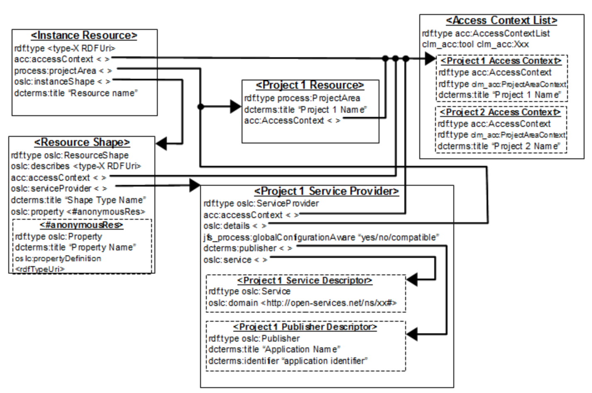

# Implementing a TRS Provider

These are some notes I took implementing the iotp-adaptor TRS provider. These will evolve and get cleaned up over time, but I wanted to get something out as quickly as possible.

# TRS Resources

* The OSLC TRS specification is currently being migrated to OASIS.  Here are some useful resources:
* [TRS 2.0 Specification](http://open-services.net/wiki/core/TrackedResourceSet-2.0/) - this is being migrated to OASIS
* [Indexable Linked Data Provider 2.0](http://open-services.net/wiki/core/IndexableLinkedDataProvider-2.0/) - this was a proposed change to the TRS 2.0 specification to focus on LDP that was never completed. Its content is being incorporated into TRS 3.0
* [TRS 3.0 specification](https://tools.oasis-open.org/version-control/browse/wsvn/oslc-core/trunk/specs/trs/tracked-resource-set.html) (currently under development)
* eclipse/Lyo [TRS Reference Application](https://wiki.eclipse.org/Lyo/TRSReferenceApplication)
* [TRS Workshop](http://wiki.eclipse.org/Lyo/TRSWorkshop)
* [Building and running the TRS Adapter for Bugzilla sample](https://wiki.eclipse.org/Lyo/BuildTRS4JBugzilla)
* [TRS SDK Exploring the TRS ToolkitTRS Reference Application](https://wiki.eclipse.org/Lyo/TRSToolkit)
* [TRS reference application guided tour](https://wiki.eclipse.org/Lyo/TRSReferenceApplication) - describes the JAX-RS and generic servlet implementations
* [Bugzilla TRS Provider Example](https://wiki.eclipse.org/Lyo/BuildTRS4JBugzilla) - describes building and running the Bugzilla sample TRS provider
* [LQE Report Builder Integration for 3rd Party Applications](https://ibm.box.com/s/6j83j0948nalizq6y9puhlhynhe7t5kb) - describes the steps required configure a TRS provider to support access control, process filters and JRS Query Builder

## Persisting and Pruning the Change Log (TRS Provider rebase)

TRS providers are responsible for managing the base change log for their consumers. In theory, the base is established at the "beginning of time" and the change log continues to grow forever. A TRS provider may choose to periodically, or on some significant event, rebase or recalculate the base resources and prune the change log. The server should retain at least seven days of of the most recent change events in the change log, and set the cutoffEvent to the most recent retained change event to give clients time to catch up to the new base and change log. 

See [Persisting and Pruning the Change Log](https://wiki.eclipse.org/Lyo/TRSReferenceApplication#Persisting_and_Pruning_the_Change_Log) in the eclipse/Lyo [TRS Reference Application](https://wiki.eclipse.org/Lyo/TRSReferenceApplication) for details.

The **cutoffEvent** property of the Base identifies the point in the Change Log at which processing of Change Events can be cut off because older changes are already covered by the new Base after the rebase operation.

iotp-adaptor does not currently support TRS provider rebase operations, or the rebase can be done manually while the other CE servers are down. Proper rebase support would need to be implemented in a production TRS provider.

TRS consumers wouldn't be aware of a rebase as long as they are refreshed within the 7 day window. However, if a server was down for an extended time, it would need to reindex or risk loosing change events.

Servers could rebase often as long as some change events prior to the cutoffEvent are retained.  For some servers, especially those with very large numbers of resources, the cost involved in recalculating the entire base set and setting up the TRS base RDF might be quite high. The cost of pruning the change log after a rebase should not be high - just forget the events more than 7 days behind the new cutoff.

A very frequent rebase would potentially increase the risk that a client is half-way through reading the base when it was replaced, increasing the need for the server to detect and reject attempts to read pages or members from an old base. It would also increase the risk of clients that are off-line for more than 7 days loosing change events because their base is out of date.

## Persisting the Base and ChangeLog

See org.eclipse.lyo.rio.trs.util.TRSObject.java in the [TRS Reference Application](https://wiki.eclipse.org/Lyo/TRSReferenceApplication) for how to implement best practices for persisting and pruning the TRS provider's change log. 

Base::cutoffEvent is an RDF property. The most recent Change Log entry that is accounted for in this Base. When rdf:nil, the Base is an enumeration at the start of time. 

buildBaseResourcesAndChangeLogsWithScanning currently recreates the base every time the server is restarted. It should instead read last base and change log from files and pickup where it left off. This will prevent a rebase operation on every server restart, and therefore ensure slow TRS consumers don’t miss any change events. iotp-adaptor does not do this in order to keep the example TRS provider as simple as possible. 

Ideally the change log would be stored in a queryable database in order to more efficiently support paging. It may also be possible to store each change log page in separate files, ordered by change event.


# Adding a TRS provider to iotp-adaptor

The following sections describe the steps required to add a TRS provider to an OSLC server generated by eclipse/Lyo Designer.

### Update the pom.xml file to include the dependency on oslc-trs.

```
 <dependency>
        <groupId>org.eclipse.lyo</groupId>
        <artifactId>oslc-trs</artifactId>
        <version>2.3.0</version>
</dependency>
```

### Create package com.ibm.oslc.adaptor.iotp.trs for the TRS provider implementation

**TrackedResourceSetService.java** - provides the JAX-RS services to get the TRS, Base, ChangeLog, etc. resources

**TRSObject.java** - provides the adaptor specific implementation of the methods to:
 
* buildBaseResourcesAnChangeLogs calls buildBaseResourcesAndChangeLogsWithScanning
* getBaseResource - calls buildBaseResourcesAndChangeLogsWithScanning and returns the baseResources
* getChangeLog - calls buildBaseResourcesAndChangeLogsWithScanning and returns the changeLogs

These are the TRS adapter methods called by TrackedResourceSetService that actually do the work on the underlying data sources. These methods are implemented in TRSObject.java. Currently they all call TRSObject.buildBaseResourcesAndChangeLogsWithScanning.


**TRSObject.buildBaseResourcesAndChangeLogsWithScanning**:

* Does not yet address paging or reindexing in the initial implementation
* If baseResources is null, the base and change log are recreated from scratch. 
* calls updateChangeLog () to update the change log

buildBaseResourcesAndChangeLogsWithScanning currently recreates the base every time the server is restarted. In a production version it should instead read last base and change log from files or a database, and pickup where it left off. This will minimize changes sent to the TRS consumers. 

**getBase** - gets the base resources

The base resources consist of all the IoT Platform resources managed by the organization to which the configured trs_user is a member. The getBase() method reads all organizations, and for each organization it:

1. Uses IoT Platform REST APIs to get all instances of DeviceType, LogicalInterface, PhysicalInterface, EventType, Schema, ThingType, Rule, Thing and Device
1. Calculates the OSLC URI from the element id.
1. adds it to the resource Base.

Paging should be handled by how the URLs are added to the baseResources. As the IoT Platform resource URIs are constructed from the IoT Platform scan, they are organized into page objects that can be indexed by page number. That is, the Base stores the members by page.

The getBase method also not currently put the members into pages. The members are added directly to the base as if there was only one large page.

The getBase method currently only reads the DeviceTypes - it needs to also read, create the OSLC URI and add members to the base for:

* LogicalInterface
* PhysicalInterface
* EventType
* Schema
* Device
* ThingType
* Rule
* Thing

These are resources are not included because 1) iotp-adaptor is not a production TRS provider and 2) the simple scan method used to detect changes would put too much load on the Watson IoT Platform. An event-based change management mechanism would be needed for more efficient change log generation.

**updateChangeLog** - detects and logs changes in IoT platform resources

The Watson IoT Platform does not yet provide an notification of changes to platform resources. Currently MQTT messages from physical devices on the edge of the internet are processed by the PhysicalInterface of a Device according to its DeviceType in order to get the runtime data values for the Device. However there is no other notification available to the IoT Platform REST APIs. As a result, the only way to detect changes in IoT platform resources is to scan every resource and examine the modification dates. The updateChangeLog method:
 
1. Keeps a lastSnapshot of the Base resources
1. Gets the latestSnapshot of the base
1. Compares the members of latestSnapshot with lastSnapshot
	1. 	adds Creation event to the change log for resources in latestSnapshot, but not in lastSnapshot
	1. 	adds Modification event for resources that have changed based on their last update times (which are different for Device and DeviceType than the other resources)
	1. 	add Deletion events for anything that was in lastSnapshot, but not in latestSnapshot
	1. 	sets lastSnapShot to latestSnapshot 

updateChangeLog in a production implementation would to add the events to the ChangeLog by pages and set the trs:previous property to the URL of the previous change log. 

### Register the TRS provider REST services

Register the new REST service class with the application referenced in javax.ws.rs.Application parameter in the web.xml file: com.ibm.oslc.adaptor.iotp.servlet.Application:

```
    // Start of user code Custom Resource Classes
    // TRS service
    RESOURCE_CLASSES.add(TrackedResourceSetService.class);
    // End of user code
```

### Add the TRS provider to the rootservices document

This is needed to bootstrap discovery for the jazz based apps. For example, LQE can use the iotp-adaptor root services document to discover the TRS providers and the OAuth URLs needed to add the iotp-adaptor TRS provider as a Data source. The rootservices_rdfxml.jsp file is modified to add the TRS provider information:


/rootservices provides the root services document required to create a friend relationship needed for LQE to be a Friend of the TRS provider. This document defines the TRS provider to the jazz-base apps.

Update the iotp-adaptor rootservices to provide additional TRS provider information:


```
    xmlns:iotp="http://jazz.net/ns/dm/iotp#"
    xmlns:oslc="http://open-services.net/ns/core#"
    xmlns:dc="http://purl.org/dc/terms/"
    xmlns:trs2="http://open-services.net/ns/core/trs#"

    <!-- IoT Platform Tracked Resource Set Provider -->
    <iotp:trackedResourceSetProvider>
        <trs2:TrackedResourceSet>
            <trs:trackedResourceSet rdf:resource="https://rlia4iot.raleigh.ibm.com:9443/iotp/services/trs" />
            <dc:title>TRS 2.0 for IoT Platform Resources</dc:title>
            <dc:description>TRS 2.0 feed for IoT Platform resources</dc:description>
            <dc:type     rdf:resource="http://open-services.net/ns/cm#" />
            <oslc:domain rdf:resource="http://open-services.net/ns/cm#" />
            <oslc:domain rdf:resource="http://open-services.net/ns/am#" />
        </trs2:TrackedResourceSet>
    </iotp:trackedResourceSetProvider>
```

This information is not currently documented in the jazz.net [Root Services Specification](https://jazz.net/wiki/bin/view/Main/RootServicesSpec) but is described in an LQE workgroup March 2015 meeting.

### Add two-legged OAuth support to the CredentialsFilter

Adding a TRS provider as an application such as an LQE data source typically uses OAuth [two-legged](http://oauthbible.com/#oauth-10a-two-legged) authentication. This allows the iotp-adaptor server to respond to HTTP requests authenticated with OAuth without requiring a user to enter their credentials. The interaction between a TRS consumer and a TRS provider wouldn't typically involve individual users. Instead a functional ID is often used to authenticate access to the TRS provider. Use the trs4j-bugzilla-sample as a model for updating the CredentialsFilter.doFilter method.

A validated OAuth authentication still requires a connection to the IoT Platform and Bluemix. This requires a functional ID that has credentials for logging in to both of these platforms, and is a member of the organizations that will be accessible through the TRS provider. iotp-adaptor gets this user id and and password from its config.properties file. These values, along with the baseURI and port will need to be provided by installation and configuration.

The CredentialsFilter class is used to manage the OAuth authentication between the consumer and friend applications, using the Lyo server oauth-webapp nested web app.

This is different than the CredentialsFilter from the BugzillaAdapter sample because it needs to support two-legged OAuth. The [TRS Workshop, 3 TRS Reference Application, TRS reference application guided tour](https://wiki.eclipse.org/Lyo/TRSSDK#TRS_Reference_Application) describes the code very nicely. The iotp-adaptor CredentialsFilter implements two-legged OAuth flow using validateTwoLeggedOAuthMessage(OAuthMessage) in the doFilter method. This allows LQE to authenticate with iotp-adaptor without providing user credentials as long as a functional user id has been provided. The functional user ID for the iotp-adapter is specified as the trs_user in the config.properties file and is the credentials used to access the Watson IoT Platform. 

If the doFilter checks to see if the token is blank to see if this is a two-legged oauth request. If it is, it validates the message:

```
// test if this is a valid two-legged oauth request
if ("".equals(message.getToken())) {
    validateTwoLeggedOAuthMessage(message);
    isTwoLeggedOAuthRequest = true;
}
```                                              

Assuming the message is valid, it proceeds as if it was not an OAuth request and does a normal login with credentials provided by the user.

There are other examples of AbstractAdapterCredentialsFilter in trs4j-bugzilla-sample, including one that supports multiple threads. These may be useful for other adaptors


### Testing the IoT Platform TRS Provider

Testing this minimal TRS provider consists of accessing the TRS and its base and change log resources. These requests can be authenticated with the credentials of the logged in user, or using two-legged OAuth if your REST client supports (Postman only supports OAuth1.0, not OAuth1.0a). 

* Get the TRS: https://localhost:8080/iotp/services/trs
* Get the Base resources: https://localhost:8080/iotp/services/trs/base
* Get the ChangeLog: https://localhost:8080/iotp/services/trs/changeLog 

Verify the content is as expected. It should be something like:

```
@prefix trs:     <http://open-services.net/ns/core/trs#> .
@prefix rdf:     <http://www.w3.org/1999/02/22-rdf-syntax-ns#> .
@prefix xsd:     <http://www.w3.org/2001/XMLSchema#> .
@prefix dcterms:  <http://purl.org/dc/terms/> .
@prefix ldp:     <http://www.w3.org/ns/ldp#> .
@prefix rdfs:    <http://www.w3.org/2000/01/rdf-schema#> .
@prefix oslc:    <http://open-services.net/ns/core#> .

<https://rlia4iot.raleigh.ibm.com:9443/iotp/services/trs>
      a       trs:TrackedResourceSet ;
      trs:base <https://rlia4iot.raleigh.ibm.com:9443/iotp/services/trs/base> ;
      trs:changeLog
              [ a       trs:ChangeLog ;
                trs:change <urn:urn-3:trs-provider:2018-06-07T20:52:16Z:3>
              ] .

<urn:urn-3:trs-provider:2018-06-07T20:52:16Z:3>
      a       trs:Deletion ;
      trs:changed 
      	<https://rlia4iot.raleigh.ibm.com:9443/iotp/services/iotp/ov305m/resources/deviceTypes/TestID1> , 		<https://rlia4iot.raleigh.ibm.com:9443/iotp/services/iotp/ov305m/resources/deviceTypes/TestIDXXXX99> , 
      	<https://rlia4iot.raleigh.ibm.com:9443/iotp/services/iotp/ov305m/resources/deviceTypes/TestGatewayType> , 
      	<https://rlia4iot.raleigh.ibm.com:9443/iotp/services/iotp/ov305m/resources/deviceTypes/May17_123> , 
      	<https://rlia4iot.raleigh.ibm.com:9443/iotp/services/iotp/ov305m/resources/deviceTypes/TestDeviceType> , 
      	<https://rlia4iot.raleigh.ibm.com:9443/iotp/services/iotp/ov305m/resources/deviceTypes/TempCtrl> , 
      	<https://rlia4iot.raleigh.ibm.com:9443/iotp/services/iotp/ov305m/resources/deviceTypes/TestID999999> , 
      	<https://rlia4iot.raleigh.ibm.com:9443/iotp/services/iotp/ov305m/resources/deviceTypes/TestID2345> , <https://rlia4iot.raleigh.ibm.com:9443/iotp/services/iotp/ov305m/resources/deviceTypes/TestPie> , 
      	<https://rlia4iot.raleigh.ibm.com:9443/iotp/services/iotp/8dm156/resources/deviceTypes/TempCtrl> ;
      trs:order "3"^^xsd:int .

```


# Configuring LQE to use iotp-adaptor TRS provider

This simple TRS provider provides a surprising amount of capability by simply adding IoT Platform resources to LQE. You can:

* Use the LEQ admin application to explore IoT Platform data with SPARQL queries
* Create RELM custom artifact elements on IoT Platform resources
* Create RELM traceability and impact analysis views that show requirements, change requests, and test cases connected to realizing device types
* Create JRS reports using custom SPARQL queries

This section describes how to add the iotp-adaptor TRS provider as a data source in LQE. 

See [Setup Rational Engineering Lifecycle Manager, Lifecycle Query Engine, Jazz Team Server and Tracked Resource Set Provider for Bugzilla](https://jazz.net/library/article/1313) for details.


## Prerequisites Integrating with LQE

A TRS client that keeps the latest clone of a Tracked Resource Set is certainly implemented like a daemon and there is no chance to ask the user to submit credentials via login page. Consequently, OAuth communication code needs to be extended so that a Provider, and a Consumer (a TRS client), can communicate without user interaction (a.k.a. two-legged OAuth). 

When adding a TRS provider as a data source to LQE, LQE needs to have the OAuth URLs to do the two-legged authentication, the consumer key and secret, and the URL for the TRS provider. Typically these are provided in the rootservices document as described above.

The OAuth functional ID used by the iotp-adaptor TRS provider  provided in the trs_user propert in the config.properties file. The trs_user_password should be encrypted in a production version, but is left open in this sample application. Be cautions about exposing any meaningful user credentials in this sample application.

## Integrating with JTS, LQE and RELM

LQE and RELM run in the JTS which requires a Friend authenticated with OAuth to the iotp-adaptor server. Then new Data Source can be configured in LQE to the iotp-adaptor TRS provider (described in the rootservices resource). LQE will now have the data from the IoT Platform as described by the provided resource shapes. RELM can also have a friend to iotp-adaptor so that resource preview can work on IoT Platform resources in the RELM views.

### Add a Friend in JTS (for LQE and RELM) to the TRS provider server

LQE runs in the JTS and uses /jts/admin to add the friends. It is not a separate application like some of the other CE apps.

Goto the JTS server admin and add a Friend to the TRS provider server - same as any other friend. Provide the iotp-adaptor rootservices URI for the friend server, and authenticate and authorize the provisional key with JTS admin credentials. 

Server Admin: https://localhost:8080/jts/admin
Root Services URI: https://localhost:8080/iotp/rootservices

Make the friend Trusted to avoid any unnecessary dialogs.

The iotp-adaptor OSLC server provides a simple admin UI for managing OAuth consumer keys. This UI is actually provided by the eclipse/Lyo oauth-webapp sub-application. 

Navigate to https://localhost:8080/iotp/services/oauth/admin and enter your Watson IoT platform credentials. You will see a page that allows you to manage the OAuth consumers that have been configured for the iotp-adaptor server through adding friends to the jazz-apps. You can approve provisional keys here, or delete active keys that are no longer needed. These same keys are displayed in the friends tab of the Jazz Team Server admin page (/jts/admin). You will need to remember the consumer secret you used to add the friend, it is not displayed anywhere.

## Configure an LQE data source from the TRS provider Friend

Next, add the iotp-adaptor TRS provider as a data source to LQE:

1. Open  https://rlia4iot.raleigh.ibm.com:9443/lqe/web/admin/data-sources 
1. Click Manage Data Sources and then Add Data Source
1. Choose `Root Services URL` and enter the rootservices URL for the TRS provider (e.g., https://localhost:8080/iotp/rootservices)
1. Select the desired TRS provider URL listed in the rootservices document
1. Use the consumer key and secret for the Friend you added to to the JTS
1. Change any configuration information as desired
1. Click `Test Connection` to test the connection to the server
2. Click `Finish` to add the data source.

After successfully adding the data source. LQE will begin processing the TRS provider, reading all the base resources.

## Configure the iotp-adaptor data source permissions

LQE uses TRS AccessContext resources to specify access control of its resources. The data in LQE is a copy of the data contributed by the TRS providers in the configured data sources. Each of these TRS providers will have its own user authentication and access control configured to protect its resources. Once these resources are copied into LQE, the individual TRS provider access control no longer applies. So it is important to configure LQE permissions on the TRS data sources to avoid unintended or innapproprate read access to resources a user should not be able to see. 

The iotp-adapter does not currently support TRS AccessContext resources, or provide what LQE calls 'process' resources (which typically correspond to jazz-app project areas or OSLC service providers), nor does it contribute its resource shapes. These will be covered in future implementations and documented in later sections.

For iotp-adaptor data sources, the LQE permissions apply to the whole data source. Future versions of the TRS provider will provide LEQ process resources that correspond to the IoT Platform organizations in order to specify finer grained access control.

By default, an LEQ data source will have permissions that provide no access. This prevents unintended access to the resources. As a result, any SPARQL query or RELM view on iotp-adaptor data will show no data. To configure permissions in order to provide data access:

1. Navigate your browser to `https://localhost:8080/lqe/web/admin/home`
2. Click on `Manage data sources`
3. Click on the `Permissions` link under `Access Control`
4. Select the iotp-adaptor data source in the Permissions Data Groups.
5. Choose `Assign different permissions`
6. Add any Groups or Users who should have access to the IoT Platform resource provided by the iotp-adaptor data source. For testing, you can use the `Everyone` group to open access to any logged in user

## Test the Integration

After the rebuild index is completed, use SPARQL to query LQE for the newly added data sources. Navigate your browser to `https://localhost:8080/lqe/web/admin/home`, and click on the Query tab. Or you can use a REST client to access the LQE SPARQL Endpoint: `https://localhost:8080/lqe/sparql` and POST to this URL with a SPARQL query entity request body to get results.

Enter a query such as:

```
PREFIX dcterms: <http://purl.org/dc/terms/> 
PREFIX oslc_cm: <http://open-services.net/ns/cm#> 
SELECT ?resource ?title 

 WHERE { 
        ?resource 
                dcterms:identifier "TempCtrl" ; 
                dcterms:title ?title .
}
```
See [Steve Blog](https://clmpractice.org/2015/12/01/clm-6-x-improved-sparql-editor/) for lots of good information on RELM and LQE

## Integrating the TRS provider with RELM

If the TRS provider is also an OSLC resource preview provider, and iotp-adaptor is, you can add a Friend in RELM to the TRS provider so RELM can display resource preview of the resource properties it queries from LQE.

RELM and LQE both run inside the JTS, so the friend added to JTS to iotp-adaptor works for both.

## Creating RELM Views for the TRS provider resources

In order to include IoT Platform resources in RELM views, a RELM custom artifact element needs to be created that can be added to the RELM views. It is beyond the scope of this document to define RELM custom artifact elements, see the [RELM help](https://www.ibm.com/support/knowledgecenter/SS2L6K_6.0.6/com.ibm.team.jp.relm.doc/topics/t_creating_custom_artifact_element.html)

# Implementing Support for JRS


The JRS Report Builder (RB) and Rational Engineering Lifecycle Manager (RELM) use LQE as a data source for reporting and document generation. There are additional requirements on data published by TRS providers that are intended to be used for JRS. Extending the iotp-adaptor TRS provider with process, access context and resource shapes will enable the following additional capabilities:

* Filtering by IoT Platform organization in RELM views
* LQE access control at the organization level instead of the whole TRS provider
* Use of JRS Query Builder (QB) for query and reporting
* RPE documentation generation (indirectly through JRS QB)
 
TRS providers wishing to contribute data for JRS need to also publish "process resources" (such as project areas and service providers), artifact resources and resource shapes with their properties, and configurations.

LQE typically uses process resources with a separate TRS provider to manage the shapes. This separates shapes that usually don't change once they are read from other user resources that may be changing a lot. 

LQE uses the process TRS resources to identify the service providers, to manage access control lists, and to provide additional filtering.

In general, you need to:

1. Publish your application’s data and metadata as tracked resource sets in tracked resource sets
    * Process resources, including project areas, service providers, and access context
    * Configurations, if you provide them
Resource shapes for each type, with all defined properties for that type
    * Data instance resources (which may be versioned)
2. For each kind of resource, provide the necessary metadata to include your resources and properties in Report Builder, including:
    * Access control, based on project area permissions
    * Merging of equivalent types and properties across projects, using resource shapes and external URIs
    * Localization into different languages, if needed
    * The ability to report on relationships in either direction



The following sections describe changes to the iotp-adaptor TRS provider in order to support JRS. See [Integrating external data sources with LQE and Report Builder](https://jazz.net/library/article/91450) for details.

## Adding the iotp-adaptor domain vocabulary to LQE

LQE supports importing static vocabularies as an optional step that allows types to be reused across applications. To see the available vocabularies and manually add vocabularies, navigate your browser to `https://rlia4iot.raleigh.ibm.com:9443/lqe/web/admin/vocabularies`.

Alternatively TRS providers can provide new and updated metadata such as types and properties as well as resource instances. These are more dynamic than static vocabularies since Applications can reference and extend the static vocabularies in their TRS feeds.

Most third-party applications or external data sources should use TRS feeds instead of static vocabularies.

Optional:
- [ ] Create the iotp-adaptor domain vocabulary. We have URLs for the individual shapes, but not the vocabulary. It would also be nice to have a single URL with all the shapes.
- [ ] Publish the iotp-adaptor domain vocabulary 

## Defining TRS providers

The iotp-adaptor TRS provider should provide two TRS providers as configured in the rootservices document:

1. **process resources** - represent service providers, resource containers, and units of access control. Correspond to IoT Platform organizations for iotp-adaptor
2. **data and metadata resources** - defines the resource instances, resource shapes, and configuration components that are managed by iotp-adaptor

These are defined in the rootservices document:

    <iotp:trackedResourceSetProvider>
        <trs:TrackedResourceSetProvider>
            <trs:trackedResourceSet rdf:resource="https://ce4iot.rtp.raleigh.ibm.com:9443/iotp/services/trs" />
            <dc:title>TRS 2.0 for IoT Platform Resources</dc:title>
            <dc:description>TRS 2.0 feed for IoT Platform resources</dc:description>
            <dc:type     rdf:resource="http://open-services.net/ns/cm#" />
            <oslc:domain rdf:resource="http://open-services.net/ns/cm#" />
            <oslc:domain rdf:resource="http://open-services.net/ns/am#" />
        </trs:TrackedResourceSetProvider>
    </iotp:trackedResourceSetProvider>

LQE requires each TRS provider to specifies the dcterms:type property to classify feed resources in order to support merging resource shapes for Report Builder. This is usually an OSLC domain URI:

* http://open-services.net/ns/am#
* http://open-services.net/ns/cm#
* http://open-services.net/ns/qm#
* http://open-services.net/ns/rm#
* http://open-services.net/ns/config#
* http://jazz.net/ns/process#

## Publishing process resources

The app’s process TRS provider supports three kinds of resources:
1. Project area and related resources
2. OSLC service provider resources
3. OSLC access context resources

RB and LQE use these resources for:
1. **AccessContext** that define a user’s visibility/access permissions on the data
2. **Scope filtering** in RELM, RB UI and report queries by project area

- [ ] For scope filtering by project area to work, all resources must include process:projectArea property 

- [ ] iotp-adaptor simulates a project area for each IoT Platform organization.

Add these assertions to the TRS provider base resources and change log:

`<iotp-adaptor organization/service provider URL> rdf: type process:ProjectArea`

Include these properties in all resource shapes:

* oslc:serviceProvider 
* process:projectArea 
* acc:accessContext??

Include values for these properties in the resource instances (oslc:serviceProvider is already provided)

* oslc:serviceProvider `<iotp-adaptor organization/service provider URL>` (this is already provided)
* process:projectArea `<iotp-adaptor organization/service provider URL>`
* acc:accessContext

With the metadata described above, RB will recognize your application’s simulated project areas and correctly associate its resource shapes and resources. RB will include your simulated project areas in the Limit Scope section of the report editor, and display the associated types and properties for those project areas. LQE will recognize the AccessContexts and allow you to configure user and group permissions.

