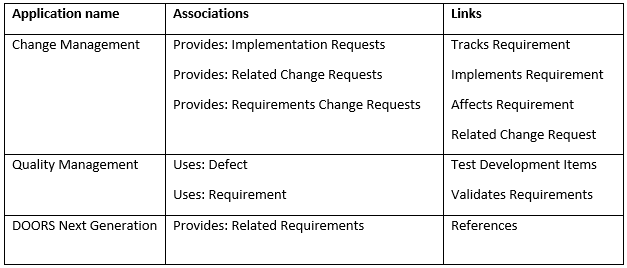

# Introduction

The following sections describe how to administer the IBM Continuous Engineering applications (RDNG, RTC, RQM, etc.) to enable lifecycle management of IBM Watson IoT Platform resources using the OSLC iotp-adaptor server. 

The administration steps connect the CE applications with the iotp-adaptor OSLC server, and establish the artifact container associations between the CE project areas and the IoT Platform organizations. This will enable the creation of links between CE resources and IoT Platform resources.

# Establish cross-server communication

For lifecycle management applications to interact with the IoT Platform artifacts, you must establish communication between the Jazz Team Server that hosts the lifecycle management applications and the iotp-adaptor OSLC server. This relationship between the two servers is called a friend relationship. It indicates that the requests coming from the servers can be trusted, and the two servers can communicate with each other. By creating this friend relationship and associating project areas, you can link tasks, defects, stories, or requirements from the lifecycle management applications with IoT Platform artifacts. To establish the friend relationship between Jazz Team Server and the connector, you must log in to Jazz Team Server with an account that has Jazz Project Administrator privileges.

1. Log on to Jazz Team Server, and go to the Administration page. In your web browser, enter: https://host_name:port/jts/admin. host_name is the host name with the DNS domain reference of the computer where the Jazz Team Server is installed.
1. On the Jazz Team Server Administration page, click the Server tab.
1. From the menu on the left, under Communication, click Friends (Outbound).
1. On the Friends page, in the Friends List section, click Add.
1. In the Add Friend window, specify the field values:
	1. Enter the root services URI for the connector in the following format:
	1. https://host_name:port/iotp/rootservices 
	1. Note: The URI is case sensitive. Use the same values as the ones that are set for scheme, host, and port in the web.xml file.
	1. Enter a name to identify the friend server. For example, CE Connector for IoT.
	1. Click Next, and enter the OAuth Secret twice.
	1. Note: You must remember the OAuth Secret for later use.
	1. Select the Trusted check box. Trusted consumers can share authorization with other trusted consumers and do not require user approval to access data.
	1. Click Create Friend.
1. Click Next. You can see the provisional key.
1. On the Authorize Provisional Key page, click Grant access for the provisional key.
1. Type your IBM IoT Platform credentials, and click Continue.
1. Enter the server name, select the Trusted check box, and click Allow. A message indicates that the provisional key is approved.
1. Click Finish. On the Friends page, the friend relationship is established, and the relationship is displayed in the list of friends.

# Creating artifact container associations

Artifact container associations connect service providers with consumers. An artifact container includes a set of artifacts and capabilities specified by a service provider.

Artifact containers are often the unit of access control and version management. The CE tools use project areas as artifact containers, each tool managing different artifacts and links between artifacts. The Watson IoT platform uses organizations as the artifact container. Choose the appropriate artifact container association for the tool and links you want to use to connect CE artifacts with Watson IoT Platform artifacts.

1. Associate the connector with each CE application you will use it with. In each application, go to Manage Project Areas. Note: Continuous engineering applications can be Change Management, Quality Management, or DOORS Next Generation.
1. On the Application Administration page, from the Active Project Areas list, click a project area to configure.
1. Scroll to the Associations section; then click Add.
1. In the Add Association dialog box:
	* From the Application list, select the target connector application to link to.
	* From the Association list, select the connector association.
	* In the Artifact Containers section, select the project area that the connector links to, and then click OK.
1. Use the following table to find the supported associations and links for each application. 
1. Click OK to close the Add Association dialog box.