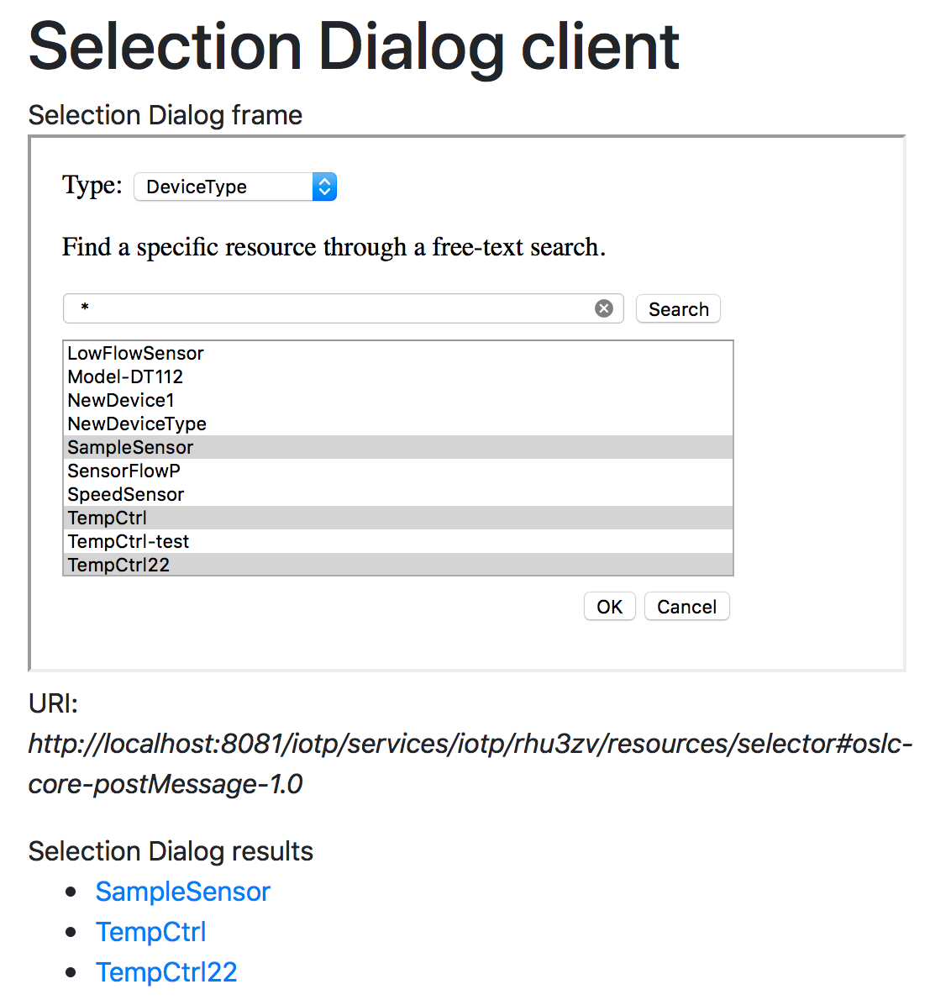
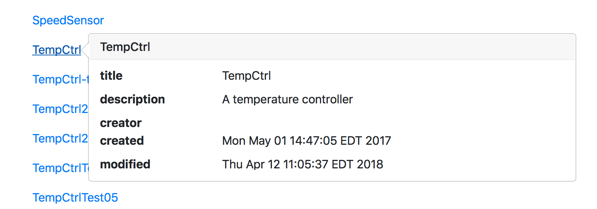

# Introduction

The eclipse/Lyo Designer Toolchain modeler and code generator creates a standard JEE Web application (WAR file) that provides a simple "debug" interface to the generated OSLC server. This simple interface allows you to easily navigate the OSLC service provider catalog, see the available service providers, and explore the available services on the supported domains. 

The Lyo Designer generated Web application is not intended to be a production application for end users. Rather it provides a convenient means to explore and test the OSLC services you have configured in the adaptor model for your domains. Much of the generated Web application is in JSP pages whose content is largely inside protected user code (code that is retained on code regeneration). So it is possible to substantially improve the generated UI so that it can support production needs.

The iotp-adaptor is what might be called a "pure" adaptor. That is, it has no user management or persistence of its own, delegating these capabilities to the underlying IBM Watson IoT Platform. It also is not intended to provide an direct end-user functionality. Rather it supports creation and navigation of links to IoT Platform resources from the IBM Continuous Engineering applications. It is these applications, and the Watson IoT Platform Web UI that provide the end user interface. iotp-adaptor is just a facade on Watson IoT Platform in order to expose its managed resources as OSLC resources and through standard OSLC capabilities.

# iotp-adaptor Web UI

This brief guide provides an introduction to the iotp-adaptor Web application in order to guide early experimentation.

## Home page

Visit [http://localhost:8080/iotp/](http://localhost:808/iotp/) to access the home page. This provides the generated home page with a link to the [Service Provider Catalog](http://localhost:8080/iotp/services/catalog/singleton).

## Service Provider Catalog

Click on the [Service Provider Catalog](http://localhost:8080/iotp/services/catalog/singleton) to view the service providers. This will likely result in an authentication challenge what will be requesting your IBM Watson IoT Platform credentials. Use the same userid and password that you use to login to the [Watson IoT Platform Web UI](https://internetofthings.ibmcloud.com/#/). 

A list of service providers will be shown. The service providers correspond to the Watson IoT Platform and Bluemix organizations. IBM Cloud uses organizations as a means of managing resources. Organizations contain the resources and provide member management, roles, and permissions to control access to the managed resources.

Click on any of the service provider links to view the services provided for that organization.

## Service Provider

An OSLC ServiceProvider defines a container of managed resources, and the OSLC services that are provided on those resources. Services that can be accessed from this page include:

* Selection Dialogs
* Creation Dialogs
* Creation Factories
* Query Capabilities 
* Creation Resource Shapes
* Query Resource Shapes

For the selection and creation dialogs, two urls are provided, one to the OSLC dialog itself, and the other to a sample client that allows you to select or create resources and see the results.

For example, click on the (sample client) link for the selection dialogs for one of your service providers (i.e., organizations). Choose a type of resource to select from the dropdown, and enter a Java regular expression in the search field to select some resources. Multi-selection is supported. Click on the OK button to see the selected resources. 

The (sample client) is an HTML page that acts as a typical OSLC selection dialog client. It does a GET on the selection dialog URL and puts the resulting dialog in its iframe. When you click on OK in the selection dialog, the sample client gets a Window event with the OSLC selection result. It then displays the results with their title and links to the selected resources. This sample client shows how to use selection dialogs in other web applications.

You can click on any of the Query Capability URLs to get an HTML page that lists the instances of that resource type. The iotp-adaptor sample code only provides implementations of the following resource types:

* DeviceType
* Device

For example, click on the DeviceTypeQueryCapability link to see a list of IoT Platform device types. Hover the cursor over any of the device type links to see the small preview.

Go ahead and explore the rest of the generated UI. Note that this sample code is an incomplete implementation, so expect there to be things that aren't fully supported, and possible bugs.

## Resource Shapes

The Lyo Designer code generator also generates OSLC ResourceShape constraints for all the domain classes. These shapes can be used to describe the results from OSLC queries, or to validate the contents of PUT entity request bodies for updating resources. For example, click on [http://localhost:8080/iotp/services/resourceShapes/deviceType](http://localhost:8081/iotp/services/resourceShapes/deviceType) to see the resource shape for resource DeviceType rendered as an HTML page.
