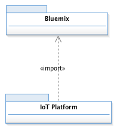
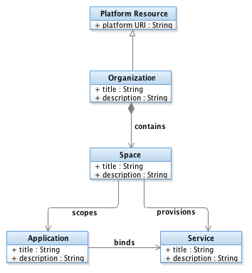
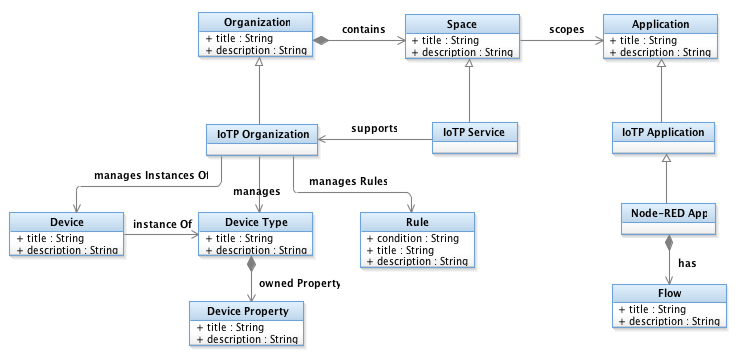

  

    <h2 class="title">Using The OSLC adaptor for Watson IoT Platform</h2>
  

  

    How to install, configure, administer and use the iotp-adaptor to manage the lifecycle of IBM Watson IoT Platform Resources.
  

# Introduction

The IBM Continuous Engineering (CE) development tools and methods combined with the IBM Watson IoT Platform help development teams to design and implement complex, reliable, and secure IoT solutions. The iotp-adaptor project demonstrates how to use the eclipse/Lyo Designer toolchain modeler and code generator to build an OSLC adaptor that extends these capabilities to support scalable development of IBM Watson IoT Platform solutions.

The iotp-adaptor is a JEE Web application (WAR file) that exposes the Watson IoT Platform resources as OSLC resources. It provides the typical OSLC capabilities including:

* OSLC Discovery: the OSLC ServiceProvider resources correspond to the Watson IoT Platform organizations
* CRUD operations on RDF resource representations in various RDF serialization formats
* Creation factories to create Watson IoT Platform resources
* Delegated creation and selection dialogs to establish links between CE requirements, change requests, design elements, test cases, etc. and Watson IoT Platform resources
* Resource preview for displaying links and small and large preview
* Minimal OSLC query capability
* Simple Tracked Resource Set provider for device types

See [iotp-adaptor Developer Guide](../developer-guide) for documentation on how the iotp-adaptor OSLC server was developed.

The source code is available in a the GitHub [iotp-adaptor Project](https://github.com/OSLC/iotp-adaptor).

# Business Challenge

The Internet of Things (IoT) is driving businesses to transform themselves into connected, digital enterprises to take advantage of new opportunities for optimizing operations, increasing customer engagement and loyalty, developing new revenue streams and business models, disrupting existing markets, and innovating faster with an IoT feedback loop that informs business and engineering leaders.

But being fast to market, which is challenging in its own right, is not enough. IoT solutions that interact with the physical world through sensors and actuators can cause serious harm, financial loss, or reputation damage if the solution fails to perform. Doing enterprise-scale transformations to realize enterprise-level business value requires enterprise-appropriate systems and software engineering processes.

Systems engineers and developers need to be able to connect their IoT Platform development activities with the rest of their Systems and Software Engineering methods and tools in order to:

# Integration Solutions

IoT solutions have many components that are typically hosted on multiple runtime environments and developed by multiple teams. Coordinating across these teams while designing, building, and evolving an enterprise solution is especially challenging.

IBM IoT Continuous Engineering (CE) tools and practices can be employed to design and build dependable enterprise IoT solutions. The iotp-adaptor is an example of how to use OSLC to extend development practices by including the teams who build IoT solution components on the IBM Watson IoT Platform.  Using iotp-adaptor, you can work with views of your IoT solution, including IoT Platform devices. You can link these IoT Platform artifacts to any other artifact in the Continuous Engineering solution, such as requirements, change requests, or test cases. You can also use Rational Engineering Lifecycle Management for traceability and impact analysis of potential changes to your IoT solutions.

The iotp-adaptor provides an OSLC server that exposes IBM Watson IoT Platform artifacts using standard OSLC capabilities. The IoT Platform artifacts participate in change management, impact analysis, requirements-driven development, requirements-driven testing, and other common development practices.

The following diagram shows how the IoT CE environment works with the Watson IoT Platform:

* The CE solution runs on Cloud or in your data center. For more information, see the CE Connector for IoT Installation Guide.
* iotp-adaptor is a WAR file that runs on the CE Jazz Team Server. It requests information from the Watson IoT Platform and from IBM Cloud about the resources that are available in the IBM Watson IoT Platform and Node-RED applications.
* As soon as the IoT Platform artifacts are represented as OSLC resources in the CE solution, you can use existing CE capabilities and practices with those resources.

# Business Value

OSLC adaptors integrate lifecycle management tools like IBM's Continuous Engineering Solutions with the resources who's lifecycle teams need to manage. This helps close the gap between client demands and solution capabilities. Addressing the challenges above with OSLC integration solutions helps teams:

* Turn existing products into connected products
* Innovate faster with an IoT feedback loop to business leaders and engineering, including use of Watson services for advanced analytics
* Achieve consistency and robustness across the product development process to enable efficient, cost effective, and reliable (high quality) implementation
	* Design complex system-of-systems solutions (requirements management, systems engineering, MBSE)
	* Manage change effectively across the IoT solution lifecycle (change requests following customized workflow, traceability, and impact analysis of lifecycle artifacts)
	* Manage risk (particularly deployment risks) and respond more effectively when risks materialize
	* Enable validation of the solution architecture against the system requirements and use cases
	* Improve development collaboration across geographical and organizational boundaries
* Develop your solution design ground truth necessary to estimate costs and effort

# Introduction to the Watson IoT Platform Domain

The IoT Platform Domain defines a design-level view of Watson IoT Platform resources in IBM Rhapsody Design manager. This view provides an abstraction of the IoT Platform organization and application implementation details in order to facilitate the design and lifecycle management of your IoT devices and Node-RED flows. The IoT Platform domain defines the analysis and design artifacts that can be integrated with other lifecycle management artifacts including requirements, work items, test cases and other UML or SysML model elements.

The IoT Platform domain is organized into two parts or ontologies: Bluemix and the IoT Platform, as shown in the following UML model sketches:

The Bluemix ontology covers design artifacts that are common to all Bluemix projects. A Bluemix Organization establishes the unit of organization and user management for the Spaces that it contains. Spaces can be used to scope applications and provisioned services for different purposes or lifecycle phases. For example, a typical organization might have different spaces for managing different lifecycle phases such as development, testing, preproduction and production. Applications represent the deployed instances of the Bluemix runtime platform with its bound services. Applications typically have routes that provide access to the running application. All of the Bluemix classes, and many of the Watson IoT Platform artifacts described below specialize Platform Resource which provides a platform URI property that supports direct navigation from Design Manager to the represented Watson IoT Platform resource.

Note: this technical preview imports Node-RED applications from Bluemix. The Bluemix organizations, spaces, and other applications and services are not currently included.

The IoT Platform ontology extends the Bluemix ontology with artifacts that represent design artifacts derived from Watson IoT Platform devices and applications. IoTP Organization extends Bluemix Organization to address IoT Platform specific properties. Like a Bluemix Organization. IoTP Organization is the unit of user management. An IoTP Organization manages Device Types, each with their own Device Properties. Device Type and Device Property classes abstract the Watson IoT Platform device type and device schema elements. A Device represents an instance of a Device Type, and something that would be deployed to the Watson IoT Platform to collect real-time data.

The IoTP Organization also manages Rules for real-time analytics. A Rule has a condition property which is a string representation of the RTI rule condition. The design view enables you to see and manage dependencies between the rules and the devices they reference.

A Node-RED Application is a specialization of a Bluemix Application and represents the Node-RED applications in a Bluemix organization. This allows you to manage the dependencies between your Node-RED flows and the devices they use.

