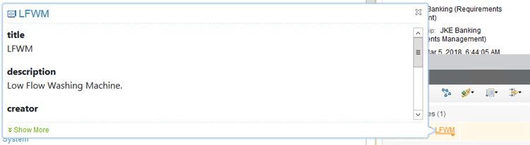

# Using the Watson IoT Platform Data in CE Projects

Lifecycle management of IoT artifacts is not that different from dealing with analysis, design or implementation artifacts produced by CE applications such as IBM Rational DOORS Next Generation, IBM Rational Rhapsody, IBM Rational Team Concert, IBM Rational Quality Manager. You can use Continuous Engineering Lifecycle Management capabilities to facilitate the design, development, and implementation of your Watson IoT Platform applications. You can also use these capabilities in an embedded software development to deploy solution components to the Watson IoT Platform. This way you can expand the scope of traditional Systems and Software Engineering (SSE) solutions to the IoT.

Here are a few examples of how you can use the connector with continuous enginering capabilities:

1. Creating links to Watson IoT Platform artifacts
1. Previewing IoT Platform artifacts in Continuous Engineering applications
1. Using traceability and impact analysis to manage change

# Creating Links to IoT Platform Resources

The iotp-adaptor OSLC server provides creation and selection dialogs for Watson IoT Platform artifacts as OSLC Change Management artifacts. You can link IoT Platform artifacts to any other OSLC provider that supports links to Change Management (CCM) artifacts. Various OSLC domain specifications define standard links to Change Management artifacts. These properties are supported by the products that are part of the IBM Continuous Engineering Solution.

You can create links from IoT Platform artifacts to requirements, change requests (or any IBM Rational Team Concert work item type), and so on. When you create a link to an IoT Platform artifact, the selection dialog of the iotp-adaptor lists the possible target elements to link to. For example, if you are viewing a requirement in Rational DOORS Next Generation, you can create a References link to one or more IoT platform artifacts.

You can search for the IoT Platform artifacts based on their names using [Java regular expressions](https://www.tutorialspoint.com/java/java_regular_expressions.htm), or type * or .* to show all artifacts. You can also select multiple artifacts to create several links in a single operation.

# Previewing IoT Platform Resources in CE Applications

After you create links between CE artifacts, including IoT Platform artifacts, OSLC consumer applications can use OSLC preview to show artifacts managed by other tools. For example, if you created a References link from a requirement to an IoT Platform artifact Low Flow Washing Machine (represented as LFWM), Rational DOORS Next Generation shows a preview of the LFWM device type. Hover over the link to see it. 

The preview includes the following details:

* Artifact icon and label
* Basic information about the artifact
* For Device, the current values of the Device are shown using its logical interface

Note: You can also click Show more at the bottom of the window to see more details.

The preview makes it easy to view linked artifacts across tools in order to understand their relationships. To open the artifact in the tool in which it was created, click the artifact. If you click an IoT Platform artifact, you see it directly on the Watson IoT Platform dashboard.

# Using Traceability and Impact Analysis

Managing change is one of the main purposes of the IBM Continuous Engineering Solution. It facilitates collaborative interaction across multiple teams and across the whole solution delivery lifecycle to maximize the positive impact of change while minimizing its negative effects. The primary means of managing change is through comprehensive impact analysis across the lifecycle.

The IoT Continuous Engineering Solution provides several ways to manage change, from fine-grained impact analysis in individual tools, to comprehensive impact analysis across tools by using Rational Engineering Lifecycle Manager (RELM).

Individual tools often provide their own fine-grained traceability and impact analysis capabilities. In these tools, impact analysis extends only to the "edge" of the tool. That is, the tool can show traceability among its own artifacts, and links to artifacts in other tools. However, you cannot navigate beyond these links into the tool where the artifact resides. 

With Rational Engineering Lifecycle Manager you unlock the data from the CE applications, and perform impact analysis across tools. Each individual tool provides additional details that support a richer impact analysis of change.

iotp-adaptor supports a minimal OSLC Tracked Resource Set (TRS) provider for IoT Platform device types. See the [IBM Continuous Engineering Connector for IoT in Rational Engineering Lifecycle Manager 6.0.5.1](https://jazz.net/downloads/ce4iot-connector/releases/6.0.5.1?p=userGuide) documentation for information on how to configure iotp-adaptor as an LQE data source, and to create RELM views. 
