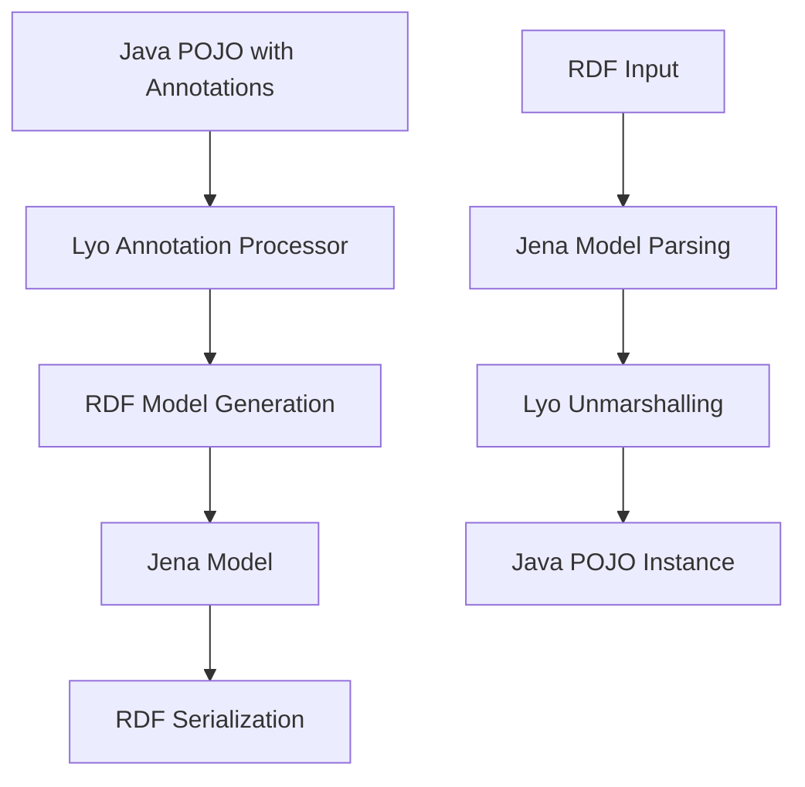

# Lyo Core Internals

This page covers the internal workings of Eclipse Lyo Core, focusing on annotation processing and the mechanisms that enable OSLC resource management.

## Annotation Processing

Lyo enables marshalling and unmarshalling Java POJOs to/from Jena RDF models through annotation-driven processing. This approach allows developers to work with Java objects while automatically handling RDF serialization.

!!! tip "AbstractResource Base Class"
    While any POJO can be used, extending `AbstractResource` is almost always the recommended approach.

!!! info "Code Generation"
    Lyo Designer normally generates code with appropriate annotations. Currently, only OSLC Shapes code generation is implemented, though the Designer supports modeling both RDF classes (vocabularies) and OSLC Shapes (domain specifications).

### Class-Level Annotations

These annotations must be applied at the class level:

| Annotation | Required | Purpose |
|------------|----------|---------|
| `@OslcName` | ✅ | Defines the name of the RDF class |
| `@OslcNamespace` | ✅ | Defines the RDF namespace of the class |
| `@OslcResourceShape` | ✅ | Links to the OSLC Resource Shape |
| `@OslcService` | ⚪ | Indicates the class provides OSLC services |
| `@OslcNotQueryResult` | ⚪ | Excludes class from query results |

**Example:**
```java
@OslcNamespace(Constants.CHANGE_MGMT_NAMESPACE)
@OslcName("ChangeRequest")
@OslcResourceShape(title = "Change Request Shape", describes = Constants.TYPE_CHANGE_REQUEST)
public class ChangeRequest extends AbstractResource {
    // class implementation
}
```

### Property-Level Annotations

These annotations are applied to getter methods:

#### Mandatory Property Annotations

| Annotation | Purpose |
|------------|---------|
| `@OslcName` | Defines property name |
| `@OslcPropertyDefinition` | URI of the property |
| `@OslcOccurs` | Property cardinality (Exactly-one, Zero-or-one, Zero-or-many, One-or-many) |
| `@OslcRange` | Allowed value types for the property |

#### Optional Property Annotations

| Annotation | Purpose | Notes |
|------------|---------|-------|
| `@OslcReadonly` | Property is read-only | Cannot be modified by clients |
| `@OslcTitle` | Human-readable property title | Used in UI generation |
| `@OslcRepresentation` | How property values are represented | Reference, Inline, Either |
| `@OslcValueType` | Specific value type constraint | Resource, XMLLiteral, etc. |
| `@OslcValueShape` | Shape constraint for resource values | Links to Resource Shape |
| `@OslcAllowedValue` | Single allowed value | Takes array parameter |
| `@OslcAllowedValues` | Multiple allowed values | Takes single string parameter |
| `@OslcDefaultValue` | Default property value | Used when property not specified |
| `@OslcDescription` | Property description | Documentation and UI hints |
| `@OslcHidden` | Hidden from standard representations | Internal properties |
| `@OslcMaxSize` | Maximum size constraint | For string/binary properties |
| `@OslcMemberProperty` | Container membership property | For collections |

**Example:**
```java
@OslcDescription("Short name identifying a change request.")
@OslcName("identifier")
@OslcPropertyDefinition(DctermsVocabulary.IDENTIFIER)
@OslcReadOnly
@OslcTitle("Identifier")
@OslcOccurs(Occurs.ExactlyOne)
@OslcValueType(ValueType.String)
public String getIdentifier() {
    return identifier;
}
```

### JAX-RS Method Annotations

For JAX-RS methods that handle Lyo model classes:

| Annotation | Purpose |
|------------|---------|
| `@OslcCreationFactory` | Marks creation factory endpoints |
| `@OslcDialog` | Defines delegated UI dialogs |

**Example:**
```java
@POST
@Consumes(MediaType.APPLICATION_RDF_XML)
@Produces(MediaType.APPLICATION_RDF_XML)
@OslcCreationFactory(
    title = "Change Request Creation Factory",
    label = "Change Request Creation",
    resourceShapes = {Constants.PATH_RESOURCE_SHAPES + "/" + Constants.PATH_CHANGE_REQUEST},
    resourceTypes = {Constants.TYPE_CHANGE_REQUEST},
    usages = {Constants.USAGE_DEFAULT}
)
public Response createChangeRequest(final ChangeRequest changeRequest) {
    // implementation
}
```

### Package-Level Annotations

The `@OslcSchema` annotation can be applied at the package level in `package-info.java`:

```java
@OslcSchema({
    @OslcNamespaceDefinition(prefix = "cm", namespaceURI = Constants.CHANGE_MGMT_NAMESPACE),
    @OslcNamespaceDefinition(prefix = "dcterms", namespaceURI = DctermsVocabulary.NAMESPACE)
})
package com.example.oslc.cm.resources;

import org.eclipse.lyo.oslc4j.core.annotation.OslcNamespaceDefinition;
import org.eclipse.lyo.oslc4j.core.annotation.OslcSchema;
```

## Annotation Processing Flow



## Best Practices

### Annotation Usage

!!! success "Recommended Practices"
    - **Use consistent namespaces** across related classes
    - **Provide meaningful titles and descriptions** for all properties
    - **Apply appropriate cardinality** with `@OslcOccurs`
    - **Use standard vocabularies** where possible (Dublin Core, FOAF, etc.)
    - **Document custom properties** thoroughly

### Property Design

!!! tip "Property Guidelines"
    - **Start with required properties** using `@OslcOccurs(Occurs.ExactlyOne)`
    - **Use appropriate value types** for validation
    - **Consider read-only properties** for system-generated values
    - **Provide default values** where appropriate
    - **Use allowed values** for enumerated properties

### Performance Considerations

!!! warning "Performance Notes"
    - **Annotation processing happens at runtime** - consider caching
    - **Large object graphs** can impact serialization performance
    - **Lazy loading** may be needed for complex relationships
    - **Consider pagination** for large collections

## Common Patterns

### Resource Identifier Pattern
```java
@OslcDescription("Unique identifier for this resource.")
@OslcName("identifier")
@OslcPropertyDefinition(DctermsVocabulary.IDENTIFIER)
@OslcReadOnly
@OslcTitle("Identifier")
@OslcOccurs(Occurs.ExactlyOne)
@OslcValueType(ValueType.String)
public String getIdentifier() {
    return identifier;
}
```

### Resource Reference Pattern
```java
@OslcDescription("Creator of this resource.")
@OslcName("creator")
@OslcPropertyDefinition(DctermsVocabulary.CREATOR)
@OslcRange(FoafVocabulary.PERSON)
@OslcTitle("Creator")
@OslcOccurs(Occurs.ZeroOrMany)
@OslcValueType(ValueType.Resource)
@OslcRepresentation(Representation.Reference)
public URI[] getCreators() {
    return creators.toArray(new URI[creators.size()]);
}
```

### Enumerated Property Pattern
```java
@OslcDescription("The state of the change request.")
@OslcName("state")
@OslcPropertyDefinition("http://example.com/ns#state")
@OslcTitle("State")
@OslcOccurs(Occurs.ExactlyOne)
@OslcValueType(ValueType.String)
@OslcAllowedValue({"New", "In Progress", "Resolved", "Closed"})
public String getState() {
    return state;
}
```

## Debugging Annotations

### Common Issues

!!! bug "Annotation Problems"
    **Missing Required Annotations**: Ensure all mandatory annotations are present
    
    **Incorrect Property Definitions**: Verify URI syntax and namespace declarations
    
    **Cardinality Mismatches**: Check `@OslcOccurs` matches actual data structure
    
    **Namespace Conflicts**: Resolve duplicate or conflicting namespace definitions

### Validation Tools

- **Lyo Validation**: Built-in validation during marshalling/unmarshalling
- **RDF Validators**: External tools for RDF syntax validation
- **Shape Validation**: SHACL or Resource Shape validation
- **Unit Tests**: Automated testing of annotation behavior

## Reference Documentation

- **[Lyo Core Annotations Javadoc](https://download.eclipse.org/lyo/docs/core/latest/org/eclipse/lyo/oslc4j/core/annotation/package-summary.html)**
- **[OSLC Resource Shapes Specification](https://docs.oasis-open.org/oslc-core/oslc-core/v3.0/oslc-core-v3.0.html#resource-shapes)**
- **[RDF Vocabularies](https://www.w3.org/TR/rdf11-primer/)**

## Related Topics

- [Eclipse Lyo Overview](index.md)
- [Setup Development Environment](setup.md)
- [Lyo Designer](designer.md)
- [Sample Applications](../samples.md)
