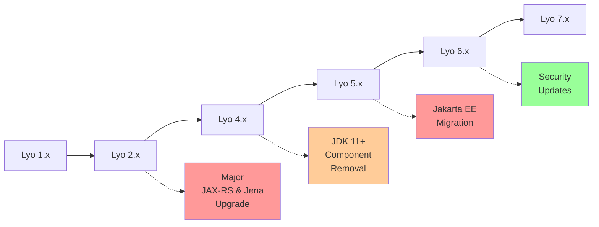

# Eclipse Lyo Migration Guide Overview

This section provides comprehensive guidance for migrating between different versions of Eclipse Lyo, from legacy 2.x versions to the latest 7.x releases.

## Migration Path Overview

## Migration Complexity Matrix

| From Version | To Version | Complexity | Key Changes |
|--------------|------------|------------|-------------|
| **2.x** → **4.x** | 🔴 **High** | JAX-RS 1.1→2.0, Jena 2.x→4.x, JDK 7→8+ |
| **4.x** → **5.x** | 🟡 **Medium** | JDK 11+, Component removal, Jena upgrade |
| **5.x** → **6.x** | 🔴 **High** | Jakarta EE migration (javax→jakarta) |
| **6.x** → **7.x** | 🟢 **Low** | Security updates, WORK IN PROGRESS |

!!! error "Lyo 3.x Does Not Exist"
    There is no Eclipse Lyo version 3.x. The project went directly from Lyo 2.x to Lyo 4.x to avoid confusion with the OSLC 3.0 specification. When you see references to "OSLC 3.0", this refers to the specification version, not the Lyo SDK version.

## Detailed Migration Guides

### 🔴 Major Migrations (High Risk/Effort)

#### [Lyo 2.x to 4.x Migration](migration-2x-4x.md)
**Most Complex Migration - Plan Carefully**

- **JAX-RS Framework Change**: Apache Wink → Jersey 2.x
- **Jena Package Renaming**: `com.hp.hpl.jena.*` → `org.apache.jena.*`
- **JDK Upgrade**: Java 7 → Java 8+
- **Repository Migration**: Eclipse Maven → Maven Central
- **Client Library**: Replace old client with new Lyo 4.0 client

**⚠️ High Risk Factors:**
- Custom JAX-RS providers need rewriting
- All Jena imports must be updated
- Web.xml configuration changes required
- Extensive testing needed

#### [Lyo 5.x to 6.x Migration](migration-5x-6x.md)  
**Jakarta EE Namespace Migration**

- **Package Renaming**: All `javax.*` → `jakarta.*`
- **JDK Upgrade**: Java 11 → Java 17+
- **Jersey Upgrade**: 2.35 → 3.1.5
- **Servlet Container**: Requires Jakarta EE 9+ support

**⚠️ High Risk Factors:**
- Every Java EE import needs updating
- Application server compatibility requirements
- Jersey 3.x has configuration changes
- JSP taglib updates needed

### 🟡 Medium Migrations

#### [Lyo 4.x to 5.x Migration](migration-4x-5x.md)
**JDK and Component Cleanup**

- **JDK Upgrade**: Java 8 → Java 11+
- **Component Removal**: Several deprecated components removed
- **Jena Upgrade**: 3.x → 4.5.0 (security update)
- **TRS Changes**: BigInteger support for order properties

**⚠️ Medium Risk Factors:**
- JDK 11+ compatibility testing needed
- Removed components must be replaced
- TRS code needs BigInteger updates

### 🟢 Low-Risk Migrations

#### [Lyo 6.x to 7.x Migration](migration-6x-7x.md)
**Security-Focused Update**

- **Jena Security Update**: 4.8 → 4.10 (CVE-2023-32200)
- **Deprecated Removal**: `oslc4j-json4j-provider` removed
- **Bug Fixes**: OSLC Query improvements

**✅ Low Risk Factors:**
- Minimal breaking changes
- Mostly dependency updates
- Security improvements

## Migration Strategy Recommendations

### 🎯 Recommended Approach: Incremental Migration

**Don't skip versions!** Each migration guide builds on the previous:

1. **Start with your current version**
2. **Follow each guide in sequence**
3. **Test thoroughly at each step**
4. **Don't rush major migrations**

## Migration Support Resources

### 📚 Documentation
- **[Eclipse Lyo Project](https://github.com/eclipse/lyo)** - Main project repository
- **[Lyo Release Notes](https://github.com/eclipse/lyo/releases)** - Detailed release information
- **[RefImpl Examples](https://github.com/oslc-op/refimpl)** - Working migration examples

### 💬 Community Support
- **[OSLC Community Forum](https://forum.open-services.net/c/sdks/lyo/9)** - Get help from the community
- **[GitHub Issues](https://github.com/eclipse/lyo/issues)** - Report bugs or ask questions
- **[Eclipse Lyo Dev List](https://accounts.eclipse.org/mailing-list/lyo-dev)** - Developer discussions

### 🔧 Migration Tools
- **[Eclipse Transformer](https://projects.eclipse.org/projects/technology.transformer)** - Automates `javax.*` → `jakarta.*` migration
- **IDE Refactoring Tools** - Help with package name changes
- **Maven Dependency Analyzer** - Identify dependency conflicts

## Troubleshooting Common Issues

### Build Failures
- **Maven repository issues**: Ensure you're using Maven Central, not old Eclipse repos
- **Dependency conflicts**: Use `mvn dependency:tree` to identify conflicts
- **JDK version mismatches**: Verify JDK version matches Lyo requirements

### Runtime Errors
- **ClassNotFoundException**: Usually indicates missing dependencies or wrong versions
- **NoSuchMethodError**: API changes between versions - check release notes
- **ServletException**: Configuration issues, especially with Jakarta EE migration

### Performance Issues
- **Memory usage**: New Jena versions may have different memory patterns
- **Startup time**: Jersey versions may affect startup performance
- **Response time**: Test under load to ensure acceptable performance

---

!!! tip "Need Help?"
    If you encounter issues during migration, don't hesitate to:
    
    1. **Check the specific migration guide** for your version combination
    2. **Search the [OSLC Community Forum](https://forum.open-services.net/c/sdks/lyo/9)** for similar issues
    3. **Review [RefImpl migration commits](https://github.com/oslc-op/refimpl/commits)** for working examples
    4. **Post questions** on the forum with specific error messages and configuration details
