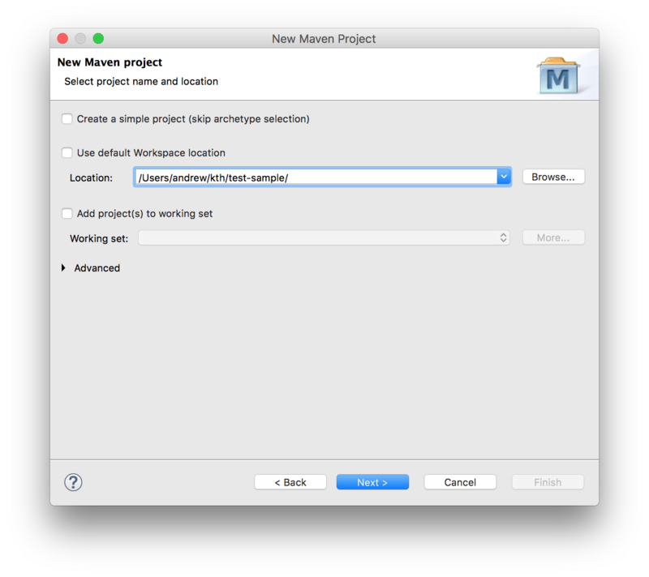
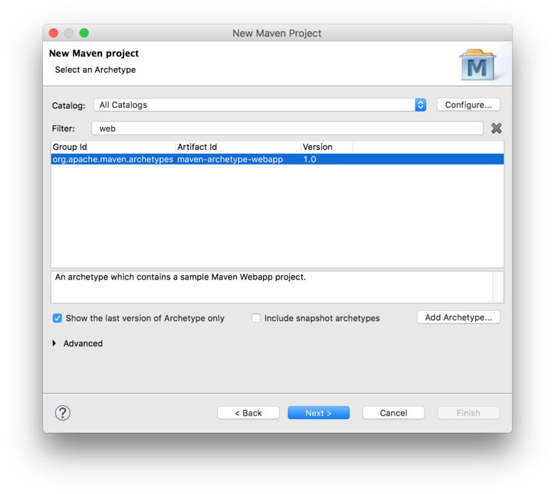
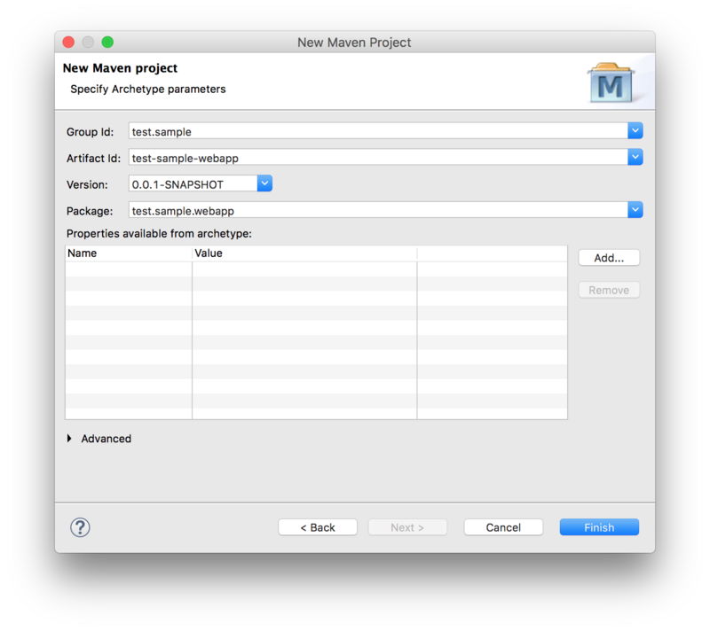
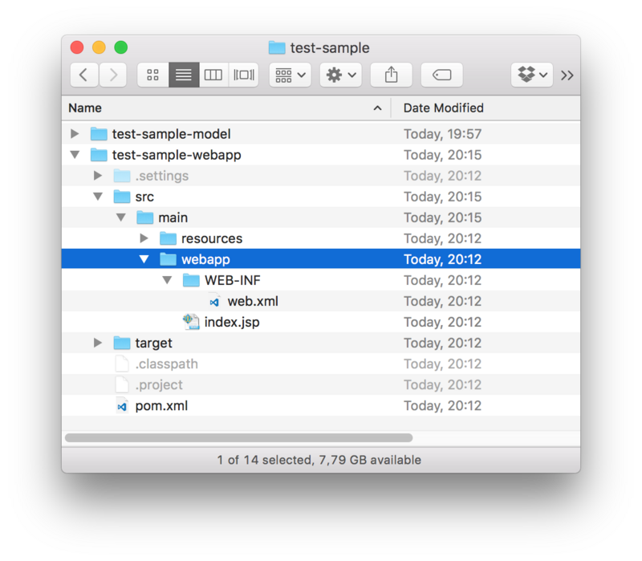

# Create an Eclipse Lyo project

This document provides step-by-step instructions for creating a Java project with the necessary configurations to develop OSLC server/client applications using Lyo. The instructions assume Eclipse IDE is being used, but are equally valid for other development environments.

## An alternative to the manual steps below

An alternative to the instructions on this page is to use [Lyo Designer](./lyo-designer.md) to quickly generate the project, including a very basic code skeleton. The generated project will also include the necessary setup for OpenApi/Swagger support, TRS, etc.

1. Set up the environment for Lyo development as instructed on [Eclipse Setup for Lyo-based Development](./eclipse-setup-for-lyo-based-development.md).
1. Install [Lyo Designer](./install-lyo-designer.md).
1. Follow the [Create a Modelling Project](./toolchain-modelling-workshop.md#create-modelling-project) instructions (*Only this particular section*) to create the Eclipse project.
1. Follow the [Adaptor Interface](./toolchain-modelling-workshop.md#adaptor-interface-view) instructions (*Only this particular section*) to create a single Adaptor Interface in the model. Do not create additional elements, such as a Service Provider Catalog, Service Provider, etc. Set the generation settings as expected.
1. Follow the [Generate Lyo Java code](./toolchain-modelling-workshop.md#generate-oslc4j-java-code) instructions (*Only this particular section*) to generate the basic project setup.
1. The process is complete! Lyo Designer can be used to model the complete OSLC Server/Client and generate additional project code.

## Introduction

In the instructions below, the following parameters are assumed, which need to be adjusted for the particular project:

* Eclipse Project Name: `adaptor-sample-webapp`
* Base Package Name for Java Classes: `com.sample.adaptor`

These instructions create only the code skeleton. The [Toolchain Modelling Workshop](./toolchain-modelling-workshop.md) can then be used to generate the necessary code to become a fully functional server.

As a complement when following the instructions below, you can find sample projects under the [Lyo Adaptor Sample Modelling](https://github.com/OSLC/lyo-adaptor-sample-modelling) git repository.

* For Lyo 4.1.0, please refer to the `main-4.x` branch.
* For Lyo 5.0.0-SNAPSHOT, please refer to the `main-5.x` branch.
* For Lyo 2.4.0, please refer to the `main-2.x` branch.

Creating the project consists of these steps:

1. [Set up Eclipse](#set-up-eclipse)
1. [Create a Maven project](#create-maven-project)
1. [Customise the project POM file](#customize-project-pom-file)
1. [Customise the web configuration](#customize-web-configuration)
1. [(Optional) Provide OpenApi/Swagger Support](#provide-openapi-support)
1. [(Optional) Provide TRS Support](#provide-trs-support)
1. [Run the server](#run-server)

## Set up Eclipse

Set up the environment for Lyo development as instructed on [Eclipse Setup for Lyo-based Development](./eclipse-setup-for-lyo-based-development.md).

## Create a Maven project

To create a Maven project from an archetype via Eclipse:

1. Select **File -> New -> Other**.
1. Then select **Maven Project** under **Maven** group.
1. Leave the **Create a simple project** checkbox unchecked.
1. Uncheck the **Use default Workspace location** option and point it to the project root.
1. Press **Next**.



Next, select the `maven-archetype-webapp` archetype:



Next, fill in the **Group Id**, **Artifact Id**, and the **Package Base**.

* The **Package Base** value (`com.sample.adaptor` on this page) will be used as a base package for the server code.



The project is now available in Eclipse with the following folder structure:



## Customise the project POM file

Modify the project `pom.xml` file.

### Set up general POM properties

Use properties to define the Java version and common version for Lyo packages:

```xml
<properties>
  <project.build.sourceEncoding>UTF-8</project.build.sourceEncoding>
  <project.reporting.outputEncoding>UTF-8</project.reporting.outputEncoding>
  <maven.compiler.release>21</maven.compiler.release>
  <version.lyo>7.0.0.Beta3</version.lyo>
</properties>
```

### Use the Lyo BOM

Eclipse Lyo provides a Bill of Materials (`lyo-bom`) to manage versions for Lyo modules and related dependencies (such as Jena, Jersey, and Jakarta APIs). Add `lyo-bom` to the `<dependencyManagement>` section:

```xml
<dependencyManagement>
  <dependencies>
    <dependency>
      <groupId>org.eclipse.lyo</groupId>
      <artifactId>lyo-bom</artifactId>
      <version>${version.lyo}</version>
      <type>pom</type>
      <scope>import</scope>
    </dependency>
  </dependencies>
</dependencyManagement>
```

### (Optional) Add Lyo repositories

Lyo release artefacts are on Maven central since 4.0.0 - no action needed.

If using the latest development snapshots is required, the following entry is needed:

```xml
<repositories>
    <repository>
        <name>Central Portal Snapshots</name>
        <id>central-portal-snapshots</id>
        <url>https://central.sonatype.com/repository/maven-snapshots/</url>
        <releases>
            <enabled>false</enabled>
        </releases>
        <snapshots>
            <enabled>true</enabled>
        </snapshots>
    </repository>
</repositories>
```

### SLF4J package dependencies

Lyo uses SLF4J for logging, leaving the choice of the logging library to use. The simplest option:

```xml
<dependency>
  <groupId>org.slf4j</groupId>
  <artifactId>slf4j-simple</artifactId>
  <scope>runtime</scope>
</dependency>
```

### Servlet dependencies

Jakarta EE 10 (Servlet 6.0) and JSTL 3.0 are required:

```xml
<dependency>
  <groupId>jakarta.servlet</groupId>
  <artifactId>jakarta.servlet-api</artifactId>
  <scope>provided</scope>
</dependency>
<dependency>
  <groupId>jakarta.servlet.jsp.jstl</groupId>
  <artifactId>jakarta.servlet.jsp.jstl-api</artifactId>
  <scope>provided</scope>
</dependency>
```

### JAX-RS implementation dependencies

Lyo depends on Jakarta RESTful Web Services APIs. The application must provide an implementation of these APIs. When using Jersey (3.1.x), the versions are managed by `lyo-bom`:

```xml
<dependency>
  <groupId>org.glassfish.jersey.core</groupId>
  <artifactId>jersey-server</artifactId>
</dependency>
<dependency>
  <groupId>org.glassfish.jersey.containers</groupId>
  <artifactId>jersey-container-servlet</artifactId>
</dependency>
<dependency>
    <groupId>org.glassfish.jersey.inject</groupId>
    <artifactId>jersey-hk2</artifactId>
</dependency>
```

### Lyo dependencies

The minimal Lyo dependencies are:

```xml
<dependency>
  <groupId>org.eclipse.lyo.oslc4j.core</groupId>
  <artifactId>oslc4j-core</artifactId>
</dependency>
<dependency>
  <groupId>org.eclipse.lyo.oslc4j.core</groupId>
  <artifactId>oslc4j-jena-provider</artifactId>
</dependency>
```

### OSLC OAuth support

If the server needs to support OAuth, include the following:

```xml
<dependency>
  <groupId>org.eclipse.lyo.server</groupId>
  <artifactId>oauth-core</artifactId>
</dependency>
<dependency>
  <groupId>org.eclipse.lyo.server</groupId>
  <artifactId>oauth-consumer-store</artifactId>
</dependency>
<dependency>
  <groupId>org.eclipse.lyo.server</groupId>
  <artifactId>oauth-webapp</artifactId>
  <type>war</type>
</dependency>
```

To support OAuth, add the following JAX-RS providers to the Application (the `jakarta.ws.rs.core.Application` subclass):

```java
RESOURCE_CLASSES.add(Class.forName("org.eclipse.lyo.server.oauth.webapp.services.ConsumersService"));
RESOURCE_CLASSES.add(Class.forName("org.eclipse.lyo.server.oauth.webapp.services.OAuthService"));
```

### OSLC Client support

If the OSLC server must also consume resources from another server, add a dependency on the OSLC client package:

```xml
<dependency>
  <groupId>org.eclipse.lyo.clients</groupId>
  <artifactId>oslc-client</artifactId>
</dependency>
```

### Configure the embedded Jetty server for quick debugging

Use an embedded servlet container during debugging to simplify the development process. For Jakarta EE 10, use `jetty-ee10-maven-plugin`.

Replace the existing `<build>` entry with the Jetty configuration below, using the following customizations:

* `adaptor-sample` is the context path that can match the Eclipse project name (or another chosen value).
* `8080` is the port number to run the services on.

This configuration makes the server available at `http://localhost:8080/adaptor-sample`.

```xml
<build>
  <plugins>
    <plugin>
      <groupId>org.eclipse.jetty.ee10</groupId>
      <artifactId>jetty-ee10-maven-plugin</artifactId>
      <version>12.1.11</version>
      <configuration>
        <webApp>
          <contextPath>/adaptor-sample</contextPath>
        </webApp>
        <httpConnector>
          <port>8080</port>
        </httpConnector>
        <scan>5</scan>
      </configuration>
    </plugin>
  </plugins>
</build>
```

## Customise the web configuration

Modify the parameters in `src/main/webapp/WEB-INF/web.xml` according to the template below:

* `Adaptor Sample` can match the Eclipse project name (or another chosen value).
* `com.sample.adaptor` must match the base package name for the project.
* `8080` must match the port number specified in the POM file for Jetty configuration.

```xml
<?xml version="1.0" encoding="UTF-8"?>
<web-app xmlns="https://jakarta.ee/xml/ns/jakartaee"
  xmlns:xsi="http://www.w3.org/2001/XMLSchema-instance"
  xsi:schemaLocation="https://jakarta.ee/xml/ns/jakartaee https://jakarta.ee/xml/ns/jakartaee/web-app_6_0.xsd"
  version="6.0">
  <display-name>Adaptor Sample</display-name>
  <context-param>
    <description>Base URI for the adaptor.</description>
    <param-name>com.sample.adaptor.servlet.baseurl</param-name>
    <param-value>http://localhost:8080</param-value>
  </context-param>
  <listener>
    <description>Listener for ServletContext lifecycle changes</description>
    <listener-class>com.sample.adaptor.servlet.ServletListener</listener-class>
  </listener>
  <servlet>
    <servlet-name>JAX-RS Servlet</servlet-name>
    <servlet-class>org.glassfish.jersey.servlet.ServletContainer</servlet-class>
    <init-param>
      <param-name>jakarta.ws.rs.Application</param-name>
      <param-value>com.sample.adaptor.servlet.Application</param-value>
    </init-param>
    <load-on-startup>1</load-on-startup>
  </servlet>
  <servlet-mapping>
    <servlet-name>JAX-RS Servlet</servlet-name>
    <url-pattern>/services/*</url-pattern>
  </servlet-mapping>
</web-app>
```

## (Optional) Provide OpenApi/Swagger Support

With OSLC being based on REST, an OSLC server can be documented using [OpenApi/Swagger](https://swagger.io/). 

The instructions provide the minimal settings necessary for a Lyo project using OpenAPI 3 and Jakarta REST.

### Add OpenApi/Swagger Maven dependencies

Add the following Swagger dependencies to the `pom.xml` file. The versions are managed by `lyo-bom`:

```xml
<dependency>
  <groupId>io.swagger.core.v3</groupId>
  <artifactId>swagger-jaxrs2-jakarta</artifactId>
</dependency>
<dependency>
  <groupId>io.swagger.core.v3</groupId>
  <artifactId>swagger-jaxrs2-servlet-initializer-v2-jakarta</artifactId>
</dependency>
```

### Co-host Swagger UI with the server 

The following steps provide the end-user with an interactive console to the OSLC services, by integrating [Swagger UI](https://swagger.io/swagger-ui/) with the OSLC server.

Add the following plugins to the existing `<plugins>` entry of the `pom.xml` file. These plugins download and extract the necessary `Swagger UI` files from [Swagger UI GitHub project](https://github.com/swagger-api/swagger-ui) onto the project:

```xml
<build>
  <plugins>
    <plugin>
    ...
    </plugin>
    <plugin>
      <!-- Download Swagger UI webjar. -->
      <groupId>org.apache.maven.plugins</groupId>
      <artifactId>maven-dependency-plugin</artifactId>
      <version>3.1.2</version>
      <executions>
          <execution>
              <phase>prepare-package</phase>
              <goals>
                  <goal>unpack</goal>
              </goals>
              <configuration>
                  <artifactItems>
                      <artifactItem>
                          <groupId>org.webjars</groupId>
                          <artifactId>swagger-ui</artifactId>
                          <version>5.32.8</version>
                      </artifactItem>
                  </artifactItems>
                  <outputDirectory>${project.build.directory}/swagger-ui</outputDirectory>
              </configuration>
          </execution>
      </executions>
    </plugin>
    <plugin>
      <!-- Add Swagger UI resources to the war file. -->
      <groupId>org.apache.maven.plugins</groupId>
      <artifactId>maven-war-plugin</artifactId>
      <version>3.2.3</version>
      <configuration>
          <webResources combine.children="append">
              <resource>
                  <directory>${project.build.directory}/swagger-ui/META-INF/resources/webjars/swagger-ui/5.32.8</directory>
                  <includes>
                      <include>**/*.*</include>
                  </includes>
                  <targetPath>/swagger-ui/dist</targetPath>
              </resource>
          </webResources>
      </configuration>
    </plugin>
  </plugins>
</build>
```

### Add OpenAPI JAX-RS providers to your Application

Add the OpenAPI JAX-RS providers and definition to the Application class that extends `jakarta.ws.rs.core.Application`:

```java
import io.swagger.v3.jaxrs2.integration.resources.AcceptHeaderOpenApiResource;
import io.swagger.v3.jaxrs2.integration.resources.OpenApiResource;
import io.swagger.v3.oas.annotations.OpenAPIDefinition;
import io.swagger.v3.oas.annotations.info.Info;
import io.swagger.v3.oas.annotations.servers.Server;

@OpenAPIDefinition(info = @Info(title = "Adaptor Sample", version = "1.0.0"), servers = @Server(url = "/services/"))
public class Application extends jakarta.ws.rs.core.Application {
  private static final Set<Class<?>> RESOURCE_CLASSES = new HashSet<Class<?>>();
    static
    {
      ...
      RESOURCE_CLASSES.add(OpenApiResource.class);
      RESOURCE_CLASSES.add(AcceptHeaderOpenApiResource.class);
      ...
    }
    ...
```

### Add OpenApi Annotations (Almost Optional)

The OpenAPI documentation can be enhanced by adding OpenAPI 3 annotations.

#### `@Tag`

1. For each REST service (i.e. OSLC Service), add the `@Tag` annotation to group operations.

```java
@Tag(name = "requirements", description = "OSLC service for resources of type Requirement")
@OslcService(Oslc_rmDomainConstants.REQUIREMENTS_MANAGEMENT_DOMAIN)
@Path("requirements")
```

#### `@Operation` (Optional)

For each REST method, add the `@Operation` annotation.

!!! important "OpenApi Operation Uniqueness"
    In [OpenApi](https://swagger.io/docs/specification/paths-and-operations/), an operation is considered unique based on the combination of its path and HTTP method. This means you cannot define multiple C.R.U.D. methods for the same path and method—even if they differ by parameters such as `Accept` or `Content-Type`.

!!! example
    If your OSLC Service defines separate Java methods to handle HTML and RDF/XML content types for the same path and HTTP method, OpenApi will only recognise one of these methods and ignore the other.

    **Workaround:** Annotate ALL methods that are identified as unique with the complete list of media types in the `produces` property of the `@Operation` annotation. This way, the generated documentation correctly indicates the existence of all methods.

    ```java
        @GET
        @Operation(summary = "GET on Requirement resources")
        @Path("{requirementId}")
        @Produces(OslcMediaType.APPLICATION_RDF_XML)
        public Requirement getRequirement(
    ```

#### `@Schema` (Optional)

For each Java class that models an OSLC-resource (`@OslcName` annotation), add a `@Schema` annotation that refers to the Shape of the resource, since a Shape is a more accurate description of the object, than the one automatically generated by Swagger.

```java
@Schema(description = "The model below is only an object structure as derived by swagger. For a more accurate RDF Description, refer to the Requirement Resource Shape.")
@OslcNamespace(Oslc_rmDomainConstants.REQUIREMENT_NAMESPACE)
@OslcName(Oslc_rmDomainConstants.REQUIREMENT_LOCALNAME)
@OslcResourceShape(title = "Requirement Resource Shape", describes = Oslc_rmDomainConstants.REQUIREMENT_TYPE)
public class Requirement
...
```

### Access the Swagger UI interactive console

Before accessing the [Swagger UI](https://swagger.io/swagger-ui/) interactive console for the first time, edit the `swagger-ui/index.html` file, replacing the default url `http://petstore.swagger.io/v2/swagger.json` with the URL of the YAML file `http://localhost:8080/adaptor-sample/services/openapi.yaml`.

The generated interactive API console can be accessed via:

    http://localhost:8080/adaptor-sample/swagger-ui/

### Access OpenAPI specification document (yaml file)

You can also access the OpenAPI specification document (yaml file) at:

    http://localhost:8080/adaptor-sample/services/openapi.yaml

You can copy the yaml file to a [Swagger Editor](https://editor.swagger.io), to view the API documentation, as well as generate client/Server SDK code for a number of languages and platforms.

## (Optional) Provide TRS Support

The *TRS Server* library is a set of ready-to-use classes that provide the required REST services for TRS, with minimal effort. 
The current implementation supports an In-memory TRS Server that does not persist its TRS resources.
These classes are however designed to be extended for a persistent solution. 
For a thorough walkthrough of TRS solutions, which among other things ensures persisting the TRS Logs, visit the [additional information on TRS](./eclipse-lyo.md#trs-sdk).  

### Add Maven dependencies

Add a dependency for the TRS Server library:

```xml
<dependency>
  <groupId>org.eclipse.lyo.trs</groupId>
  <artifactId>trs-server</artifactId>
</dependency>
```

### Set up the TRS JAX-RS Provider to your Application

The *TRS Server* library already contains a `TrackedResourceSetService` class that can handle the REST calls for TRS Base and ChangeLog. For this service to work, you will only need to provide a binding to a singleton of a class that implements the `PagedTrs` class.

Register the TRS JAX-RS Provider `TrackedResourceSetService` in your Application (the `jakarta.ws.rs.core.Application` subclass):

```java
import org.eclipse.lyo.oslc4j.trs.server.service.TrackedResourceSetService;
...
public class Application extends jakarta.ws.rs.core.Application {
    private static final Set<Class<?>>         RESOURCE_CLASSES                          = new HashSet<Class<?>>();
    static
    {
      ...
      RESOURCE_CLASSES.add(TrackedResourceSetService.class);
      ...
    }
    ...
```

Provide the necessary binding definition for the `PagedTrs` class:

```java
import java.util.Collections;
import org.eclipse.lyo.oslc4j.trs.server.PagedTrs;
import com.sample.adaptor.InmemPagedTrsSingleton;
import org.glassfish.hk2.utilities.binding.AbstractBinder;
...
public class Application extends jakarta.ws.rs.core.Application {
    ...
    @Override
    public Set<Object> getSingletons() {
        return Collections.singleton(new AbstractBinder() {
            @Override
            protected void configure() {
                bindFactory(new InmemPagedTrsSingleton()).to(PagedTrs.class);
            }
        });
    }
```

Define the `InmemPagedTrsSingleton` singleton class. Complete the code example below, with:
* the code that populates `uris` with the initial set of resources to be managed by `InmemPagedTrs`; 
* the desired `basePageLimit` and `changelogPageLimit` parameters. 

```java
package com.sample.adaptor;

import java.net.URI;
import java.util.ArrayList;
import java.util.Iterator;

import jakarta.ws.rs.core.UriBuilder;
import org.eclipse.lyo.oslc4j.core.OSLC4JUtils;
import org.eclipse.lyo.oslc4j.trs.server.InmemPagedTrs;
import org.eclipse.lyo.oslc4j.trs.server.PagedTrs;
import org.eclipse.lyo.oslc4j.trs.server.service.TrackedResourceSetService;
import org.glassfish.hk2.api.Factory;
import org.slf4j.Logger;
import org.slf4j.LoggerFactory;

public class InmemPagedTrsSingleton implements Factory<PagedTrs> {
    private final static Logger log = LoggerFactory.getLogger(InmemPagedTrsSingleton.class);
    private static InmemPagedTrs inmemPagedTrs;

    @Override
    public InmemPagedTrs provide() {
        return getInmemPagedTrs();
    }

    @Override
    public void dispose(final PagedTrs instance) {
        log.debug("{} is getting disposed", instance);
    }

    public static InmemPagedTrs getInmemPagedTrs() {
        if(inmemPagedTrs == null) {
            log.debug("Initialising 'InmemPagedTrs' instance");
            
            ArrayList<URI> uris = new ArrayList<URI>();
            
            //TODO: populate uris with the initial set of resources to be managed by the InmemPagedTrs instance
            ....
            // not thread-safe
            inmemPagedTrs = new InmemPagedTrs(<basePageLimit>, <changelogPageLimit>,
                UriBuilder.fromUri(OSLC4JUtils.getServletURI()).path(TrackedResourceSetService.RESOURCE_PATH).build(), 
                TrackedResourceSetService.BASE_PATH, TrackedResourceSetService.CHANGELOG_PATH, uris);
        }
        return inmemPagedTrs;
    }
}
```

The application is now ready to respond to REST requests from a TRS Client. Once running, the server will respond to requests on the relative path `/trs`.

### Update the TRS data set

To update the set of OSLC resources that form the TRS Base and ChangeLog, call the following methods in the code:

* `InmemPagedTrsSingleton.getInmemPagedTrs().onCreated(aResource);`
* `InmemPagedTrsSingleton.getInmemPagedTrs().onModified(aResource);`
* `InmemPagedTrsSingleton.getInmemPagedTrs().onDeleted(aResource.getAbout());`

## Run the server

Once the server is developed, run it by selecting **Run As ➞ Maven build ...** from the project's context menu, and setting the goal to `clean jetty:run-war`.

Access the server from [http://localhost:8080/adaptor-sample](http://localhost:8080/adaptor-sample) (`adaptor-sample` and `8080` will depend on the particular settings, as instructed above).

> **Pro Tip:** If the error `Project configuration is not up-to-date with pom.xml` occurs, right click on the eclipse project and select **Maven ➞ Update Project** ...
