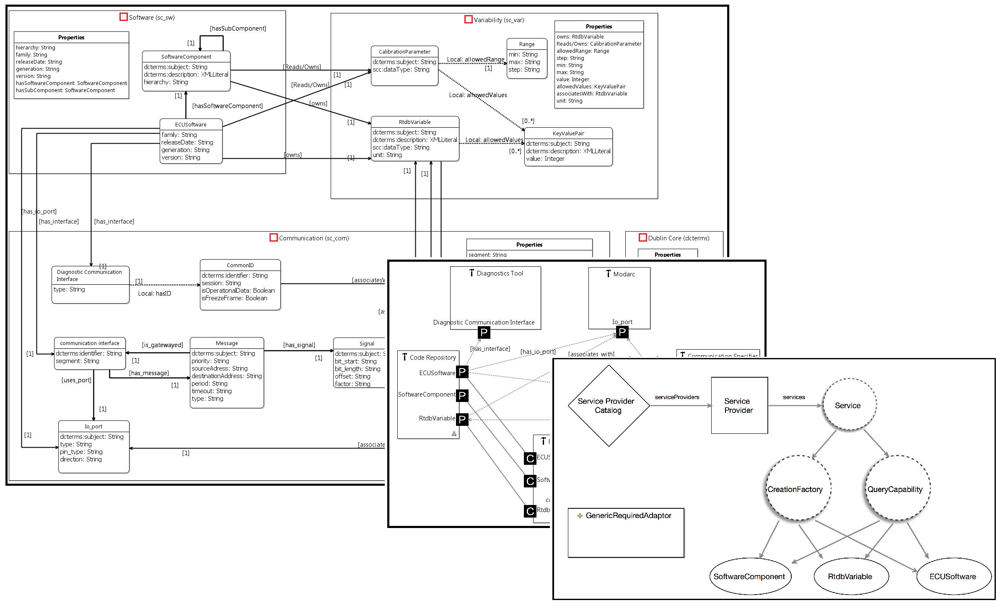
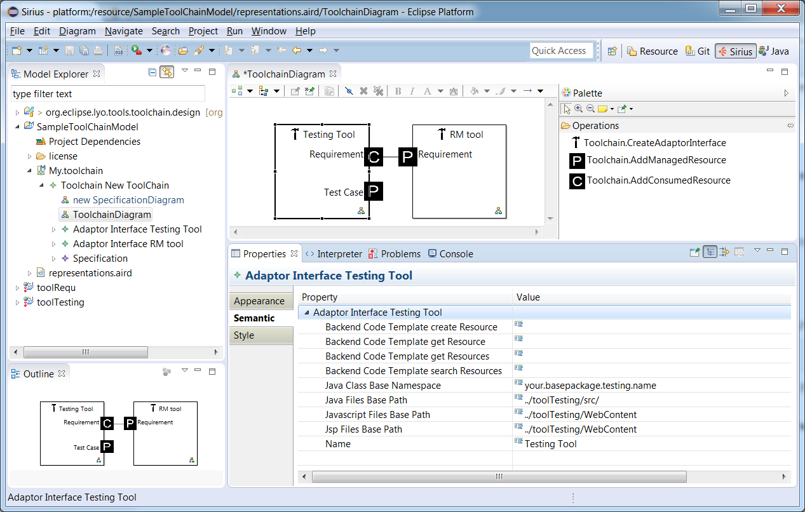
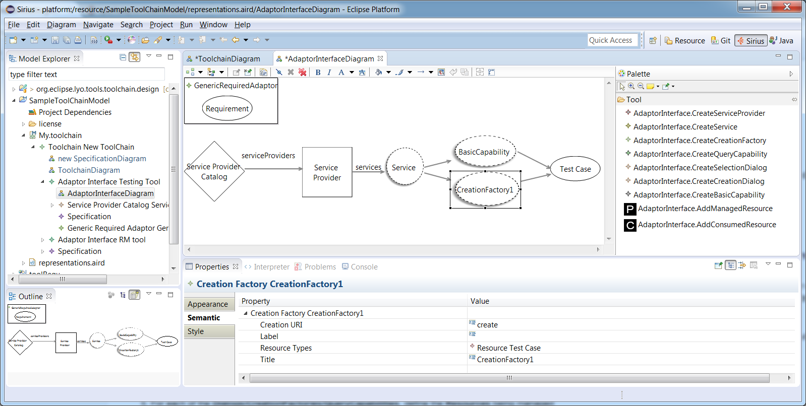
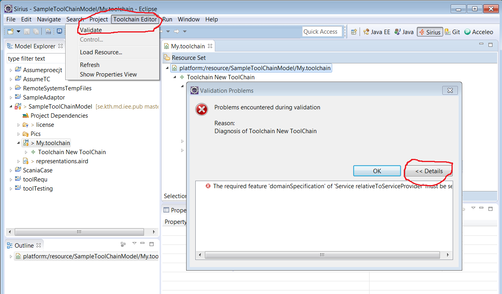

# Toolchain Modelling Workshop

This comprehensive workshop demonstrates using Lyo Designer to graphically model complete OSLC-based toolchains, including interactions between OSLC servers and clients.

## Introduction

Lyo Designer enables you to model complete OSLC toolchains at a higher level of abstraction, without dealing directly with technical details like Linked Data and RDF. However, basic understanding of these concepts remains essential.

!!! info "Workshop Scope"
    This tutorial covers the complete development cycle:
    
    1. **Environment Setup** - Configure Eclipse and Lyo Designer
    2. **Project Creation** - Create modeling project structure
    3. **Graphical Modeling** - Design toolchain and adaptor functionality
    4. **Code Generation** - Generate Lyo-compliant code
    5. **Implementation** - Complete adaptor implementation

### Three Modeling Viewpoints

Lyo Designer structures toolchain models around three key viewpoints:

!!! example "Modeling Perspectives"
    **1. Domain Specification View**
    
    - Define resource types, properties, and relationships
    - Follow [OSLC Core Specification](https://docs.oasis-open.org/oslc-core/oslc-core/v3.0/oslc-core-v3.0.html)
    - Use [Resource Shape constraint language](https://docs.oasis-open.org/oslc-core/oslc-core/v3.0/oslc-core-v3.0.html#resource-shapes)
    
    **2. Toolchain View**
    
    - Allocate resources to tools
    - Define resources exposed and consumed by each tool
    - Model tool interactions and dependencies
    
    **3. Adapter Interface View**
    
    - Design internal tool interface details
    - Capture sufficient information for code generation
    - Generate Lyo SDK-compliant interface code

### Prerequisites

**Required Knowledge:**
- Basic understanding of Linked Data and OSLC concepts
- Familiarity with Eclipse IDE

**Recommended Reading:**
- [Linked Data and OSLC Tutorial](https://archive.open-services.net/linked-data-and-oslc-tutorial-2015-update/)
- [OSLC Core Specification](https://docs.oasis-open.org/oslc-core/oslc-core/v3.0/oslc-core-v3.0.html)

## Getting Help

### Support Channels

!!! question "Need Help?"
    - **Mailing List**: [lyo-dev@eclipse.org](mailto:lyo-dev@eclipse.org)
    - **GitHub Issues**: [Lyo Designer Issues](https://github.com/eclipse/lyo.designer/issues)
    - **Community**: [OSLC Forum](https://forum.open-services.net/)

!!! warning "Development Status"
    This prototype is under active development. Features may change over time. Your feedback and bug reports are highly appreciated!

### References

If citing this modeling approach in academic work, please reference:

- Jad El-khoury, Didem Gurdur, Mattias Nyberg, ["A Model-Driven Engineering Approach to Software Tool Interoperability based on Linked Data"](http://www.thinkmind.org/index.php?view=article&articleid=soft_v9_n34_2016_8), International Journal On Advances in Software, vol. 9, no. 3 & 4, pp. 248-259, 2016.

- El-Khoury, Jad. ["Lyo Code Generator: A Model-based Code Generator for the Development of OSLC-compliant Tool Interfaces."](http://www.sciencedirect.com/science/article/pii/S2352711016300267) SoftwareX, 2016.

## Environment Setup

### Prerequisites

Before starting, ensure your development environment is properly configured:

1. **Eclipse Setup**: Follow [Eclipse Setup Guide](setup.md) for Lyo development
2. **Lyo Designer**: Install using [Installation Guide](install-lyo-designer.md)

## Sample Project

### Complete Example

A fully implemented example is available in the [Lyo Adaptor Sample Modelling](https://github.com/OSLC/lyo-adaptor-sample-modelling) repository. Use this as reference while following the workshop.

## Project Structure

### Recommended Layout

Organize your toolchain projects using this structure:

```
toolchain-project/
├── toolchain-project-model/      # Lyo Designer modeling project
├── adaptor1-project-webapp/      # Generated webapp for adaptor 1
├── adaptor2-project-webapp/      # Generated webapp for adaptor 2
└── common-domains/               # Shared domain specifications
```

**Directory purposes:**
- **toolchain-project**: Git repository root
- **toolchain-project-model**: Modeling project (manage models)
- **adaptor-project-webapp**: Generated adaptor code and webapp configuration

## Creating a Toolchain Modeling Project

### Step 1: Create Project

1. **Switch to Modeling Perspective**
   - Select **Window → Open Perspective → Modeling**

2. **Create Modeling Project**
   - **File → New → Modeling Project**
   - Choose project name (e.g., `toolchain-model`)
   - Click **Finish**

### Step 2: Create Toolchain Model

1. **Create New Model**
   - Right-click project → **New → Other...**
   - Navigate to **Lyo Designer → OSLC Toolchain Model**
   - Click **Next**

2. **Configure Model**
   - Enter filename (e.g., `toolchain.xml`)
   - Click **Next**
   - Set **Model Object** to `SpecificationModel`
   - Click **Finish**

3. **Enable Viewpoints**
   - Right-click project → **Viewpoints Selection**
   - Select **SpecificationViewpoint** and **ToolchainViewpoint**
   - Click **OK**

## Modeling Overview

### Model Structure



*The three modeling viewpoints and their relationships*

Your toolchain model includes three integrated diagrams:

1. **SpecificationDiagram**: Domain definitions
2. **ToolchainDiagram**: Tool allocation and interactions  
3. **AdaptorInterfaceDiagram**: Implementation details

### Navigation

Access diagrams through the Model Explorer:

1. Expand the model file (e.g., `toolchain.xml`)
2. Look for diagram entries under the model structure
3. Double-click diagrams to open them for editing

!!! warning "Important"
    **Don't double-click the model file directly** - this opens the XML editor instead of the graphical diagrams.

## General Modeling Instructions

### Basic Operations

#### Creating Elements

1. **Select Tool**: Choose appropriate tool from the palette
2. **Click Diagram**: Click in the diagram where you want to place the element
3. **Configure Properties**: Use the Properties view to configure the element

#### Connecting Elements

1. **Select Connection Tool**: Choose connection type from palette
2. **Click Source**: Click the source element
3. **Click Target**: Click the target element
4. **Configure Relationship**: Set properties for the connection

#### Editing Properties

- **Select Element**: Click on any element in the diagram
- **Properties View**: Use the Properties view (typically at bottom of Eclipse)
- **Direct Editing**: Some properties can be edited directly in the diagram

### Diagram Navigation

!!! tip "Efficiency Tips"
    - **Zoom**: Use Ctrl+Mouse wheel or View menu
    - **Pan**: Hold space and drag, or use scroll bars
    - **Fit to Window**: Use toolbar button or View menu
    - **Grid**: Enable grid for alignment (View → Grid)

## Domain Specification View

### Purpose

Define the OSLC resources that will be used across your toolchain. This includes:

- Resource types (e.g., Requirement, Defect, TestCase)
- Resource properties and their constraints
- Relationships between resources
- Namespaces and vocabularies


*Example domain specification showing resources and relationships*

### Modeling Steps

#### 1. Create Domain Specifications

1. **Add Domain Specification**
   - Select **Domain Specification** from palette
   - Click in diagram to place
   - Set name and namespace properties

2. **Configure Namespace**
   ```
   Name: Change Management
   Namespace: http://example.com/ns/cm#
   Namespace Prefix: cm
   ```

#### 2. Define Resources

1. **Add Resource**
   - Select **Resource** from palette
   - Place inside Domain Specification
   - Configure properties:

   | Property | Example | Description |
   |----------|---------|-------------|
   | **Name** | `ChangeRequest` | Resource type name |
   | **Namespace** | Inherited from domain | Resource namespace |

#### 3. Add Resource Properties

1. **Create Properties**
   - Select **Resource Property** from palette
   - Place inside Resource
   - Configure constraints:

   | Property | Description | Examples |
   |----------|-------------|----------|
   | **Name** | Property name | `identifier`, `title`, `description` |
   | **Property Definition** | Full URI | `http://purl.org/dc/terms/identifier` |
   | **Occurs** | Cardinality | `Exactly-one`, `Zero-or-many` |
   | **Value Type** | Data type | `String`, `Resource`, `DateTime` |
   | **Range** | Allowed resource types | For resource-valued properties |

### Best Practices

!!! success "Domain Modeling Guidelines"
    - **Reuse Standard Vocabularies**: Use Dublin Core, FOAF, OSLC standard properties where possible
    - **Consistent Naming**: Follow consistent patterns across your domains
    - **Clear Relationships**: Model relationships between resources explicitly
    - **Documentation**: Add descriptions to all resources and properties

## Toolchain View

### Purpose

Allocate resources to tools and define which tool exposes or consumes which resources.



*Example toolchain showing tools and their resource relationships*

### Modeling Steps

#### 1. Add Tools

1. **Create Tool**
   - Select **Tool** from palette
   - Place in ToolchainDiagram
   - Set tool properties (name, description)

#### 2. Allocate Resources

1. **Resource Allocation**
   - Drag **Resource** from Domain Specification
   - Drop onto appropriate **Tool**
   - Choose allocation type:
     - **Provider**: Tool exposes/creates this resource
     - **Consumer**: Tool reads/uses this resource

#### 3. Define Tool Relationships

1. **Tool Connections**
   - Select appropriate connection tool from palette
   - Connect tools that interact
   - Configure interaction type and protocols

## Adapter Interface View

### Purpose

Design the internal interface details for each tool adaptor, including OSLC services and capabilities.



*Example adaptor interface showing services and capabilities*

### Modeling Components

#### 1. Service Provider Catalog

- **Root Entry Point**: Main catalog for service discovery
- **Configuration**: Set base URLs and authentication

#### 2. Service Providers

- **Resource Containers**: Group related resources
- **Project/Context Specific**: Often project or workspace specific

#### 3. Services

Define OSLC capabilities:

| Service Type | Purpose | Configuration |
|--------------|---------|---------------|
| **Creation Factory** | Create new resources | Resource shapes, allowed types |
| **Query Capability** | Search/filter resources | Query syntax, result formats |
| **Selection Dialog** | UI for resource selection | Dialog dimensions, filters |
| **Creation Dialog** | UI for resource creation | Resource types, validation |

### Advanced Configuration

#### OAuth Support

1. **Add OAuth Configuration**
   - Select OAuth elements from palette
   - Configure authentication flows
   - Set scope and permissions

2. **Security Settings**
   - Define authentication requirements
   - Configure access control
   - Set up trusted relationships

## Model Validation

### Validation Process

Before code generation, validate your model:

1. **Automatic Validation**
   - Right-click in any diagram
   - Select **Validate Model**
   - Review validation results

2. **Common Issues**
   - Missing required properties
   - Invalid namespace URIs
   - Incomplete service configurations
   - Missing resource shapes



*Model validation results showing errors and warnings*

### Fixing Validation Issues

!!! bug "Common Problems and Solutions"
    **Namespace Errors**: Ensure all namespaces are properly formatted URIs
    
    **Missing Properties**: Check that all required OSLC properties are defined
    
    **Service Configuration**: Verify that all services have proper resource shapes
    
    **Resource Relationships**: Ensure all references point to valid resources

## Code Generation

### Generation Configuration

1. **Add Generation Settings**
   - Use **Generation Settings** from palette
   - Place in appropriate diagram
   - Configure generation parameters:

   | Setting | Description | Example |
   |---------|-------------|---------|
   | **Files Base Path** | Output directory | `../my-adaptor/src/main/java` |
   | **Java Base Package** | Root package | `com.example.oslc.adaptor` |
   | **Group ID** | Maven group | `com.example.oslc` |
   | **Artifact ID** | Maven artifact | `my-oslc-adaptor` |
   | **Lyo Version** | Lyo dependency version | `4.1.0` |

### Generate Code

1. **Trigger Generation**
   - Right-click in diagram (outside any specific element)
   - Select **OSLC Lyo Designer → Generate Complete Lyo-based Application**
   - Wait for generation completion

2. **Review Generated Code**
   - Generated projects appear in workspace
   - Examine generated classes and configurations
   - Review Maven dependencies

### Generated Structure

```
my-oslc-adaptor/
├── src/main/java/
│   ├── com/example/oslc/adaptor/
│   │   ├── resources/           # OSLC resource classes
│   │   ├── services/            # JAX-RS service classes
│   │   └── Application.java     # Main application class
├── src/main/webapp/
│   ├── WEB-INF/
│   │   └── web.xml             # Web application configuration
│   └── static/                 # Static resources
└── pom.xml                     # Maven configuration
```

## Implementation and Deployment

### Complete Implementation

1. **Review Generated Code**
   - Examine OSLC resource classes
   - Check service implementations
   - Review configuration files

2. **Add Custom Logic**
   - Implement data access methods
   - Add business logic within placeholders
   - Configure authentication and authorization

3. **Test Locally**
   - Run Maven build: `mvn clean install`
   - Deploy to local server
   - Test OSLC endpoints

### Deployment

1. **Build Application**
   ```bash
   mvn clean package
   ```

2. **Deploy WAR File**
   - Deploy to application server (Tomcat, Liberty, etc.)
   - Configure database connections
   - Set up authentication

## Next Steps

### Further Learning

- **[Domain Specification Workshop](domain-specification-modelling-workshop.md)**: Focus on domain modeling
- **[Lyo Designer Guide](designer.md)**: Comprehensive designer documentation
- **[Sample Applications](../samples.md)**: Working examples and code

### Advanced Topics

- **Multi-project Setups**: Organize complex toolchains
- **Custom Authentication**: Beyond OAuth basics
- **Performance Optimization**: Scale for production use
- **Integration Testing**: Validate OSLC compliance

## Troubleshooting

### Common Issues

!!! bug "Generation Problems"
    **Problem**: Code generation fails
    
    **Solutions**:
    - Validate model first
    - Check file paths and permissions
    - Review Eclipse error log
    - Ensure Lyo Designer is properly installed

!!! bug "Compilation Errors"
    **Problem**: Generated code doesn't compile
    
    **Solutions**:
    - Check Java version compatibility
    - Verify Maven dependencies
    - Review custom code in placeholders
    - Check for namespace conflicts

### Getting Support

- **[GitHub Issues](https://github.com/eclipse/lyo.designer/issues)**: Bug reports and features
- **[Mailing List](mailto:lyo-dev@eclipse.org)**: Development questions  
- **[OSLC Community](https://forum.open-services.net/)**: General support

## Related Resources

- [Lyo Designer Overview](designer.md)
- [Eclipse Lyo Setup](setup.md)
- [Domain Specification Workshop](domain-specification-modelling-workshop.md)
- [OSLC Specifications](https://docs.oasis-open.org/oslc-domains/)
