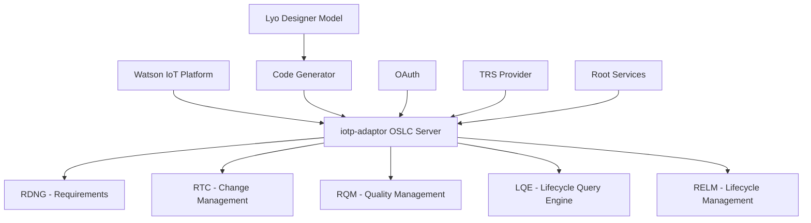
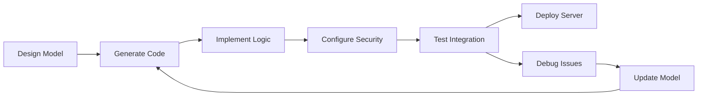

# IoTP Adaptor Developer Guide

!!! info "OSLC Watson IoT Platform Integration"
    iotp-adaptor is an OSLC server that exposes IBM Watson IoT Platform resources as OSLC resources. This guide explains how the server was developed and integrated with IBM jazz.net applications.

## Overview

The iotp-adaptor provides a comprehensive example of building an OSLC adaptor using Eclipse Lyo Designer and integrating it with IBM Continuous Engineering (CE) tools. 

**Key Resources:**
- **[User Guide](userGuide/user-guide.md)**: Installation, configuration, and usage
- **[Source Code](https://github.com/OSLC/iotp-adaptor)**: Complete implementation on GitHub
- **[Lyo Designer](../eclipse_lyo/designer.md)**: Model-based development tool used

### Development Approach

The adaptor was created using **model-based development** techniques:

1. **[Eclipse Lyo Designer](https://github.com/eclipse/lyo.designer/wiki)**: Graphical modeling tool
2. **Code Generation**: [M2T](https://www.eclipse.org/modeling/m2t/) templates generate OSLC server implementation
3. **Base Templates**: Derived from [OSLC4J Bugzilla](https://wiki.eclipse.org/Lyo/BuildOSLC4JBugzilla) sample application

## OSLC Compliance and Integration Challenges

### Generated Foundation

Lyo Designer creates an [OSLC Core 2.0](https://docs.oasis-open.org/oslc-core/oslc-core/v3.0/oslc-core-v3.0.html) compliant server with:

- ✅ OSLC resource capabilities
- ✅ Minimal Web UI for debugging
- ✅ Basic CRUD operations

### Additional Integration Requirements

To integrate with IBM jazz.net applications, additional components are required:

!!! warning "Beyond Basic OSLC Compliance"
    The generated OSLC server needs significant enhancement for jazz.net integration:

| Component | Purpose | Complexity |
|-----------|---------|------------|
| **Root Services Document** | Server discovery capabilities | Medium |
| **OAuth Consumer/Friend** | Server-to-server authentication | High |
| **Artifact Container Associations** | Project area linking | High |
| **Link Type Configuration** | Application-specific linking | Medium |
| **Application-Specific Requirements** | RDNG, RTC, RQM integration details | High |
| **TRS Provider** | RELM and LQE contribution | High |

## Developer Guide Sections

### Environment and Setup

| Section | Description | Complexity |
|---------|-------------|------------|
| **[Environment Setup](environment-setup.md)** | Eclipse development environment configuration | Beginner |
| **[Toolchain Model](toolchain-model.md)** | Watson IoT Platform OSLC domain model design | Intermediate |
| **[Code Generation](code-generator.md)** | Server implementation generation with Lyo Designer | Intermediate |

### Core Implementation

| Section | Description | Complexity |
|---------|-------------|------------|
| **[Exploring Generated Code](exploring-the-code.md)** | Project structure and key files overview | Beginner |
| **[Implementing Domain Classes](implement-domain-class.md)** | Custom domain class implementation example | Intermediate |
| **[JUnit Testing](junit-tests.md)** | OSLC CRUD operation testing | Intermediate |

### Security and Authentication

| Section | Description | Complexity |
|---------|-------------|------------|
| **[HTTPS and SSL Support](ssl-support.md)** | Secure connections and certificate management | Advanced |
| **[Authentication](authentication.md)** | End-user login and server-to-server OAuth | Advanced |

### Jazz.net Integration

| Section | Description | Complexity |
|---------|-------------|------------|
| **[Root Services Document](rootservices.md)** | Discovery capability implementation | Intermediate |
| **[Consumer/Friend Connections](consumer-friend.md)** | OAuth server relationships | Advanced |
| **[Artifact Container Associations](artifact-container-associations.md)** | Project area configuration | Advanced |
| **[Delegated Dialogs](dialogs.md)** | UI customization and embedding | Intermediate |

### Advanced Features

| Section | Description | Complexity |
|---------|-------------|------------|
| **[TRS Provider Implementation](trs-provider.md)** | Tracked Resource Set for data federation | Advanced |

## Architecture Overview

## Quick Start Path

### For Beginners

1. **[Environment Setup](environment-setup.md)** - Configure development environment
2. **[Exploring Generated Code](exploring-the-code.md)** - Understand project structure
3. **[Implementing Domain Classes](implement-domain-class.md)** - Add custom logic

### For Integration Focus

1. **[Authentication](authentication.md)** - Understand security model
2. **[Consumer/Friend Connections](consumer-friend.md)** - Establish server relationships
3. **[Artifact Container Associations](artifact-container-associations.md)** - Configure project linking

### For Advanced Development

1. **[Toolchain Model](toolchain-model.md)** - Design domain models
2. **[Code Generation](code-generator.md)** - Generate server implementations
3. **[TRS Provider Implementation](trs-provider.md)** - Implement data federation

## Development Workflow

## Key Technologies

### Core Technologies

- **Eclipse Lyo**: OSLC development framework
- **OSLC4J**: Java-based OSLC implementation
- **JAX-RS**: RESTful web services
- **Jersey**: JAX-RS implementation
- **Jena**: RDF processing

### Integration Technologies

- **OAuth 1.0a**: Authentication and authorization
- **TRS (Tracked Resource Sets)**: Data federation
- **Root Services**: Service discovery
- **LDAP**: User authentication

### IBM CE Applications

- **Jazz Team Server (JTS)**: Central authentication and project management
- **DOORS Next Generation (RDNG)**: Requirements management
- **Rational Team Concert (RTC)**: Change and configuration management  
- **Rational Quality Manager (RQM)**: Test and quality management
- **Lifecycle Query Engine (LQE)**: Cross-tool reporting and analytics

## Learning Path Recommendations

### Prerequisites

!!! note "Required Knowledge"
    - Java development experience
    - Understanding of REST APIs and HTTP
    - Basic knowledge of RDF and linked data
    - Familiarity with Eclipse IDE

### Suggested Reading Order

1. **Foundation**: [Technical Foundations](../technical-foundations.md)
2. **OSLC Basics**: [Services and Design Patterns](../services-resources-and-design-patterns.md)
3. **Lyo Framework**: [Eclipse Lyo Overview](../eclipse_lyo/index.md)
4. **This Guide**: Follow sections based on your role and needs

## Resources and References

### OSLC Community

- **[OSLC Website](https://open-services.net)**: Official specifications and community
- **[OSLC Developer Guide](http://oslc.github.io/developing-oslc-applications/)**: Comprehensive development guide
- **[OSLC Primer](https://open-services.net/resources/oslc-primer/)**: Introduction to OSLC concepts

### Eclipse Lyo

- **[Eclipse Lyo Project](https://www.eclipse.org/lyo/)**: Official project page
- **[Lyo Designer Wiki](https://github.com/eclipse/lyo.designer/wiki)**: Designer documentation
- **[Lyo Forums](https://www.eclipse.org/forums/index.php/f/228/)**: Community support

### Development Tools

- **[OSLC API Documentation](https://github.com/OSLC/OSLC-API)**: Swagger.io API specifications
- **[OSLC GitHub Organization](https://github.com/OSLC)**: Source code and examples
- **[iotp-adaptor Project](https://github.com/OSLC/iotp-adaptor)**: Complete implementation example

## Contributing to Documentation

!!! info "Continuous Improvement"
    This documentation is under continuous development as we discover more about OSLC and jazz.net integration.

**How to Contribute:**
- **Email suggestions**: [Jim Amsden](mailto:jamsden@us.ibm.com)
- **GitHub Issues**: Report problems or suggestions
- **Community Forums**: Share experiences and ask questions

**Areas needing contributions:**
- Additional integration examples
- Error handling best practices
- Performance optimization techniques
- Alternative authentication methods

## Next Steps

Choose your path based on your immediate needs:

### Quick Exploration
**[Exploring Generated Code](exploring-the-code.md)** - Understand the codebase structure

### Setup Development Environment  
**[Environment Setup](environment-setup.md)** - Configure your development tools

### Understand the Model
**[Toolchain Model](toolchain-model.md)** - Learn about the domain design

### Focus on Integration
**[Authentication](authentication.md)** - Start with security fundamentals

---

**Ready to dive deeper?** Choose a section from the developer guide based on your current needs and experience level.
