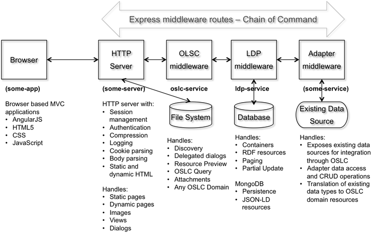
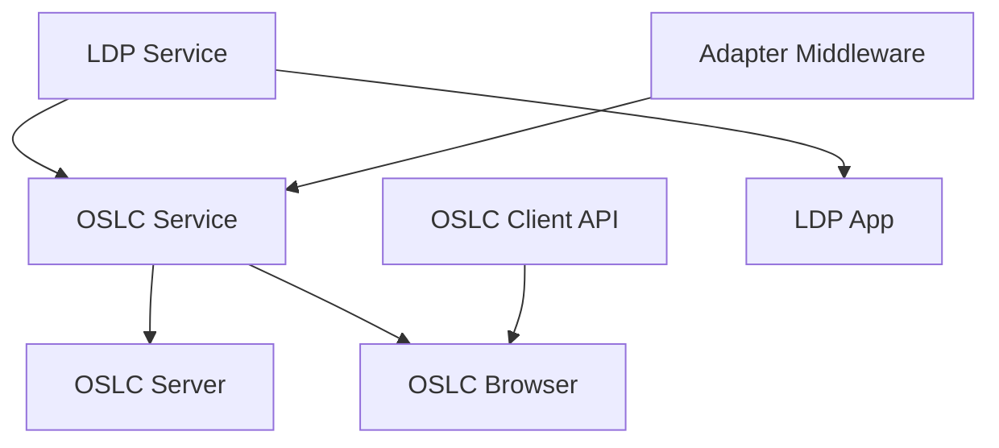

# OSLC Open Source Node.js Projects

While Eclipse Lyo provides a robust Java-based platform for OSLC development, it has a relatively high learning curve that can increase development time, costs, and risks.

**OSLC4JS** represents a collection of related open source projects that leverage the dynamic and asynchronous capabilities of JavaScript and Node.js to support OSLC-based client and server applications.

!!! info "Goal"
    OSLC4JS aims to minimize the cost of developing OSLC specifications, reference implementations, and test suites while providing a reference implementation in a dynamic language.

## Architecture Overview

The OSLC4JS ecosystem consists of modular Express.js middleware components that can be combined to create OSLC-enabled applications:



!!! tip "Vendor Integration"
    Adapter middleware provides a simple way for vendors to offer OSLC access to their data sources without implementing OSLC/LDP details directly.

## Collaboration

- **[OSLC4JS Slack Channel](https://openintegrations.slack.com/archives/oslc4js)** - Collaborative development
- **GitHub Wikis** - Documentation for each repository
- **GitHub Issues** - Development work management

## Project Portfolio

### OSLC Browser
**Repository:** [https://github.com/OSLC/oslc-browser](https://github.com/OSLC/oslc-browser)

A sample OSLC Web application that provides resource browsing capabilities using the OSLC Service.

**Features:**
- Connection pool configuration for multiple OSLC servers
- Federated browsing of contributed server content
- Support for OSLC domains and domain extensions
- Integration hub functionality for OSLC resources
- Stakeholder viewpoints and active dashboards

**Resources:**
- [Mural Design](https://app.mural.ly/t/ibm14/m/ibm14/1452806819730)
- [Wiki Documentation](https://github.com/OSLC/oslc-browser/wiki)

### OSLC Client API
**Repository:** [https://github.com/OSLC/oslc-client](https://github.com/OSLC/oslc-client)

A Node.js asynchronous OSLC client API that provides a logical abstraction over raw REST services.

**Benefits:**
- Rich JavaScript application development
- Asynchronous API design
- Higher-level abstraction than direct REST calls
- Simplified OSLC resource access

**Resources:**
- [Wiki Documentation](https://github.com/OSLC/oslc-client/wiki)
- [NPM Package](https://www.npmjs.com/package/oslc-client)

### OSLC Service
**Repository:** [https://github.com/OSLC/oslc-service](https://github.com/OSLC/oslc-service)

Generic Node.js Express middleware providing OSLC 3.0 services for any domain.

**Features:**
- Domain-agnostic OSLC 3.0 compliance
- Easy adaptation to any data source
- Built on LDP Service foundation
- Express.js middleware architecture

**Resources:**
- [Wiki Documentation](https://github.com/OSLC/oslc-service/wiki)
- [NPM Package](https://www.npmjs.com/package/oslc-service)

### OSLC Server
**Repository:** [https://github.com/OSLC/oslc-server](https://github.com/OSLC/oslc-server)

A minimal OSLC server implementation using oslc-service and ldp-service.

**Features:**
- Browser REST client access
- IBM Bluemix deployment for testing
- OSLC experimentation platform
- Minimal setup requirements

**Resources:**
- [Wiki Documentation](https://github.com/OSLC/oslc-server/wiki)
- [Live Instance](https://oslc-server.mybluemix.net/) (if available)

### LDP App
**Repository:** [https://github.com/OSLC/ldp-app](https://github.com/OSLC/ldp-app)

A sample Linked Data Platform (LDP) Web application supporting CRUD operations on linked data graphs.

**Features:**
- [W3C LDP 1.0](https://www.w3.org/TR/2015/REC-ldp-20150226/) compliance
- CRUD operations support
- Linked data graph management
- Built on LDP Service

**Resources:**
- [Wiki Documentation](https://github.com/OSLC/ldp-app/wiki)

### LDP Service
**Repository:** [https://github.com/OSLC/ldp-service](https://github.com/OSLC/ldp-service)

Express middleware providing Linked Data Platform capabilities with MongoDB storage.

**Features:**
- LDP specification compliance
- JSON-LD storage in MongoDB
- Express.js middleware integration
- Foundation for OSLC services

**Resources:**
- [Wiki Documentation](https://github.com/OSLC/ldp-service/wiki)
- [NPM Package](https://www.npmjs.com/package/ldp-service)

## Quick Start

!!! example "Getting Started with OSLC4JS"
    ```bash
    # Install OSLC Service
    npm install oslc-service
    
    # Install LDP Service (dependency)
    npm install ldp-service
    
    # Create a simple OSLC server
    npm install oslc-server
    ```

## Project Relationships



## Use Cases

!!! success "Ideal For"
    - **Rapid Prototyping** - Quick OSLC server development
    - **Client Applications** - Rich JavaScript OSLC clients
    - **Vendor Integration** - Simple data source OSLC exposure
    - **Testing & Experimentation** - OSLC specification validation

## Comparison with Eclipse Lyo

| Aspect | OSLC4JS | Eclipse Lyo |
|--------|---------|-------------|
| **Language** | JavaScript/Node.js | Java |
| **Learning Curve** | Lower | Higher |
| **Development Speed** | Faster | Slower |
| **Asynchronous** | Native | Requires frameworks |
| **Deployment** | Lightweight | Full-featured |
| **Community** | Growing | Established |

## Contributing

Each project welcomes contributions through:

- **GitHub Issues** - Bug reports and feature requests
- **Pull Requests** - Code contributions
- **Wiki Updates** - Documentation improvements
- **Slack Discussions** - Community collaboration

## Related Resources

- [Eclipse Lyo](eclipse_lyo/index.md) - Java-based OSLC toolkit
- [Technical Foundations](technical-foundations.md) - OSLC fundamentals
- [Sample Applications](samples.md) - Additional examples
- [Node.js Official Documentation](https://nodejs.org/docs/)
- [Express.js Framework](https://expressjs.com/)
