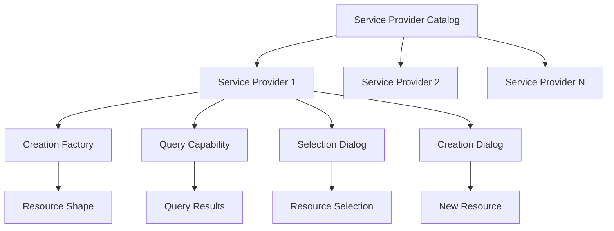

# Services, Resources and Design Patterns

The [OSLC Core specification](https://docs.oasis-open.org/oslc-core/oslc-core/v3.0/oslc-core-v3.0.html) defines the fundamental patterns and protocols that any OSLC software must implement. Domain-specific workgroups extend these foundations but do not introduce new protocols.

!!! info "Core Foundation"
    OSLC Core provides the essential building blocks that all OSLC implementations must follow, ensuring consistency and interoperability across different tools and domains.

## Core Resources and Patterns

The following table outlines the major resources and patterns defined in the OSLC Core specification:

| Resource/Pattern | Purpose | Learn More |
|------------------|---------|------------|
| **Service Provider** | Describes resource collections and provides creation/discovery capabilities | [OSLC Primer: Service Provider](https://open-services.net/resources/oslc-primer/#serviceprovider) |
| **Resource Paging** | Breaks long resource lists into manageable pages with navigation URLs | [OSLC Primer: Resource Paging](https://open-services.net/resources/oslc-primer/#resource-paging) |
| **Queries** | Standard query patterns for retrieving resource subsets and properties | [OSLC Primer: Query Mechanisms](https://open-services.net/resources/oslc-primer/#query-mechanisms) |
| **Resource Shapes** | Define resource property schemas, including values, cardinality, and requirements | [OSLC Primer: Resource Shapes](https://open-services.net/resources/oslc-primer/#resourceshapes) |
| **Creation Factory** | Service for creating new resources via HTTP POST, with optional Resource Shapes | [Core 3.0: Creation Factories](https://docs.oasis-open.org/oslc-core/oslc-core/v3.0/oslc-core-v3.0.html#creation-factories) |
| **Service Provider Catalog** | Lists available ServiceProviders in a discoverable format | [OSLC Primer: ServiceProvider](https://open-services.net/resources/oslc-primer/#serviceprovider) |
| **Delegated UI Dialogs** | Embed creation/selection interfaces from one tool within another | [OSLC Primer: Delegated UI Dialogs](https://open-services.net/resources/oslc-primer/#delegated-user-interface-dialogs) |
| **UI Previews** | Discover and display resource previews across different tools | [OSLC Primer: UI Preview](https://open-services.net/resources/oslc-primer/#ui-preview) |

## Service Provider Architecture



## Resource Discovery Flow

!!! example "Typical Discovery Process"
    1. **Start** with Service Provider Catalog
    2. **Navigate** to appropriate Service Provider
    3. **Discover** available services and capabilities
    4. **Use** Creation Factories, Queries, or Dialogs as needed
    5. **Interact** with resources using standard HTTP methods

## Design Patterns

### Creation Pattern
Resources are created through Creation Factories that:

- Accept HTTP POST requests
- Use Resource Shapes to validate input
- Return newly created resource URLs
- Support batch creation where appropriate

### Query Pattern
Resource discovery uses standardized query parameters:

```http
GET /resources?oslc.where=dcterms:title="Example"&oslc.select=dcterms:title,dcterms:description
```

### Paging Pattern
Large result sets are paginated using:

- `oslc:nextPage` links for navigation
- `oslc:totalCount` for result sizing
- Consistent page size handling

### Dialog Pattern
UI integration follows these principles:

- **Lightweight** - Minimal resource impact
- **Responsive** - Works across device types  
- **Secure** - Proper authentication handling
- **Accessible** - WCAG compliance

## Resource Relationships

OSLC resources use RDF to express rich relationships:

!!! tip "Linked Data Benefits"
    - **Semantic meaning** through well-defined vocabularies
    - **Flexible relationships** between resources
    - **Cross-tool linking** with maintained context
    - **Query-friendly** structure for complex searches

## Authentication and Security

OSLC implementations must handle:

- **OAuth 2.0** for secure authentication
- **HTTPS** for transport security
- **CORS** for cross-origin access
- **CSRF** protection for state-changing operations

See: [Additional Security Considerations](additional-security-considerations.md)

## Implementation Guidelines

### Best Practices

!!! success "Implementation Tips"
    - **Follow HTTP semantics** correctly (GET, POST, PUT, DELETE)
    - **Use appropriate content types** (RDF formats, JSON-LD)
    - **Implement proper error handling** with meaningful HTTP status codes
    - **Support content negotiation** for different RDF serializations
    - **Provide clear documentation** for custom extensions

### Common Pitfalls

!!! warning "Avoid These Issues"
    - Ignoring HTTP caching headers
    - Poor error message design
    - Inconsistent URI patterns
    - Missing or incorrect CORS configuration
    - Inadequate resource shape validation

## Extension Points

While Core defines the foundation, implementations can extend:

- **Custom properties** using domain vocabularies
- **Additional services** beyond standard patterns
- **Enhanced UI capabilities** in dialogs and previews
- **Specialized query** syntax for domain needs

## Specifications and Vocabularies

Explore additional OSLC specifications:

- **[OSLC Vocabularies Index](https://docs.oasis-open.org/oslc-domains/)** - Complete specification list
- **[Requirements Management](https://docs.oasis-open.org/oslc-domains/rm/v2.1/rm-v2.1.html)** - RM domain specification
- **[Change Management](https://docs.oasis-open.org/oslc-domains/cm/v3.0/cm-v3.0.html)** - CM domain specification
- **[Quality Management](https://docs.oasis-open.org/oslc-domains/qm/v2.1/qm-v2.1.html)** - QM domain specification

## Related Topics

- [Technical Foundations](technical-foundations.md)
- [Eclipse Lyo Overview](eclipse_lyo/index.md)
- [OSLC Open Source Node.js Projects](oslc-open-source-node-projects.md)
- [Why Develop OSLC Applications](why-develop-oslc-applications.md)
