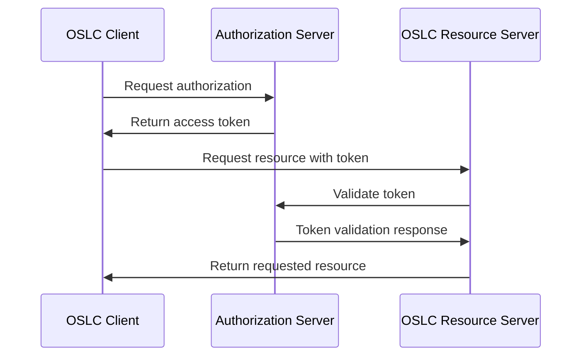

# Technical Foundations

Building OSLC-compliant software requires understanding several key technical concepts and standards. This guide provides the essential foundation knowledge needed for successful OSLC development.

## Core Concepts

### Linked Data

[Linked data](http://www.w3.org/DesignIssues/LinkedData.html) forms the primary technical foundation of all OSLC specifications. It enables rich, semantic connections between resources across different tools and systems.

!!! info "Understanding Linked Data"
    The following video provides an overview of linked data's value and its implementation in OSLC:

<div style="position: relative; padding-bottom: 56.25%; height: 0; overflow: hidden;">
  <iframe src="https://www.youtube.com/embed/40mjwqGEKBU" 
          style="position: absolute; top: 0; left: 0; width: 100%; height: 100%;" 
          frameborder="0" 
          allowfullscreen>
  </iframe>
</div>

**Additional Resources:**
- [Linked Data and RDF Overview Playlist](https://archive.open-services.net/resources/videos/linked-data-and-rdf-overview-playlist/)
- [W3C Linked Data Design Issues](http://www.w3.org/DesignIssues/LinkedData.html)

### RESTful Web Architecture

OSLC applications must follow [RESTful](https://en.wikipedia.org/wiki/Representational_state_transfer#Architectural_constraints) architectural principles and use the HTTP protocol.

!!! tip "REST Learning Resources"
    For a comprehensive REST primer, we recommend ["Learn REST" by Dr. M. Elkstein](http://rest.elkstein.org/):

    1. [What is REST?](http://rest.elkstein.org/2008/02/what-is-rest.html)
    2. [REST as Lightweight Web Services](http://rest.elkstein.org/2008/02/rest-as-lightweight-web-services.html)
    3. [How Simple is REST?](http://rest.elkstein.org/2008/02/how-simple-is-rest.html)
    4. [More Complex REST Requests](http://rest.elkstein.org/2008/02/more-complex-rest-requests.html)
    5. [REST Server Responses](http://rest.elkstein.org/2008/02/rest-server-responses.html)

#### REST Architectural Constraints

| Constraint | Description | OSLC Application |
|------------|-------------|------------------|
| **Client-Server** | Separation of concerns | OSLC clients consume services from OSLC servers |
| **Stateless** | No client context stored on server | Each OSLC request contains all necessary information |
| **Cacheable** | Responses explicitly indicate cacheability | OSLC resources support HTTP caching headers |
| **Uniform Interface** | Consistent interface across services | Standard OSLC resource patterns and HTTP methods |
| **Layered System** | Hierarchical layers for scalability | OSLC supports proxy servers and load balancers |

## Data Formats and Standards

### RDF (Resource Description Framework)

!!! warning "Required Format"
    OSLC services and resources **must** be represented in [RDF](http://www.w3.org/RDF/), though you can supplement with other formats.

**Key RDF Concepts:**
- **Triples**: Subject-Predicate-Object statements
- **URIs**: Unique identifiers for resources and properties
- **Vocabularies**: Standardized sets of properties and classes
- **Serializations**: Different ways to represent RDF data

### Supported Serialization Formats

| Format | Media Type | Use Case | Example |
|--------|------------|----------|---------|
| **RDF/XML** | `application/rdf+xml` | Standard RDF format | Machine processing |
| **Turtle** | `text/turtle` | Human-readable RDF | Development and debugging |
| **JSON-LD** | `application/ld+json` | JSON with linked data context | Web applications |
| **N-Triples** | `application/n-triples` | Simple triple format | Data exchange |

!!! example "Content Negotiation"
    ```http
    GET /resources/123
    Accept: application/rdf+xml, text/turtle;q=0.8, application/ld+json;q=0.6
    ```

### Processing RDF Data

!!! success "Recommended Approach"
    Use RDF parsing libraries instead of string parsing and regular expressions:

**Popular RDF Libraries:**
- **Java**: [Apache Jena](http://jena.apache.org/)
- **JavaScript**: [rdflib.js](https://github.com/linkeddata/rdflib.js)
- **Python**: [RDFLib](https://rdflib.readthedocs.io/)
- **C#**: [dotNetRDF](https://www.dotnetrdf.org/)

```java
// Example with Apache Jena
Model model = ModelFactory.createDefaultModel();
model.read(inputStream, null, "RDF/XML");
```

## Authentication and Security

### OAuth Integration

While OSLC doesn't mandate OAuth, it's the most common authentication approach for client-server interactions.

!!! info "OAuth Benefits"
    - **Secure token-based authentication**
    - **Delegated authorization** without sharing credentials
    - **Scope-limited access** to resources
    - **Standard implementation** across tools

**OAuth Flow for OSLC:**



### Security Considerations

- **Transport Security**: Always use HTTPS in production
- **Token Management**: Securely store and refresh OAuth tokens
- **CORS Configuration**: Properly configure cross-origin access
- **Input Validation**: Validate all incoming data

See: [Additional Security Considerations](additional-security-considerations.md)

## HTTP Protocol Requirements

### Standard HTTP Methods

OSLC implementations must properly implement HTTP semantics:

| Method | Purpose | OSLC Usage |
|--------|---------|------------|
| **GET** | Retrieve resources | Fetch OSLC resources and collections |
| **POST** | Create resources | Use Creation Factories to create new resources |
| **PUT** | Update/replace resources | Full resource updates |
| **DELETE** | Remove resources | Resource deletion |
| **HEAD** | Resource metadata | Check resource existence and metadata |
| **OPTIONS** | Available methods | CORS preflight and capability discovery |

### HTTP Status Codes

Use appropriate HTTP status codes:

!!! example "Common OSLC Status Codes"
    - **200 OK**: Successful GET request
    - **201 Created**: Resource successfully created
    - **204 No Content**: Successful PUT/DELETE with no response body
    - **400 Bad Request**: Invalid request format
    - **401 Unauthorized**: Authentication required
    - **403 Forbidden**: Access denied
    - **404 Not Found**: Resource doesn't exist
    - **409 Conflict**: Resource conflict (e.g., concurrent updates)
    - **500 Internal Server Error**: Server processing error

## OSLC-Specific Technical Requirements

### Resource Identification

- **Stable URIs**: Resources must have persistent identifiers
- **HTTP URIs**: All OSLC resource URIs must be HTTP(S) URIs
- **URI Patterns**: Follow consistent, predictable URI structures

### Content Negotiation

Support multiple content types through HTTP Accept headers:

```http
Accept: application/rdf+xml, text/turtle;q=0.9, */*;q=0.1
```

### Resource Shapes

Define and validate resource structures using OSLC Resource Shapes:

- **Property definitions** with datatypes
- **Cardinality constraints** (required, optional, multiple)
- **Value restrictions** and allowed values
- **Documentation** and human-readable descriptions

## Development Tools and Frameworks

### Eclipse Lyo (Java)

The primary OSLC development framework:

- **Code Generation**: Automated server and client code
- **RDF Handling**: Built-in RDF processing capabilities
- **Authentication**: OAuth and other security mechanisms
- **UI Components**: Delegated dialogs and preview widgets

[Learn more about Eclipse Lyo](eclipse_lyo/index.md)

### OSLC4JS (JavaScript/Node.js)

Lightweight OSLC development for JavaScript environments:

- **Express Middleware**: Easy integration with existing apps
- **Asynchronous Operations**: Native JavaScript async support
- **Rapid Development**: Lower learning curve than Java

[Learn more about OSLC4JS](oslc-open-source-node-projects.md)

## Testing and Validation

### OSLC Compliance Testing

- **Resource Shape Validation**: Ensure resources conform to shapes
- **HTTP Protocol Compliance**: Verify proper HTTP semantics
- **RDF Validation**: Check RDF syntax and semantics
- **Authentication Testing**: Verify security implementations

### Development Workflow

!!! tip "Best Practices"
    1. **Start with Resource Shapes** - Define your data model first
    2. **Use RDF Libraries** - Don't parse RDF manually
    3. **Test Early and Often** - Validate compliance continuously
    4. **Follow HTTP Standards** - Implement proper REST semantics
    5. **Document Extensions** - Clearly document any custom behavior

## Next Steps

- [Services, Resources and Design Patterns](services-resources-and-design-patterns.md)
- [Eclipse Lyo Setup Guide](eclipse_lyo/setup.md)
- [Sample Applications and Code](samples.md)
- [Why Develop OSLC Applications](why-develop-oslc-applications.md)

## External Resources

- [OSLC Core 3.0 Specification](https://docs.oasis-open.org/oslc-core/oslc-core/v3.0/oslc-core-v3.0.html)
- [W3C RDF Primer](https://www.w3.org/TR/rdf11-primer/)
- [REST API Tutorial](https://restfulapi.net/)
- [OAuth 2.0 Specification](https://tools.ietf.org/html/rfc6749)
